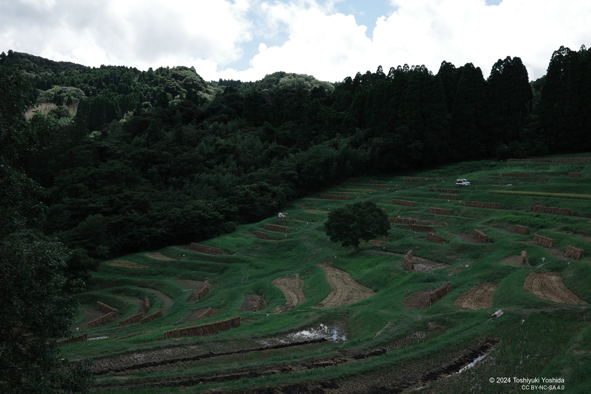

+++
title = "Oyama Senmaida(大山千枚田)"
description = "美しい棚田が並ぶ大山千枚田に入ってきました。"
date = 2024-08-26
aliases = ["/articles/2024/08/26/Oyama-senmaida"]

[taxonomies]
tags = ["Travel", "Photography"]
+++

I visited **Oyama Senmaida(大山千枚田)** in Chiba Pref, Japan. These
terraced rice fields, dating back to before the 1600s, are ingeniously built
on hillside slopes, forming 30 levels with 375 paddies still in use today.
They are the quintessential rural landscape of Japan.
