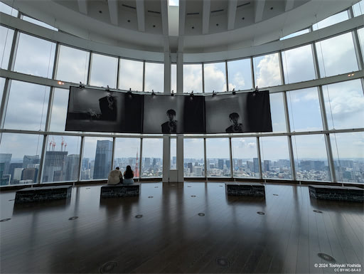

+++
title = "Paul McCartney’s photo exhibition"
description = "Paul McCartneyの写真展が六本木でやっていたので見に行ってきました。"
date = 2024-08-08
aliases = ["/articles/2024/08/08/Paul-McCartney-PhotoExhibition"]

[taxonomies]
tags = ["Photography", "Art", "Beatles"]
+++

I went to Roppongi to see Paul McCartney’s photo exhibition “Eyes of the
Storm”.
The photos were taken between 1963 and 1964, capture their everyday life.
But they were forgotten until 2020.
These unseen photos of the Beatles during their peak success made the exhibition very fascinating.
