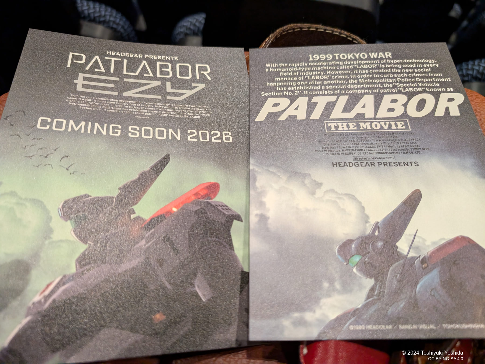

+++
title = "リバイバル上映:映画『機動警察パトレイバー THE MOVIE』"
description = "映画『機動警察パトレイバー THE MOVIE』(1989年)のリバイバル上映を今晩見てきました。"
date = 2024-09-24
aliases = ["/articles/2024/09/24/Patlabor-the-movie"]
+++

「思い出補正」で作品評価を必要以上に上げていて見直すとがっかりするのではと懸念していましたが、予想に反してしっかりと楽しむことができました。
1989 年と言えば、昭和天皇の崩御、ベルリンの壁崩壊、冷戦終結の年。三菱地所がロックフェラー・センターを買収し、任天堂がゲームボーイを発売。振り返ると、現代とは異なる世界線だったように感じます。

🎥Tonight, I attended a revival screening of "Patlabor: The Movie" (1989). I was concerned that "nostalgia goggles" might have inflated my evaluation of the film, potentially leading to disappointment upon rewatching. However, contrary to my expectations, I found myself thoroughly enjoying it.
The year 1989 was marked by significant events: the death of Emperor Hirohito, the fall of the Berlin Wall, and the end of the Cold War. It was also the year Mitsubishi Estate purchased Rockefeller Center, and Nintendo released the Game Boy. Looking back, it feels like we were living in a different timeline compared to today.
