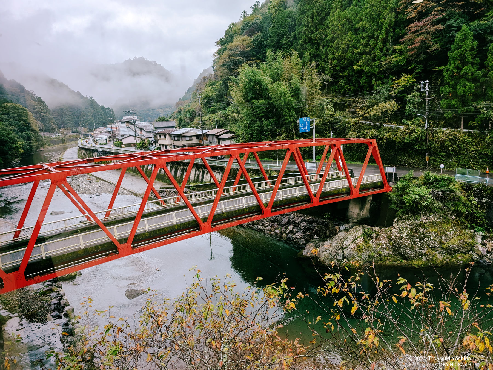

+++
title = "フォレストかみきたに行ってきた"
description = "世界遺産「大峯奥駈道」と日本百名山「大台ケ原」に囲まれた奈良県上北山村。この地の「フォレストかみきた」で週末を過ごしました。"
date = 2024-10-28
aliases = ["/articles/2024/10/28/Kamikita"]

[taxonomies]
tags = ["Travel"]
+++

宿の脇を流れる小谷川は大台ケ原からの伏流水が注ぐ清流。上流に人は住まないため
水道水をそののままいただけて冷たく美味しい。その清流で育つあまごの塩焼きは絶
品。

客室には自転車ハンガーが設置され、サイクリストへの配慮が行き届いています。この地域は大台ケ原へと続く標高差1,240メートルのヒルクライムコースで自転車の聖地として有名です。私は自転車に乗りませんが。

雄大な自然に囲まれた静かな時間は、心身ともにリフレッシュできる贅沢な体験となりました。

| 項目 | 内容 |
|------|------|
| 店名 | フォレストかみきた |
| 住所 | 奈良県吉野郡上北山村大字河合552-2 |
| 地図 | [OpenStreetMap](https://www.openstreetmap.org/?mlat=34.139024&mlon=136.000662#map=17/34.139024/136.000662) |
| 電話 | 07468-3-0001 |
| 定休日 | 不明 |
| ウェブサイト | <https://forest-kamikita.com/> |
