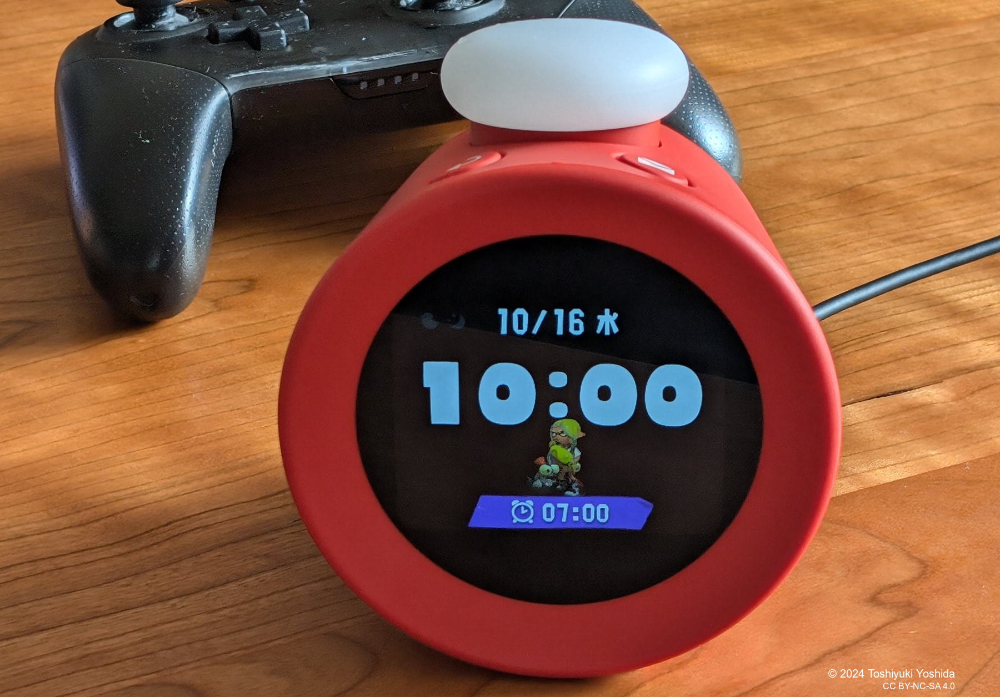

+++
title = "Weekly Buzz🐝 2024-10-18"
description = "ちょっと間が開いてしまいましたが、この間にすっかり秋らしくなって涼しくなってきました。ただ、今週末も夏日になるというので油断できません。今週は宮崎空港不発弾事件とNintendo Alarmoについてです。"
date = 2024-10-18
aliases = ["/articles/2024/10/19/Weekly-buzz-20241019"]
+++

## 宮崎空港不発弾について

10 月 2 日に突然宮崎空港で不発弾が爆発しました。

宮崎空港では 2021 年 6 月にも駐機場でアメリカ製の 1 トンの不発弾が見つかっています。
宮崎空港は太平洋戦争当時、旧日本海軍の「赤江飛行場」として使用されており、
米軍による空爆が行われていたことが原因です。2021 年以前にも何度か不発弾が
見つかっています。

家族が現在宮崎で仕事をしており、私もたまに空港を使うことがあるので困ったもの
です。

防衛省の統合幕僚監部が発表する
「[令和5年度における自衛隊の災害派遣](https://www.mod.go.jp/js/pdf/2024/p20240729_02.pdf)」
を読むと、令和 5 年度に陸上で発見された不発弾だけでも沖縄だけで 441 件、全国で
2,348 件に上ります。しかも、終戦から 80 年近く経過しており、爆発物は不安定な化
合物で時間が立つにつれより敏感なるため、そのリスクはますます高まっています。

一方で不発弾撤去については自衛隊が処理に当たっているようですが、その費用負担
については法整備がされていません。2018 年の大阪の事例では土地所有者が不発弾処
理のための周辺警備などの費用 580 万円を負担し「戦後処理の一環として、行政が処
理責任を負うべき」と裁判を起こしましたが退けられています。

80 年経ってもこれほどの負担を強いる「戦争」などという問題解決方法など安易に取
るべきではないという教訓ですね。

## Nintendo Alarmoがやってきた

任天堂が突然発売した目覚まし時計 Alarmo を手に入れることができました。
ここ数日使っていますが、ベッドに入ると自動的に睡眠を誘う音楽を流してくれ、ス
プラトゥーンの音楽で目覚ましアラームを鳴らしてくれ、ベッドから出ると指一本触
れずにアラームが止まります。

マリオやゼルダ、スプラトゥーンなど、任天堂の豊富な IP を活かしつつ、ゲーム要素を敢えて排除し純粋な目覚まし時計として設計したところが秀逸なところだと思います。

UI などボタン 3 つでここまで使いやすいデバイスに仕上げられるのを見ていると、ど
こかの自動車メーカーなどぜひ参考にしてほしいものです。
