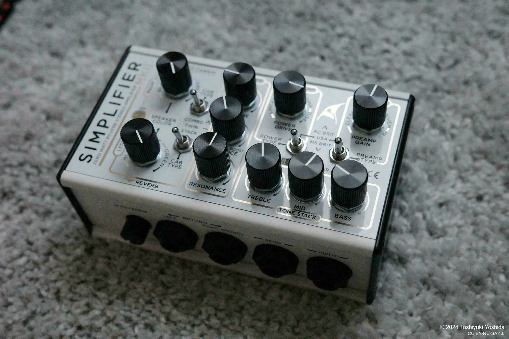

+++
title = "Zero-Wat Amp Simplifier MK-II"
description = "I purchased the Simplifier MK-II from Simplifier Amp which was the best ampsimulator I've ever seen!"
date = 2025-02-11
aliases = ["/articles/2025/02/11/simplifier-mk2"]

[taxonomies]
tags = ["Guitar", "Guitar Pedals"]
+++

I had no major complaints about the Strymon Iridium I had been using for a long time,
but I was drawn to the word "analog" and ended up purchasing the
[DSM & Humboldt Simplifier MK-II](https://www.simplifieramp.com/simplifier-mk-ii).

## Zero-Watt Amp

The Simplifier MK-II is an amp simulator handmade by the Chilean manufacturer DSM & Humboldt, using primarily analog circuits. It is marketed as a "zero-watt amp," condensing amp functionality into a compact enclosure.

Most amp simulators are divided into an amp section and an IR (impulse response) section.
But the Simplifier MK-II mimics an actual amp by separating **Preamp** and **Power Amp**,
allowing users to switch between _Vox_, _Fender_, and _Marshall_ types for each.

A 3-band equalizer adjusts the tone, while the master section controls overall volume, mid-high frequencies, and low frequencies.

Finally, you can select a cabinet type from _Combo_, _Twin_, or _Stack_.
And you can also select fine-tune the speaker characteristics using a dial with settings
for _BLACK (Fender)_, _BLUE (Vox)_, and _GREEN (Marshall)_.

All of these features are built using analog circuitry.
Additionally, it includes a high-quality digital reverb.

## Impressions of the Simplifier MK-II

I've only used it briefly, but here are my initial impressions of the Simplifier MK-II.

Since you can adjust the gain separately on the Preamp and Power Amp, it allows for fine-tuned control over drive sounds. The gain range is also broad, making it possible to create a variety of distortion tones with just this unit.

Personally, I prefer to _increase the Power Amp level as much as possible and adjust the distortion with the Preamp as needed_.
However, I did notice some noise, so I plan to use a distortion pedal as a booster in front. The response to boosting is amp-like and easy to understand.

Additionally, since all controls are analog, it is intuitive and easy to quickly dial in the desired sound.

The unit features a SEND/RETURN (effects loop), so I have connected my Strymon El Capistan II, using its delay and reverb instead of the built-in reverb.

Furthermore, the **DI OUTPUT** allows direct XLR connection to my MOTU M2, making it very convenient for recording with Logic Pro.

## Drawbacks

I found three drawbacks:

- Settings cannot be saved, requiring manual knob adjustments each time (MIDI-based setting changes are also not possible). This is the trade-off of using analog circuitry.
- Turning up the gain introduces some noise.
- Due to the compact design accommodating multiple interfaces, jacks can interfere with each other when connecting cables. In particular, the reverb adjustment knob is located on the side, making it difficult to use when mounted on a pedalboard.

## Conclusion

The Simplifier MK-II is an amp simulator that offers the response and feel of analog operation, which sets it apart from digital simulators. The separation of preamp and power amp allows for precise gain adjustments, making it possible to create highly realistic amp-like tones.

Jack placement requires some thought when integrating it into a board. I will take some time to figure out a good setup. Since I primarily use it at home, this is not a major concern for me, but for live use, the lack of digital control and connectivity might require some creative solutions.

Even so, its simple operation and dynamic analog response make it a strong candidate for the centerpiece of my pedalboard. I will continue using it and provide a more detailed review in the future.

---

## 零ワットアンプ

Simplifier MK-II は、チリのメーカーDSM & Humboldt によって主にアナログ回路を使用して手作りされたアンプシミュレーターです。「零ワットアンプ」として販売されており、アンプの機能をコンパクトな筐体に凝縮しています。

ほとんどのアンプシミュレーターはアンプセクションと IR（インパルスレスポンス）セクションに分かれていますが、
Simplifier MK-II は実際のアンプを模倣して**プリアンプ**と**パワーアンプ**を分離し、
それぞれで
_Vox_ 、_Fender_、_Marshall_ タイプを切り替えることができます。

3 バンドイコライザーでトーンを調整し、マスターセクションで全体の音量、中高域、低域をコントロールします。

最後に、キャビネットタイプを_Combo_、_Twin_、または_Stack_から選択し、_BLACK(Fender)_、_BLUE(Vox)_、_GREEN(Marshall)_ の設定がある調整ダイヤルでスピーカーの特性を微調整できます。

これらの機能はすべてアナログ回路で構築されています。
さらに、高品質なデジタルリバーブも搭載しています。

## Simplifier MK-IIの印象

まだ短時間しか使用していませんが、Simplifier MK-II の初期印象を紹介します。

プリアンプとパワーアンプでゲインを個別に調整できるため、ドライブサウンドを細かくコントロールできます。ゲインの範囲も広く、この 1 台だけでさまざまな歪みトーンを作り出せます。

個人的には、パワーアンプのレベルをできるだけ上げて、必要に応じてプリアンプで歪みを調整する方法を好みます。
ただし、ノイズも気になったので、前段にディストーションペダルをブースターとして使用する予定です。
ブーストに対する反応はアンプらしく、理解しやすいです。

また、すべてのコントロールがアナログなので、直感的で望みの音を素早く設定しやすいです。

ユニットには SEND/RETURN（エフェクトループ）があるので、Strymon El Capistan II を接続し、内蔵リバーブの代わりにそのディレイとリバーブを使用しています。

さらに、**DI OUTPUT**で MOTU M2 に直接 XLR 接続できるため、Logic Pro での録音がとても便利です。

## 欠点

3 つほど欠点があります。

- 設定を保存できないため、毎回手動でノブを調整する必要がある（MIDI による設定変更も不可能）。これはアナログ回路を使用する際のトレードオフ。
- ゲインを上げるとノイズが発生する。
- 複数のインターフェースを収容するコンパクト設計のため、接続時にジャック同士の干渉が起こりやすい。
  特に、リバーブ調整ノブは側面にあるため、ペダルボードに取り付けた場合は使用が困難。

## 結論

Simplifier MK-II は、アナログ操作のレスポンスと感触を提供するアンプシミュレーターであり、これがデジタルシミュレーターとの違いです。プリアンプとパワーアンプの分離により、正確なゲイン調整が可能で、非常にリアルなアンプらしいトーンを作り出すことができます。

ジャックの配置は、ボードへ組み込む際に考慮が必要です。
良いセットアップを考える時間をとるつもりです。
私は主に自宅で使用するため、これは大きな問題ではありませんが、ライブでの使用には、デジタル制御と接続性の欠如に対して創造的な解決策が必要かもしれません。

それでも、シンプルな操作とダイナミックなアナログレスポンスにより、私のペダルボードの中心的な存在となる強力な候補です。今後も使用を続け、より詳細なレビューを提供する予定です。
