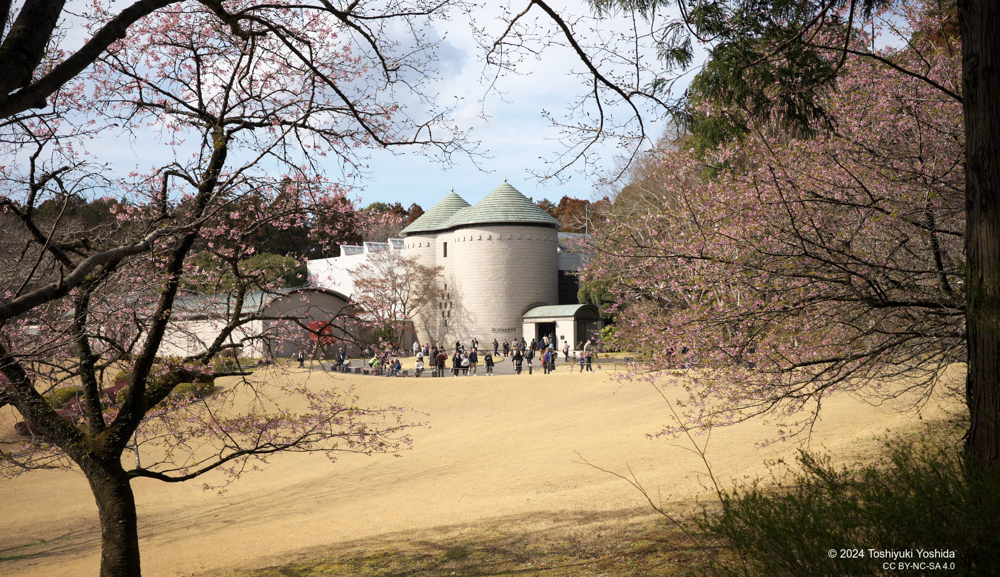

+++
title = "閉館予定のDIC川村記念美術館"
description = "今月一杯で閉館してしまう。千葉県佐倉市のDIC川村記念美術館に行ってってきました。"
date = 2025-03-18
aliases = ["/articles/2025/03/18/Karamura-musium"]

[taxonomies]
tags = ["Current Affairs","Art","Chiba"]
+++

年初から美術館のWeb Siteで次のようにアナウンスされていたので、
ある程度は混んでいるのは覚悟していました。

<blockquote>
  庭園内にあるレストラン
  ベルヴェデーレは、2025年1月2日(木)より、各回80分の完全予約制となります。
  当館の周辺には飲食店がございません。庭園は一部を除き飲食が可能ですので、
  ゆっくりと過ごされたい方は、お弁当のご持参等もご検討いただけますと幸いです。
  <footer>
    - 川村美術館 お知らせ「来館者増加に伴う運営方法の変更について」
  </footer>
</blockquote>

しかし、見くびっていました。

平日なのに、ロビー前はバスを待つ人であふれ返り、ギフトショップの前には人が行
列を作り、館内もゆっくり絵を観賞するゆとりを失うくらいには人がいました。

17世紀のレンブラントによる肖像画、モネやルノワールら印象派から、
ピカソ、シャガールの西洋近代、アメリカの現代美術まで、と今回展示のコレクショ
ンはさすがに見ごたえがありました。

美術品もさることなが、約3万坪の広大な庭園が何度来ても素晴らしい。
冬に落葉する木が多いのですが、落葉し明るくなった森で見る青空と枝ぶりが
いっそう際立っていました。

この庭園は4月以降もしばらくは一般開放され、その後については佐倉市とDICで協議
するとのこと。次は桜の開花の頃に来てみようかな。
