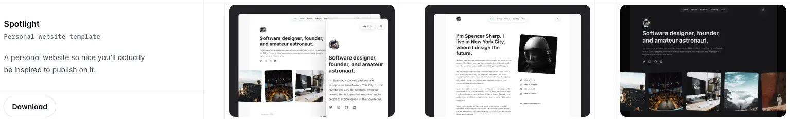

+++
title = "エンジニア的ブログ再構築 : Next.js × Tailwind Plusで得る柔軟性"
description = "Micro.blogを利用したブログを運用していましたが、Next.js + Tailwind Plus(旧Tailwind UI)を使ってエンジニアから見て柔軟なブログを再構築してみました。"
date = 2025-03-17
aliases = ["/articles/2025/03/17/NextJS-TailwindUI-blog"]

[taxonomies]
tags = ["Tech","Web","Weblog"]
+++

## Micro.blogから移行

"[Indie Microblogging](https://book.micro.blog/)"というコンセプトに共感し、
X.com のようなプラットフォームに依存せず
長文の記事だけでなくマイクロブログも可能な Micro.blog
を昨年から利用していました。
気軽なつぶやきと長文記事を同じプラットフォームで書けて、
Micro.blog のコミュニティーで海外のユーザーとのコミュニケーションも楽しくはありました。

しかし、半年くらい使ってみると次のような点で不満を持ちました。

- 長文記事とつぶやきが混在するので、読みづらい。そのためテーマをカスタマイズ
  して両者を分離したくなるが、よく考えると本末転倒でないかと思い始めた。Micro.blog 自体も
  長文を意識した Summery 欄を追加したり Longform にフォーカスしたテーマが人気だったり、
  コンセプトがブレてきていると感じてしまった。
- やはり、Compose 画面が長文には向いておらず、エディタで編集して切り貼りすることが多
  く非効率。海外ユーザーは MarsEdit を使っているユーザーが多いようだが、
  リッチテキストを好きになれない。
- Micro.blog は独自の機能とプラグインとして提供されているテーマ、バックエンドで Hugo
  で構成されており、それぞれの依存からカスタマイズ時の制約が大きく独自のノウハ
  ウが必要となる。

## モダンな技術スタックでブログ

先日に遊びで Next.js + Tailwind CSS で Portfolio サイトを作りましたが、
CMS のような制約がなく、コードで部品を書いていける体験が
楽しかったのでブログも同じような技術スタックで構成することにしました。

Next.js ベースでのブログの Starter Kit のようなものはいくつか存在しますが、
興味から有償の Tailwind Plus を購入したので、Tailwind Plus が提供する個人向け
Blog の"Spotlight"という**Template**をベースにカスタマイズしました。



Tailwind Plus の Template は、完全に動作する React ベースのアプリケーションコード
で、Javascript 版と TypeScript 版が提供されており、Tailwind CSS を利用した UI 要素
だけでなく状態管理やルーティング、API との連携など本番環境ですぐに使用でき
る機能を全て含んでいます。next-themes を利用したダークモード対応や PrismJS を
使った Syntax Highlight、レスポンシブ対応、画像最適化やコンポーネントのプリ
ロードなどは最初から組み込まれています。開発者はこれらのテンプレートを導入す
るだけで、最小限のカスタマイズで完全な機能を持つ React アプリケーションを短時
間で構築できると謳われています。

しかし、実際にブログで運用にはそこそこカスタマイズが必要でした。

主なカスタマイズポイントとしては以下のような点です。

- **UI/UXの改善**：個人用のブログに合わせヘッダー、フッターのカスタマイズ
- **記事管理システム**：App Router の構造を活かしたシンプルな MDX ベースの記事管理
- **記事一覧フィルター**: 日付でのフィルター機能を追加(デフォルトではページ
  制御されていないため)
- **コメントシステム**：Giscus を使用した GitHub ベースのコメント機能

通常であれば、gray-matter や remark などを入れてヘッドレス CMS などから Markdown 記事を取り込み
動的ルーティングで記事を生成するのが美しいのでしょうが、
「そのまま MDX で書けばいいか」と割り切って App Router の下に記事を書いていくスタイルにしました。
記事の執筆とサイトのコーディングの区別がつかない今のスタイルは不便もありますが、
気に入っています。HMR[^1]機能で特に工夫もせずに更新した記事がテスト環境でリアルタイムに
反映されブラウザで確認できる点も気に入っています。

[^1]:
    HMR (Hot Module Replacement)アプリケーション実行中にコードが変更された
    時、ページ全体をリロードせずに変更されたモジュールのみを動的に置き換える
    技術。Webpack などのバンドラーがファイル変更を監視し、ウェブソケット接続を通じて変更部分だけをブラウザに送信するため、アプリケーションの状態を保持したまま即座に変更が反映される。

まだ記事の移行も終わっていませんし、元のテンプレートからそのまま未修正のもの
もありますが、ぼちぼちと修正していこうと思います。

Deploy 先は、AWS の**Amazon Amplify**としました。ゆくゆくメールフォームなども作っ
ていきたいと思います。

## カスタムコンポーネントの活用

Next.js と Tailwind UI の大きな魅力の 1 つは、カスタムコンポーネントを簡単に作成
して再利用できる点です。従来の CMS であればプラグインやテンプレートの変更とな
り気軽にできませんが、今のスタイルであれば Typescript でコードを書けばすぐに利
用できます。コードなので Claude Code などの AI 支援も活用できます。

例えば、ブログ記事の中でレストランやショップの情報を
綺麗に表示するためのコンポーネントを作成しました。

```tsx
// src/components/ShopInfo.tsx
interface ShopInfoProps {
  name: string;
  address: string;
  osmAddress: string;
  phone: string;
  closedDays: string;
  website?: string;
}

export function ShopInfo({
  name,
  address,
  osmAddress,
  phone,
  closedDays,
  website,
}: ShopInfoProps) {
  // コンポーネントの実装...
}
```

このコンポーネントを使用すると、以下のように店舗情報を簡単に表示できます。

| 項目         | 内容                                                                                                       |
| ------------ | ---------------------------------------------------------------------------------------------------------- |
| 店名         | スターバックスコーヒー 学園都市キャンパススクェア店                                                        |
| 住所         | 兵庫県 神戸市西区 学園西町1-4 キャンパススクェア                                                           |
| 地図         | [OpenStreetMap](https://www.openstreetmap.org/?mlat=34.683006&mlon=135.057619#map=17/34.683006/135.057619) |
| 電話         | 078-798-7613                                                                                               |
| 定休日       | 不定休                                                                                                     |
| ウェブサイト | <https://store.starbucks.co.jp/detail-1718/>                                                               |

レストランやカフェだけでなく、様々な店舗情報を表示できます。

このようなコンポーネントは、情報を構造化して表示するだけでなく、スタイリングの一貫性を保ち、コードの再利用性を高めるメリットがあります。MDX の中で React コンポーネントをシームレスに使用できるのは、このブログシステムの大きな魅力の 1 つです。

## まとめ

Micro.blog から Next.js × Tailwind Plus × Amazon Apmplify(AWS)へのブログ移行は、
モダンな Web 技術スタックを活用するという点で非常に満足のいく選択でした。

新しいプラットフォームでは、以下のようなメリットを実感しています。

- **開発の柔軟性**: フロントエンドとして React ベースの Next.js を使うことで、好きなようにカスタマイズできる自由度を得られた
- **執筆体験の向上**: MDX を使うことで、マークダウンの手軽さと React コンポーネントの柔軟性を両立できる
- **パフォーマンス**: 静的生成とエッジでのレンダリングにより、高速なページ読み込みを実現できた
- **学習機会**: 実際のプロジェクトを通じて最新の Web フロントエンド技術を深く学べる点も大きな魅力

もちろん、まだ改善点もあります。コンテンツの移行や検索機能の実装、SEO 対策など、今後も少しずつアップデートしていく予定です。自分のペースで改良していける点が、自前のプラットフォームの最大の魅力だと感じています。

Next.js と Tailwind Plus の組み合わせは、Web アプリケーション構築だけでなく
個人ブログの構築においても非常に強力なツールセットになっていると実感しています。
興味がある方はぜひ試してみることをおすすめします。
