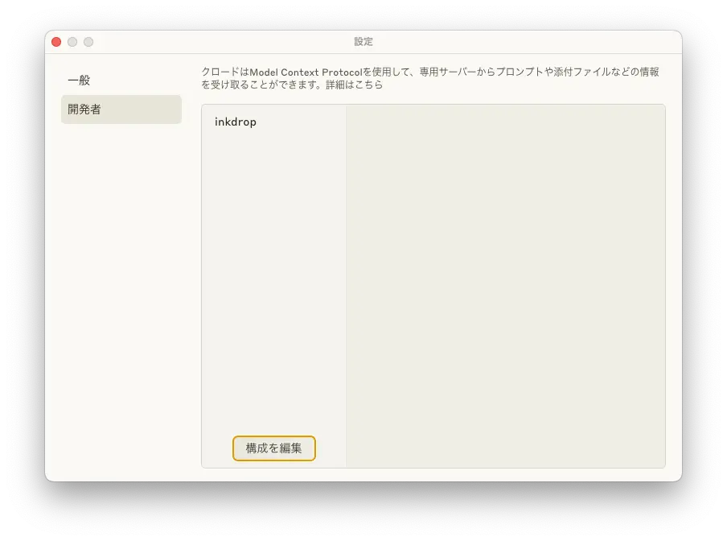
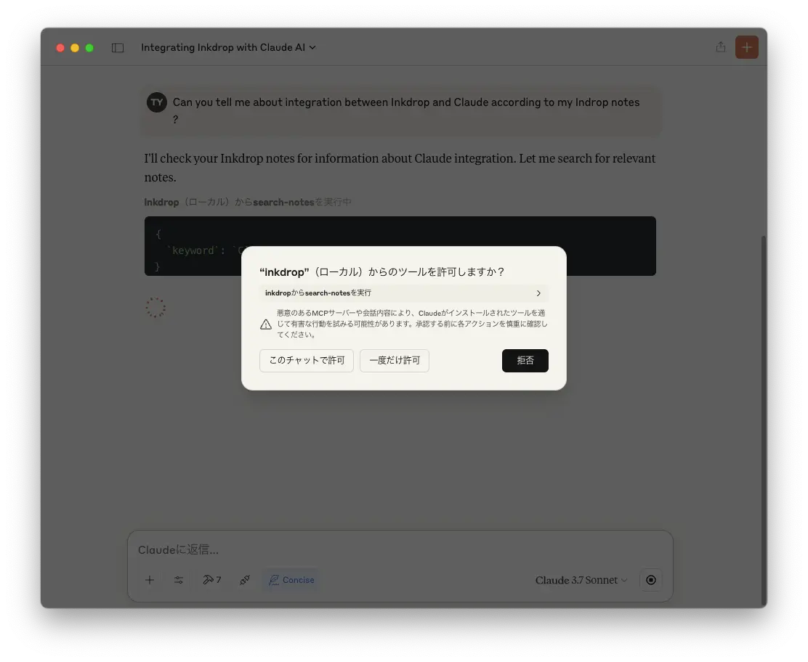
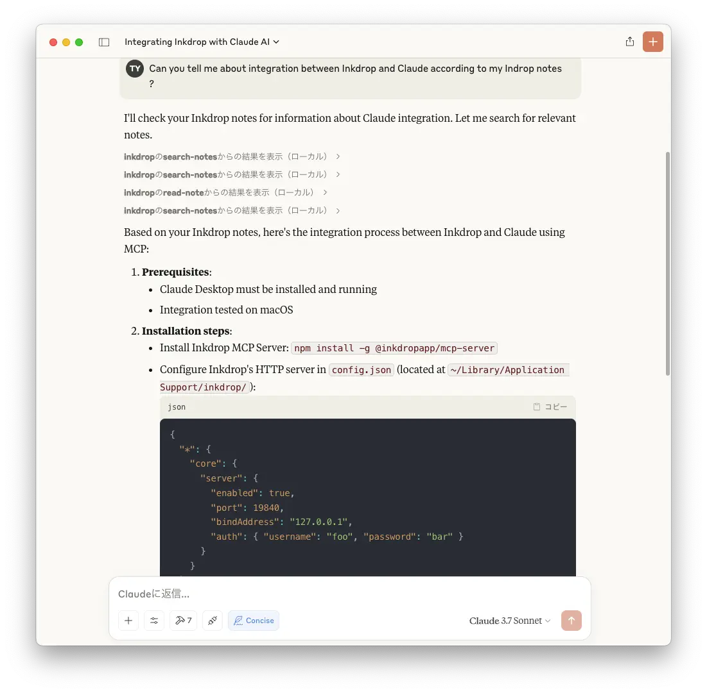

+++
title = "InkdropとClaudeのMCP統合"
description = "Inkdropの作者の方が、InkdropとClaudeのMCP統合についてYoutubeを上げていたので、早速検証しましたが、自分の書きためたKnowledgeをClaudeで活用できることがこんなに便利かと驚きました。"
date = 2025-03-28
aliases = ["/articles/2025/03/28/claude-integration-with-inkdrop"]
+++

作者の方の記事「
[Integrating my note app with Claude's MCP](https://www.devas.life/integrating-my-note-app-with-claudes-mcp/)
」と[YouTube](https://www.youtube.com/watch?v=ou4BYmY8Dq0&t=116s&themeRefresh=1)
を参考にしながら、実際に macOS で検証してみました。前提として Claude Desktop が稼働している必要が
あります。
元記事が英語なので日本語でまとめてみました。

<!-- toc -->

## メリットとユースケース

実施するまえに、Inkdrop と Claude が統合すると何がうれしいのでしょう？

MCP 統合により、Claude が Inkdrop のノートに直接アクセスし検索・作成・更新が可能となります。
これにより、次のようなメリットがあります。

- Claude がユーザーの書きためた複数ノートの知見を横断的に分析・活用できる
- Inkdrop の Note 管理作業を自動化し効率化できる

例えば考えられるユースケースは、次のようなものです。

- **パーソナル知識アシスタント**
  - 技術メモや学習ノートが蓄積された Inkdrop で「JavaScript の Promise について教えて」と質問すると、
    Claude はあなたの過去のノートから関連情報を抽出し、あなた自身の理解や用語に合わせた説明を提供。
    さらに「これをプロジェクト X に適用するには？」と質問すると、プロジェクト X のノートも参照しながら具体的な実装アドバイスを返せる。
- **スマートな情報整理と要約**
  - 「先月の週次会議ノートを要約して月次報告として重要なアクションアイテムを抽出し、新しいノートにまとめて」と指示すると、
    Claude は該当期間の会議ノートを検索・分析し、重要ポイントとアクションアイテムを抽出した新規ノートを自動生成。
    定期的なレビューや進捗管理が効率化される。

## インストール手順

まず [Inkdrop MCP Server](https://github.com/inkdropapp/mcp-server?tab=readme-ov-file)をインストールします。

```bash
npm install -g @inkdropapp/mcp-server
```

次に Inkdrop 内の HTTP Server をセットアップのために、`config.json`を修正します。

Mac の場合は`~/Library/Application Support/inkdrop/` です。

Inkdrop を修了させて、既存の設定を壊さないように次の設定を追加します。`username`と`password`の設定は例なので、ちゃんと書き換えましょう。

```json
{
  "*": {
    "core": {
      "server": {
        "enabled": true,
        "port": 19840,
        "bindAddress": "127.0.0.1",
        "auth": { "username": "foo", "password": "bar" }
      }
    }
  }
}
```

設定したら、Inkdrop を起動し次のコマンドで確認できます。

```bash
curl -v -u foo:bar http://localhost:19840/
# -> {"version":"5.10.0","ok":true}
```

`{"version":"5.10.0","ok":true}`と表示されれば OK です。

次に Cladue Desktop の設定が必要ですが、Claude がどうもシェルに`bash`が使用されていることを前提としているため、
「[Integrating my note app with Claude's MCP](https://www.devas.life/integrating-my-note-app-with-claudes-mcp/)」の記事通りに設定しても動作しませんでした。

シェルの問題を回避するため、直接`npx`で実行するのでなく、シェルを指定したシェルスクリプトを作成しそれを実行させるように修正しました。
以下は`~/bin/inkdrop-mcp`などの名前で作成してください[^2]。

[^2]:
    シェルスクリプトを作成するのでなく、Claude での指定で、npx をフルパスで
    指定する方法もあります。お好みで。

```bash
#!/usr/bin/env fish
# fish版のMCPスクリプト
npx -y @inkdropapp/mcp-server
```

1 行目の`fish`の部分は自身の環境に合わせて修正してください。

実行権限をつけておきます。

```bash
chmod +x ~/bin/inkdrop-mcp
```

## Claude Desktopの設定

設定した Inkdrop のサーバーの設定を Claude Desktop に追加します。Claude Desktop の設定画面を開くと下記のようになっています。




この画面で「構成を編集」というボタンを押すと、Finder が起動して設定ファイルを示してくれます。このボタンを押さなくても、ターミナルから`~/Library/Application
Support/Claude/claude_desktop_config.json`を開いて編集しても大丈夫です。

次のような設定を追加します。`command`の設定は先ほど作成したシェルスクリプトを絶対パスで指定します。

```json
{
  "mcpServers": {
    "inkdrop": {
      "command": "/Users/foo/bin/inkdrop-mcp",
      "args": [],
      "env": {
        "INKDROP_LOCAL_SERVER_URL": "http://localhost:19840",
        "INKDROP_LOCAL_USERNAME": "foo",
        "INKDROP_LOCAL_PASSWORD": "bar"
      }
    }
  }
}
```

編集後、Claude Desktop を再起動して設定画面を確認すると。`inkdrop`という設定が追加されているはずです。

## Inkdrop/Claude統合を試してみる

### MCP統合で何ができるか？

MCP 統合で何ができるかは、[inkdrop/mcp-server](https://github.com/inkdropapp/mcp-server?ref=devas.life#)の README.md を見ると何となく分かってきます。

<Subheading>Inkdrop MCPサーバーのComponents</Subheading>
<dl>
  <dt>`read-note`</dt>
  <dd>Noteの参照</dd>
  <dt>`search-notes`</dt>
  <dd>キーワードでのNoteの検索</dd>
  <dt>`list-notes`</dt>
  <dd> Notebookを指定してのNoteのリスト</dd>
  <dt>`create-note`</dt>{" "}
  <dd>Noteの作成 </dd>
  <dt>`update-note`</dt>{" "}
  <dd>既存の Noteの更新 </dd>
  <dt>`list-notebooks`</dt>{" "}
  <dd>Notebookのリスト </dd>
  <dt>`list-tags`</dt>{" "}
  <dd>タグのリスト </dd>
</dl>

### 実際に試してみる

この記事は Inkdrop でドラフトを執筆していますが、ここまで書いた時点で Claude に Inkdrop/Claude 統合の方法を聞いてみました。
敢えて英語で聞いてみました。途中 MCP の使用を許可するかというダイアログが出てくるので、「このチャットで許可」を押します。




何度かダイアログが表示されますが、同様に許可していくと次のように表示されました。英語ですが、きちんとまとめられてます。




## まとめ

Inkdrop 内の自身のドキュメントが Claude で活用できるのは思った以上に便利ですし、
Inkdrop に知見をまとめていく行為もより価値を出せるようになります。

プロジェクトで Claude Code を利用すると、プロジェクト内のコードを Claude Code が
見渡してくれるので生産性が飛躍的に向上しますが、同じことをドキュメンテーショ
ンでも Inkdrop との組み合わせで実現できます。

実際この記事の「メリットとユースケース」の章は Claude にドラフトさせて、
Inkdrop に追記させたものをもとに微調整しただけです。

しかも Claude Code はものすごい勢いで Anthoropic の API の課金を消費していきます
が、こちらは Claude Desktop を利用するので Pro プランを使っていれば特にそれ以上
費用は必要ありません。

Claude 周りは最近楽しいな。
