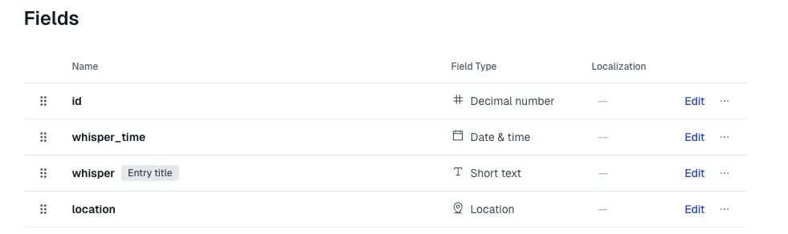
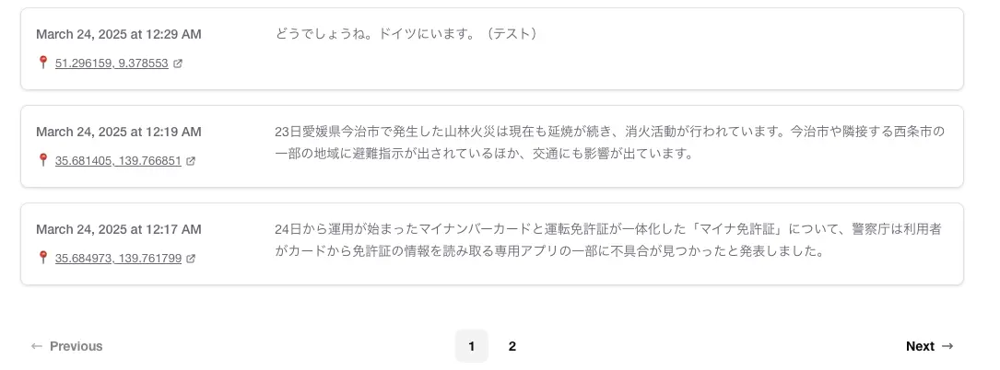

+++
title = "ヘッドレスCMS Contentfulを活用したつぶやき機能の実装"
description = "このブログでは直接App Router配下に記事を書いていますが、ヘッドレスCMSを使うことも検討して諦めました。今回、ライトにつぶやき程度であればできそうかなとContentfulを使って実装してみました。"
date = 2025-03-24
aliases = ["/articles/2025/03/24/contentful"]

[taxonomies]
tags = ["Tech","Web"]
+++

## Contentfulとは

[Contentful](https://www.contentful.com/)は、ヘッドレスCMSのひとつで、コンテンツ管理とAPI配信に特化したサー
ビスです。ウェブサイトやアプリ向けのコンテンツを一元管理し、RESTful APIや
GraphQL APIを通じて、あらゆるデバイスやプラットフォームに配信できます。

構造化されたコンテンツモデルを定義でき、マークダウンやリッチテキストエディタを備
え、多言語対応も可能です。開発者はフロントエンドを自由に構築でき、コンテンツ
編集者は直感的なインターフェースでコンテンツを管理できます。

## 「つぶやき」機能を作ってみる

ブログにContentfulを使って「つぶやき」機能をつけてみましょう。

「つぶやき」コンテンツ自体はContentfulで管理します。
今回つぶやき投稿についてはContentfulのデフォルトのエディタを使用し、
特にコンテンツ作成用のアプリを作成しないことにします。

このブログの「つぶやき機能」ではContentfulからRESTful APIを使って読み出し、
時系列で表示するものとします。Paginationも入れましょう。

以下が実現イメージです。

## ContentfulでのContent Modelの定義

ContentfulではまずSpaceを作ることになりますが、今回は無料枠を利用する予定な
ので、デフォルトのSpace `Blank`を使います。

次に**Content Model**を作成します。今回は `whisper`と名付けました。
シンプルに以下のようにしました。idは現時点では不要ですが、将来編集アプリを作
る時に備えて一応用意しました。



| Name         | Field ID    | Attribute   | Unique |
| ------------ | ----------- | ----------- | ------ |
| id           | id          | Decimal     | Y      |
| whisper_time | whisperTime | Date & time | N      |
| whisper      | whisper     | Short text  |        |
| location     | location    | Location    |        |

## Contentfulからのつぶやきの読み出し

Contentfulからのコンテンツの読み出しには、ContentfulのSDKを使用しています。

基本的な読み出しは以下のようなコードになります。

```typescript
const contentful = require("contentful");

const client = contentful.createClient({
  space: "@@@@@@@",
  environment: "master", // defaults to 'master' if not set
  accessToken: "@@@@@@@@@@@@@@@@@@@@@@@@@@@@@@@@@@@@@@@@@@@@@@@@@@@@",
});

client
  .getEntry("@@@@@@@@@@@@@@@@@@@@@@@@")
  .then((entry) => console.log(entry))
  .catch(console.error);
```

実際には
`space`,
`environment`,`accessToken`などは、Amplifyのビルド設定で `.env`に書き込んで
環境変数から読み出しています。

Paginationについては、まず10個を上限で読み出し改ページの際にレコードの開始位置を変更して実現しています。
当初はISR [^2] で実装しましたが、Contentfulとうまく連携できずWebhookでの実装も試しました。
しかし、いずれも思ったように動作しなかったりサーバーの負荷も高いため、
クライアントコンポーネントとしてクライアント側でカーソルを管理しページ制御を
実装しました。

[^2]:
    Incremental Static Regenerationの略。増分静的再生成とも言われ、静的生
    成（SSG）の拡張機能。事前にビルド済みの静的ページを提供しながら、revalidateパラメータにより再検証間隔を設定し
    バックグラウンドで定期的に再生成する機能。

## Whisper実現イメージ

このブログに「**Whisper**」というメニューを配置し、つぶやきを表示するように
しました。以下のようなイメージです。

Locationは緯度・軽度が記録されているので、緯度経度の表示とともに
Open Street Mapへのリンクも埋め込みました。

<figure>
  
  <figcaption>Whisper 実現イメージ</figcaption>
</figure>

## まとめ

今回は非常に簡単な実装でしたが、Paginationの部分でAmplifyとの互換性の問題で
苦労しました。Contentfulを使うとコンテンツ管理はContentfulに任せてしまえる
ヘッドレスCMSのメリットは体感できました。

次のようなメリットがあります。

1. **フロントエンドの自由度**：表示を司るフロントエンドとコンテンツ管理が分離されているため、任意の技術スタックでフロントエンドを構築可能
2. **オムニチャネル対応**：一度作成したコンテンツをウェブ、モバイル、IoTなど複数のプラットフォームに配信可能
3. **開発の効率化**：フロントエンドとバックエンドの開発を並行して進められる
4. **パフォーマンス向上**：静的サイト生成やCDN配信との相性が良く、高速なサイト表示が可能
5. **スケーラビリティ**：トラフィック増加にも柔軟に対応できる
6. **セキュリティ強化**：管理画面とフロントエンドが分離されているため攻撃対象が減少
7. **将来性**：新しいデバイスやプラットフォームにもフロントエンドだけ独立し
   ているため柔軟に対応できる

今回作成したWhisper機能は大した意味がありませんが、
将来的につぶやき投稿機能も別途作ろうかなと思います。
