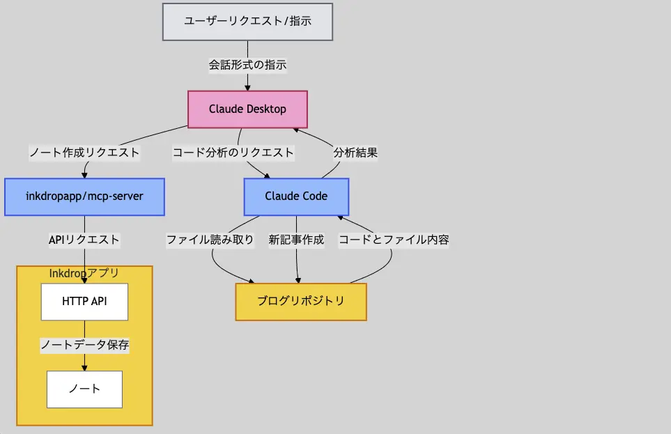

+++
title = "Claude CodeをMCPサーバーとして利用する利点"
description = "前回はInkdropとClaudeのMCP統合について紹介しましたが、今回はClaude Codeを MCPサーバーとして活用する方法とそのメリットについて解説します。 開発者にとって、Claude CodeとInkdropの組み合わせがどのように効率的な 知識管理と開発プロセスの向上につながるかを探ります。"
date = 2025-03-29
aliases = ["/articles/2025/03/29/mcp-integration-of-claude-code-inkdrop"]
+++

[前回の記事](/articles/2025/03/28/claude-integration-with-inkdrop)では、 Inkdrop と Claude Desktop の統合について紹介しました。今回は一歩進んで、Claude Code を MCP サーバーとして活用する方法とそのメリットについて詳しく解説します。

<!-- toc -->

## MCP ServerにもなれるClade Code

Claude Code を頻繁に活用することで Anthropic への支払いコストが増加していますが、一度使い始めるとコーディング作業では手放せなくなりつつあります。

その Claude Code ですが、MCP Client になれるとは知っていましたが、
[公式ドキュメント](https://docs.anthropic.com/en/docs/agents-and-tools/claude-code/)を読んでいて MCP Server にもなれるというチュートリアルを発見しました。

次のコマンドで MCP Server として起動できます。

```bash
claude mcp serve
```

## Claude DesktopにClaude CodeをMCP Serverとして登録

[Inkdropと同様](/articles/2025/03/28/claude-integration-with-inkdrop)に、Claude Desktop に
Claude Code を MCP Server として登録します。

また、`bash`の問題が起きそうだったので、例のごとくシェルスクリプトで Wrap し`~/bin/claude-code-mcp`というファイル名で配置し実行権限を付けした。

```bash
#!/usr/bin/env fish
claude mcp serve
```

作成したスクリプトを指定して、Claude Desktop の設定ファイル `~/Library/Application Support/Claude/claude_desktop_config.json`に追加します。

```json
{
  "mcpServers": {
    "inkdrop": {
      "command": "/Users/foo/bin/inkdrop-mcp",
      "args": [],
      "env": {
        "INKDROP_LOCAL_SERVER_URL": "http://localhost:19840",
        "INKDROP_LOCAL_USERNAME": "foo",
        "INKDROP_LOCAL_PASSWORD": "bar"
      }
    },
    "claude_code": {
      "command": "/Users/foo/bin/claude-code-mcp",
      "args": [],
      "env": {}
    }
  }
}
```

## Claude DesktopからClaude Codeにコード分析を依頼

Claude Code を Claude Desktop に正常に接続できたことを確認したので、次のステップとして実際にこのブログサイトのコードの分析を依頼してみます。

1. Claude Desktop のチャットインターフェースで、Claude Code にアクセスするためのプロンプトを入力
2. 分析したいプロジェクトのパスを明示的に指定
3. フォルダ階層の確認を依頼

初回実行時には、Claude Code がファイルシステムにアクセスするための許可を求めるプロンプトが数回表示されました。これは、セキュリティ上の理由から必要な確認プロセスです。許可を与えると、Claude Code は指定されたプロジェクトフォルダにアクセスし、次のよう分析しました。

```txt
私：claude_code内の~/ghq/github.com/foo/blog-source
    のプロジェクトにアクセスできますか？
    また、プロジェクト内のフォルダ階層はどうなっていますか？

/Users/foo/ghq/github.com/foo/blog-sourceにアクセスできました。
これはパーソナルブログのソースコードです。

ブログの主な特徴：

Next.js 15, React 19, TypeScript, Tailwind CSSで構築
MDXサポートで記事を書いている
レスポンシブデザイン
ダークモード対応
RSS、コードシンタックスハイライト、Giscusコメントシステム、
ソーシャルリンク、SoundCloudの埋め込み、Whisper機能、目次機能など

サイト設定では「Coded Chords」という名前のブログで、
著者は「Toshiyuki Yoshida」です。
(以下、省略)
```

## Claude Desktop/Claude Code/InkdropのMCP統合

Claude Desktop には Inkdrop も MCP Server として登録されているので、コード解析結果を Inkdrop に記録させることもできます。

次のように Claude Desktop で依頼してみました。

```txt
では、プロジェクト概要とプロジェクトのフォルダ構成について、
第三者が理解しやすいようサマリーを inkdrop内のNotebook Inboxに
「ブログの概要」というタイトルで作成してください。
なお、形式はMarkdownを使用してください。
```

結果、Claude Code から取得し分析した結果、Markdown 形式で Inkdrop の Note としてドキュメント化してくれました。

作成された結果を[公開](https://e.pcloud.link/publink/show?code=XZiJhdZ3UkXV7lTN8knDkuquFjN147NvQ0y)しておきます。

プロジェクト概要は`README.md`から読み取ったようですが、特筆すべきは、フォルダ構成や各ディレクトリの役割、記事管理の仕組みまで正確に把握・文書化している点です。

仕組みとしては全体像をダイアグラムにしてみました。次の通りです。

{
//`mermaid
//flowchart TB
//    UserReq[ユーザーリクエスト/指示]
//    CD[Claude Desktop]
//    CC[Claude Code]
//    BlogRepo[ブログリポジトリ]
//    InkdropMCP[inkdropapp/mcp-server]
//
//    subgraph Inkdrop[Inkdropアプリ]
//        API[HTTP API]
//        Notes[ノート]
//    end
//
//    %% 通常フロー
//    UserReq -->|会話形式の指示| CD
//    CD -->|コード分析のリクエスト| CC
//    CC -->|ファイル読み取り| BlogRepo
//    BlogRepo -->|コードとファイル内容| CC
//    CC -->|分析結果| CD
//
//    %% ファイル操作フロー
//    CC -->|新記事作成| BlogRepo
//
//    %% Inkdrop連携フロー
//    CD -->|ノート作成リクエスト| InkdropMCP
//    InkdropMCP -->|APIリクエスト| API
//    API -->|ノートデータ保存| Notes
//
//    %% スタイル
//    classDef claudeDesktop fill:#f9a8d4,stroke:#be185d,stroke-width:2px
//    classDef claudeCode fill:#93c5fd,stroke:#2563eb,stroke-width:2px
//    classDef inkdropCompo fill:#ffffff,stroke:#6b7280,stroke-width:1px
//    classDef repository fill:#fcd34d,stroke:#d97706,stroke-width:2px
//    classDef mcpServer fill:#93c5fd,stroke:#2563eb,stroke-width:2px
//    classDef other fill:#e5e7eb,stroke:#6b7280,stroke-width:2px
//
//    class CD claudeDesktop
//    class CC,InkdropMCP claudeCode
//    class API,Notes inkdropCompo
//    class Inkdrop,BlogRepo repository
//    class UserReq other
//`
}




便利です。

開発プロジェクトのドキュメンテーションや`README.md`の作成など、次のようなワークフローにすると大変スマートに仕事が進みそうです。

1. Claude Desktop から Claude Code にリポジトリーからコード情報を収集し、そのコードを分析し Markdown 文書を生成し Inkdrop に Note 作成させる。
2. Inkdrop 上で Markdown 文書を Preview で確認し、必要に応じて編集する
3. Claude Desktop から Inkdrop 上の Note からドキュメントを収集し、Claude Code を通じてリポジトリーにドキュメントとして格納させる

## Claude Code MCP Server利用コスト

Claude Code を MCP Server として Claude Desktop から利用した際のコストを確認してみました。

Claude Code をコマンドラインから普通に使うと、MODEL として `claude-3-7-sonnet-20250219`が使用されています。
このため、多用しているとクレジットも大量に消費されていきます。
しかし、Claude Code を MCP Server として使うと、リクエストあるからと言って Claude Code から
MODEL を使用したリクエストが出るわけでも無さそうです。またリクエストが出たとしても、今のところ`claude-3-5-haiku-20241022`しか利用されていません。
Tailwind Plus で提供されるコードが大量に lint で引っかかるので修正を Claud
Destop 経由で行いましたが、同様 Claude Code からは`claude-3-5-haiku-20241022`を
利用するリクエストかでていませんでした。

Claude Code を MCP Server として利用する場合、提供されるツールは以下のとおりです。これらのうち、AgentTool 以外の大半は Claude Code 内部で処理が完結するため、高度な分析などは Claude Desktop 側から直接リクエストされると考えられます。

| Tool             | Description                                          | Permission Required |
| ---------------- | ---------------------------------------------------- | ------------------- |
| AgentTool        | Runs a sub-agent to handle complex, multi-step tasks | No                  |
| BashTool         | Executes shell commands in your environment          | Yes                 |
| GlobTool         | Finds files based on pattern matching                | No                  |
| GrepTool         | Searches for patterns in file contents               | No                  |
| LSTool           | Lists files and directories                          | No                  |
| FileReadTool     | Reads the contents of files                          | No                  |
| FileEditTool     | Makes targeted edits to specific files               | Yes                 |
| FileWriteTool    | Creates or overwrites files                          | Yes                 |
| NotebookReadTool | Reads and displays Jupyter notebook contents         | No                  |
| NotebookEditTool | Modifies Jupyter notebook cells                      | Yes                 |

(2025-03-31 追記)

その後、もう少し複雑な処理で確認しました。ソースを複雑に分析するような場合は、
Claude Code でのリクエストからも MODEL として `claude-3-7-sonnet-20250219`が使用されていました。

依頼した処理は次のようなものです。

> プロジェクトがOGP対応しているか、対応している場合はどのようなコンポーネントが関係しどのような仕様になっているか調査し、
> InkdropのNotebook blogに新たに Noteを作成して仕様書にしてください。仕様書に
> は静的モデルと動的モデルをMermaid でダイアグラム化してください。

Claude Desktop が Inkdrop に書き出した文書をそのまま PDF にしたものも[公開](https://e.pcloud.link/publink/show?code=XZiJhdZ3UkXV7lTN8knDkuquFjN147NvQ0y)しておき
ます。

## まとめ

Claude Code の MCP Server を利用する利点は 2 つです。

1 つは、Claude Code からのリクエスト発行を押さえ、Claude Desktop からのリクエストになることでの**コスト削減**が大きくできることです。
(2025-03-31 追記) 処理内容によっては Claude Code 側の処理でも Sonnet 3.7 が使用
されるため注意は必要です。

本来次のように Claude Desktop と Claude Code は使い分けるべきだと思います。

<dl>
  <dt>**Claude Code**</dt>
  <dd>
    - コマンドライン志向
    - ファイルシステムへの直接アクセス
    - コードリポジトリとの統合
    - 開発タスクに特化
  </dd>

  <dt>**Claude Desktop**</dt>
  <dd>
    - GUI ベースの使いやすさ
    - 会話形式のインターフェース
    - 画像認識機能
    - 一般的な質問応答に最適
  </dd>
</dl>

しかし、MCP 統合によりファイルシステムへの直接アクセス、コードリポジトリとの統合のメリットを
Claude Desktop からも享受できるようになります。Claude Desktop は月額固定料金なので、ユーザーには非常に恩恵があります。

2 つ目の利点は、**ワークフロー改善の可能性**です。
Claude Code と Inkdrop の統合のような仕組みは、開発者のワークフローを大幅に改善する可能性を秘めており、以下のような発展が期待できそうです。

1. **より高度なコンテキスト理解**:
   - コードとドキュメントの関係性をより深く理解
   - プロジェクト全体の知識グラフ構築
2. **自動ドキュメント更新**:
   - コード変更に基づく関連ドキュメントの自動更新
   - コメントとドキュメントの一貫性維持
3. **協調作業の強化**:
   - チームメンバー間の知識共有と協調作業の促進
   - コードレビューとドキュメントレビューの統合

この統合は特に、複雑なプロジェクトやドキュメント駆動開発を実践している開発者にとって大きなメリットをもたらします。知識の管理と活用、コード生成、ドキュメント作成の一連のプロセスがシームレスに繋がることで、開発プロセス全体の質と効率が向上するでしょう。
