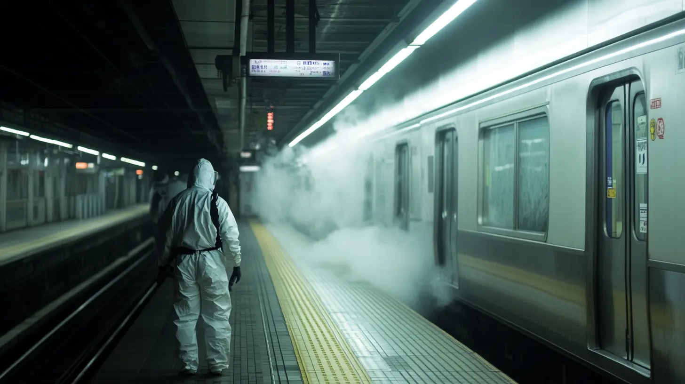

+++
title = "読了『地下鉄サリン事件はなぜ防げなかったのか』"
description = "本書は、オウム真理教が事件を起こした当時警察庁刑事局長として警察を率いていた垣見隆氏がオウム真理教事件の捜査全内幕を初めて証言したものです。"
date = 2025-03-26
aliases = ["/articles/2025/03/26/tokyo-subway-sarin-attack"]

[taxonomies]
tags = ["Books"]
+++

1995 年に発生した地下鉄サリン事件から 30 年を経て出版され、事件の背景や捜査の過
程を詳細に描いています。東京地裁が世界平和統一家庭連合（旧統一教会）に対して
解散命令を下したタイミングでタイムリーなので手に取りました。

<a href="https://hb.afl.rakuten.co.jp/hgc/1300574f.7d238558.13005750.4bcd8088/yomereba_main_202601292229111619?pc=http%3A%2F%2Fbooks.rakuten.co.jp%2Frb%2F18122328%2F%3Frafcid%3Dwsc_b_bs_1051722217600006323%3Fscid%3Daf_ich_link_urltxt%26m%3Dhttp%3A%2F%2Fm.rakuten.co.jp%2Fev%2Fbook%2F" target="_blank" >地下鉄サリン事件はなぜ防げなかったのか　元警察庁刑事局長　30年後の証言</a>
posted with <a href="https://yomereba.com" rel="nofollow" target="_blank">ヨメレバ</a>

垣見隆 朝日新聞出版 2025年02月07日頃    

<a href="https://hb.afl.rakuten.co.jp/hgc/1300574f.7d238558.13005750.4bcd8088/yomereba_main_202601292229111619?pc=http%3A%2F%2Fbooks.rakuten.co.jp%2Frb%2F18122328%2F%3Frafcid%3Dwsc_b_bs_1051722217600006323%3Fscid%3Daf_ich_link_urltxt%26m%3Dhttp%3A%2F%2Fm.rakuten.co.jp%2Fev%2Fbook%2F" target="_blank" >楽天ブックス</a>

<a href="https://www.amazon.co.jp/exec/obidos/asin/4022520310/yostosweb-22/" target="_blank" >Amazon</a>

<a href="https://www.amazon.co.jp/gp/search?keywords=%E5%9C%B0%E4%B8%8B%E9%89%84%E3%82%B5%E3%83%AA%E3%83%B3%E4%BA%8B%E4%BB%B6%E3%81%AF%E3%81%AA%E3%81%9C%E9%98%B2%E3%81%92%E3%81%AA%E3%81%8B%E3%81%A3%E3%81%9F%E3%81%AE%E3%81%8B%E3%80%80%E5%85%83%E8%AD%A6%E5%AF%9F%E5%BA%81%E5%88%91%E4%BA%8B%E5%B1%80%E9%95%B7%E3%80%8030%E5%B9%B4%E5%BE%8C%E3%81%AE%E8%A8%BC%E8%A8%80&__mk_ja_JP=%83J%83%5E%83J%83i&url=node%3D2275256051&tag=yostosweb-22" target="_blank" >Kindle</a>
                                           

## オウム真理教について

坂本弁護士一家殺害事件が 1989 年で、当時直後から一家の行方不明事件に関係していると、オウム真理教がフォーカスされたと記憶しています。当時は統一教会、幸福の科学、オウム真理教など新興宗教が注目された時期でもありました。

1990 年にはオウム真理教は「真理党」を結成して、衆議院議員総選挙に 25 人が出馬し、象のような着ぐるみを着て選挙活動をしていたのを覚えています。全員落選しましたが。

今では考えられませんが、1991 年 9 月放送の「朝まで生テレビ」でオウム真理教と幸福の科学が出演し討論していたのが忘れられません。いろいろ問題になっていた両者ですが、オウム真理教は幹部だけでなく教祖の麻原彰晃まで出演していました。「幸福の科学に比べると、オウム真理教はずいぶんと宗教らしいな」との感想を持ったと思います。

1992 年から秋葉原でオウム真理教が運営するパソコンショップ「マハーポーシャ」も
記憶に残っています。当時 DOS/V マシンを手組みしていたので、マハーポーシャの
パーツの安さは衝撃的でした。怪しいと思いつつも買っていましたね。

松本サリン事件を当時オウム真理教と関連付けていたか分かりませんが、地下鉄サリン事件が発生した時、会社で出社できないメンバーをチェックしながら「これ、オウム真理教じゃね」と発生直後に話したのを覚えているので、それくらいの認識はあったと思います。

## 本書について

この垣見氏については、確かに「決断できない」「報復を恐れて閉じこもっている」などの記事を読んだ気がします。本書を読むと、そこまでの誹謗記事が出たのは警視庁筋からのリークかなと思いますが、事件直後に「オウムがやったな」と素人の私でも直感できる状況で、事件を防げなかった責任の一端はこの方にもあるのかと感じました。

しかし、都道府県をまたぐ、しかも宗教団体が関係した事件に対処する能力が、法整備も含めて欠如していたのもよく分かりました。まぁ、教団に敵対するものの殺害だけでなく、不特定多数に対するテロを実行していく宗教団体は歴史的に特異な団体だったのでしょう。

垣見氏の評価は私には分かりませんが、オウム真理教の逮捕劇直後に更迭され、その後退職を余儀なくされています。警察内のポリティカルな闘争で読んでいてもバカらしく感じますが、No.3 であった彼が責任を取るならば、他にも責任を取るべき人がいるだろうにとは思います。

## まとめ

オウム真理教以降、これらの事件を機に法整備され、昨日東京地裁が認めた旧統一教会への解散命令など、この法整備による成果とも言えるかもしれません。
しかし、長年にわたって全国で多くの問題を起こしてきた統一教会に対して、警察はほぼ何もできておらず、解散命令が出たのもこれらの問題でなく安倍元総理の暗殺事件がきっかけでやっとという状況です。オウム真理教の一連の事件での課題がそのまま持ち越されていることを改めて認識しました。
折角オウム真理教について書いたので、忘れないよう書いておきましょう。

- オウム真理教が坂本弁護士を襲ったのは、TBS の取材した坂本弁護士のビデオをオウム真理教幹部が見て、報告を聞いた麻原彰晃が殺害指令を出したことがきっかけ。
- TBS は明確な証拠が出てくるまで、「社内調査では、ビデオをオウム真理教に見せていない」と国会でも答弁していた。
- 結局証拠が出てきて、TBS は反省のため「ワイドショー」を一掃した。そこで生まれた番組が「はなまるマーケット」。

2015 年に「はなまるマーケット」の枠で、「白熱ライブ ビビット」で"ワイドショー"を復活させました。4 年半ほど放送していたと思いますが、ずっと低視聴率でした。

TBS の罪は忘れません。
