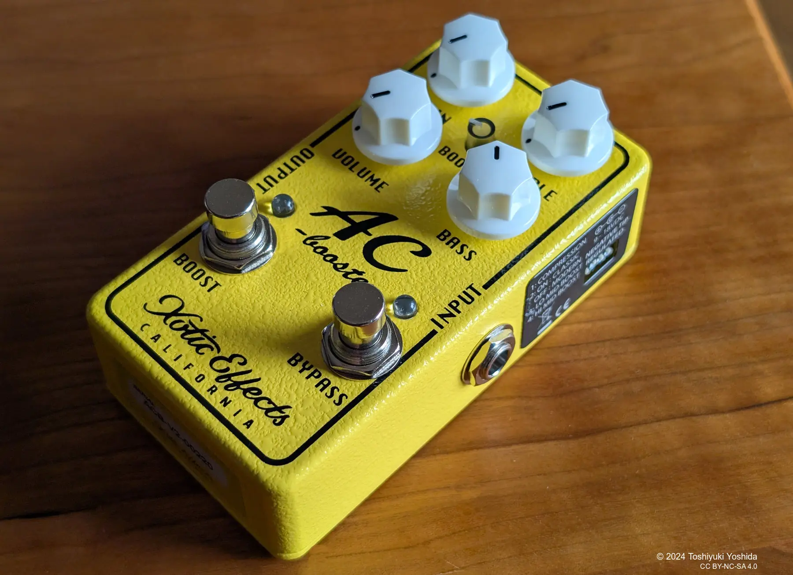

+++
title = "Xotic AC Booster V2レビュー"
description = "Xotic AC Booster V2が発表されましたが、発表前から予約し入手したので早速使ってみました。"
date = 2025-04-20
aliases = ["/articles/2025/04/20/ac-booster-v2"]
+++

## Xotic AC Boosterとは

Xotic の AC Booster は RC Booster や BB Preamp と並んで Xotic の３兄弟のような
イメージですが、何年か前に廃盤となっていました。

その名前からも想像できるように VOX AC30 Top Boost チャンネル回路を
イメージして設計されたようです。

Booster というより、ローゲインの Over Drive に近く、粒だった歪みで音圧感があり
輪郭のはっきりした音でした。サスティンも得られるため、伸びやかなリードに向い
ていました。

反面キャラクターがはっきりした音なので、BB Preamp ほど汎用性が高くなく
バッキングなどでは強すぎた印象です。

使い勝手が良く人気のペダルだったと思いますが、
廃盤になったのは AC Plus や AC comp など同じ **"AC"** という
名前を冠しているのに微妙にキャラクターの異なるペダルが発売されて
迷走したためでしょうか。

## Xotic AC Booster V2 の登場

今回発売されたのは、[AC Booster V2](https://amzn.to/42GiVp5)です。

途絶えていた AC Booster がバージョンアップして復活したわけですが、
主な違いは次の通りです。

- Boost スイッチがついて、RC Booster V2 と同様にさらにブーストを加えることが可
  能となった
- ペダル側面の DIP スイッチで細かなキャラクターの調整が可能
  - Compression ツイッチをオンにすると、6dB 上がりコンプレッション感が増
    す
  - Classic ツイッチにより、よりゲインの高いモードも使える
  - Lo Mid Boost ツイッチで、500Hz あたりを 6bB ブーストできる
  - Hi Mid boost スイッチで、2KHz あたりを 6dB ブーストできる

## Xotic AC Booster V2を弾いてみた

AC Booster V2 を使って弾いていました。
DIP ツイッチはデフォルトのままで Class Mode で、Gain は 2 時、
Boost スイッチは踏んで 9 時方向です。EQ は Treble が 1 時、Bass は 12 時です。

Simplifier MK-II から DI で直接 Mac に取り込み、リバーブとディレイは Logic Pro で
かけています。

<SoundCloudEmbed url="https://soundcloud.com/yostos/jumping-take-off?si=e65329aec0d140fa991c1fd046fe5ac7&utm_source=clipboard&utm_medium=text&utm_campaign=social_sharing" />

Distortion まで行かないけれど、ちょっと荒々しい歪みと適度なコンプレッション感
で弾いていて楽しいペダルです。

以下の動画に詳しい解説があり、とても良い音で鳴らしていて参考になります。

{{ youtube(id="ehqrZiQ-eXs") }}
