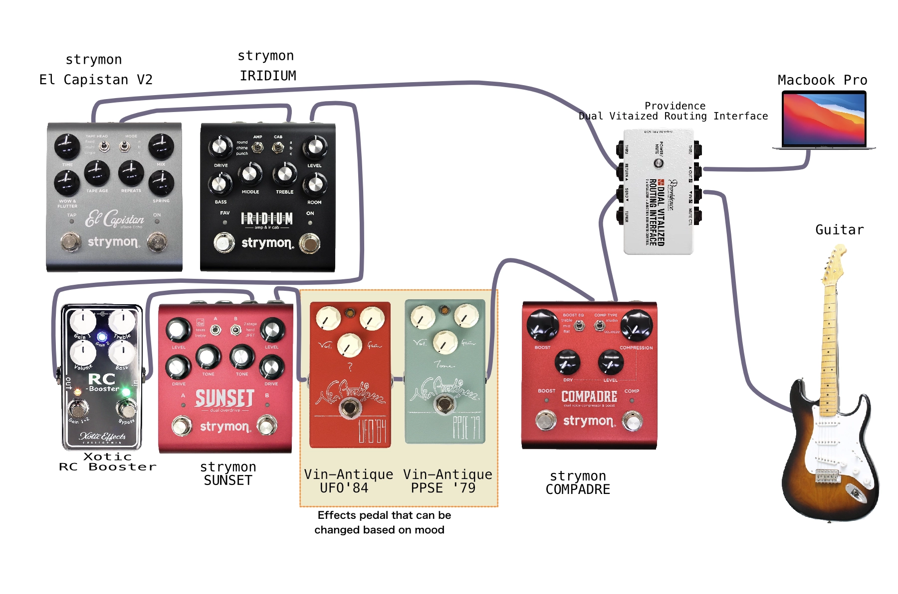
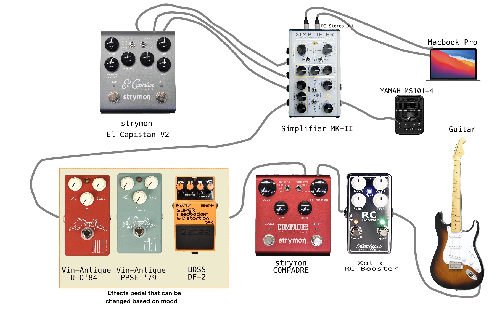

+++
title = "Beyond Distortion : Rethinking My Guitar Effects Chain"
description = "In pursuit of deeper amp-driven distortion, I recently upgraded from theStrymon Iridium to the Simplifier MK-II. This gear transition became theperfect opportunity to thoroughly revisit my long-neglected effects setup,beginning a journey of rediscovering sonic possibilities."
date = 2025-04-06
aliases = ["/articles/2025/04/06/beyond-distortion"]

[taxonomies]
tags = ["Guitar Pedals"]
+++

アンプの歪みをより深く追求するため、
先日Strymon Iridiumから新たにSimplifier MK-IIへの移行しました。
この機材更新を契機に長らく手つかずだったエフェクターセットアップ全体を
見直し始めました。

## 変更前

変更前の状態です。

<figure>
  
  <figcaption>変更前</figcaption>
</figure>

ProvidenceのVitalizer付のジャンクションボックスを利用していますが、
全体は直列接続です。
歪みは基本的にStrymon SunsetとIridiumで作っていました。
キレイな歪みなのですが、どこか自然ではない気がしていたので見直しました。

また全体でグランドループになってしまっているのも気になっていました。

## 変更後

Iridiumに替えて、[2月の記事](https://blog.yostos.org/articles/2025/02/11/simplifier-mk2)で
紹介したようアンプ部はフルアナログのSimplifier MK-IIを導入しています。

<figure>
  
  <figcaption>変更後</figcaption>
</figure>

- IridiumからSimplifier MK-IIに移行
  - 練習時はYAMAHAのスピーカーに出力
  - 録音時はDIステレオアウトからXLR接続としMOTU M2経由でMacに
  - El Capistan V2(ディレイ)はSEND/RETURNで接続。空間系はLogicPro内で掛けることが多いので、録音時は基本的にはオフ
- SUNSETは売却
  - Simplifier MK-IIのPreampとPower Amp ＋前段のオーバードライブとブースター
    で歪みは作る
- 出力をSimplifier MK-IIからXLR接続と変更したのに伴い、Providenceのジャンクションボ
  ックスを廃止
  - RC Boosterをバッファ替わりに前段へと変更。イコライザーの効きもよいので
    積極的に音作りで切るブースターとしても優秀

現時点ではこんなところです。「
[Biscayne Blue](https://blog.yostos.org/articles/2025/04/04/biscayne-blue)
」は、このシステムで使い弾きました。

悩んでいるのは次のような点です。

- クリーンやローゲインでSimplifier MK-IIは非常によい音が得られるが、
  ハイゲインでは歪みの粒が荒すぎて好みでないので、ハイゲインの歪みが欲しい
- しかし、RC Booster/Compadreにもブースト機能があり、ローゲインの歪みとの重複感がある。
  一方、多段でブーストできるからハイゲインの歪みは不要か
- 歪みはもう少し汎用性の高いもので、2個程度に絞った方がよいか
- いっそ歪み系の切り替えのためにスイッチャー入れるか

悩みは尽きず、エフェクターで悩む前に腕上げろって話ですが。
