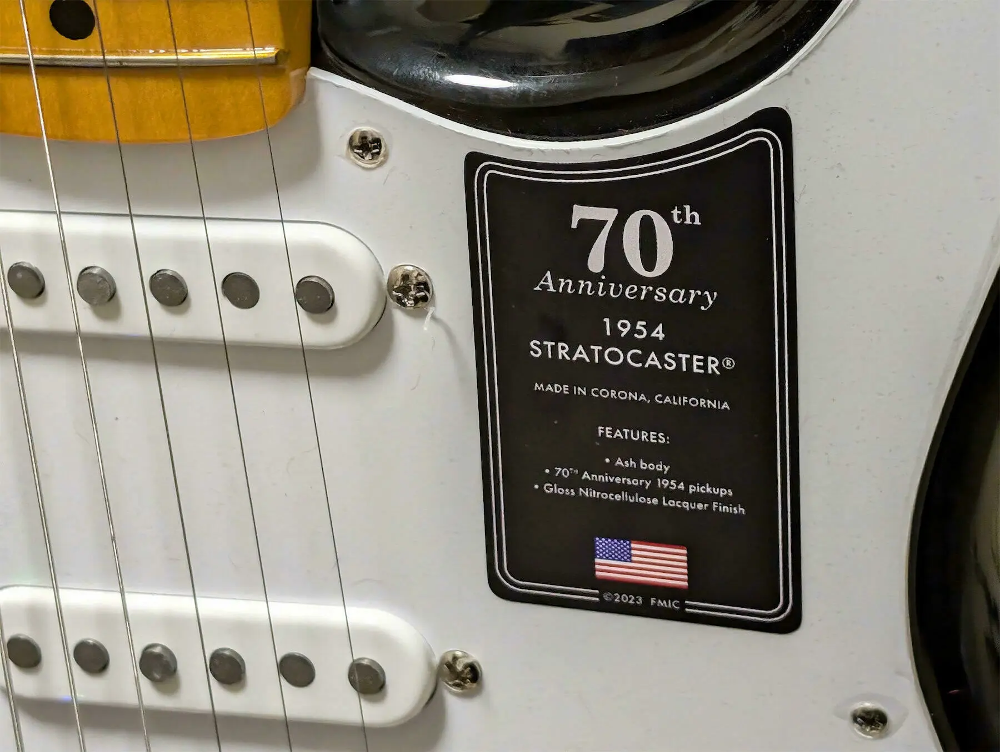

+++
title = "Fender 70th Anniversary American Vintage II 1954 Stratocaster"
description = "I always wanted an original Fender🎸 at least once in my life. And by purechance, I stumbled upon a 70th Anniversary American Vintage II 1954Stratocaster and it's only 3.5Kg  - an absolute gem. I sped off in mycar and bought it on the spot. Now, I'll let it sit for a while to cool off."
date = 2025-04-27
aliases = ["/articles/2025/04/27/stratocaster-1954"]

[taxonomies]
tags = ["Guitar"]
+++

I always wanted an original Fender🎸 at least once in my life. And by purechance, I stumbled upon a 70th Anniversary American Vintage II 1954Stratocaster and it's only 3.5Kg - an absolute gem. I sped off in mycar and bought it on the spot. Now, I'll let it sit for a while to cool off.

そう言えば、昨年購入したストラトを仕様を忘れそうなので残しておきましょう。

## 70周年記念モデル

ストラトキャスター誕生70周年記念モデルとして昨年発売されたモデルです。

American Vintage IIシリーズです。Fenderのラインナップの中でも伝統的な
位置づけを持つモデルです。
基本的に特定の年代のFenderギターを忠実に再現しようとする「レプリカ」
または「リイシュー」モデルです。

位置づけとしては、現代的な改良を加えたAmerican Professionalや、
カスタムショップのマスタービルダーによる高級な
Custom Shopモデルの間に位置するプレミアムモデルです。

メイプルネックなのはもちろんですが、
それだけでなく1954年当時のモデルを忠実に復刻してます。

- ピックアップカバーも当時のシェイプに変更
- ピックアップは当時のヴォイシングを再生するようにチューンされた70th
  Anniversary 18953 single-Coil Stratピックアップという専用品
- ボディはアッシュ材
- スイッチは三点式（ハーフトーンが面倒だが、一応五点式も付属している）
- バックプレートの穴も当時と同じく真円

細かい仕様は次の通りです。

<dl>
  <dt>BODY</dt>
  <dd>Ash</dd>
  <dt>FINISH</dt>
  <dd>Gloss Nitrocellulose Lacquer</dd>
  <dt>NECK</dt>
  <dd>1-Piece Maple</dd>
  <dt>NECK SHAPE</dt>
  <dd>1954 "C"</dd>
  <dt>SCALE</dt>
  <dd>25.5" (648 mm)</dd>
  <dt>FINGERBOARD</dt>
  <dd>Maple</dd>
  <dt>RADIUS</dt>
  <dd>7.25" (184.1 mm)</dd>
  <dt>FRET</dt>
  <dd>Vintage Style 21</dd>
  <dt>NUT</dt>
  <dd>Bone</dd>
  <dt>NUT WIDTH</dt>
  <dd>1.625" (41.3 mm)</dd>
  <dt>PICKUP</dt>
  <dd>
    70th Anniversary 1954 Single-Coil Strat
  </dd>
  <dt>BRIDGE</dt>
  <dd>
    Pure Vintage Synchronized Tremolo with Bent Steel Saddles Includes Chrome
    Bridge Cover
  </dd>
  <dt>TREMOLO ARM</dt>
  <dd>'50s Vintage Style</dd>
  <dt>TUNING MACHINE</dt>
  <dd>
    Pure Vintage Single Line "Fender Deluxe"
  </dd>
</dl>

## 3.5Kgを切れ

昨年1981年製Fernandes RST-50 THE REVIVALを手に入れて「本物ほしい」病気を
患っていたところに、よいタイミングで70周年記念モデルです。次の80周年記念モデ
ルまで生きているかわからないので、買うしかないでしょう。

当時片っ端からこのモデルを売っているお店でギターの重量を比較して
わざわざこのギターは町田まで購入しに行ってきました。アッシュ材自体の入手が
困難なためか、3.5Kg〜4.0Kgと結構重量にばらつきがありました。3.5Kgを切ってい
たのはこの個体だけでした。

軽いアッシュボディとメイプルのネックのためか、明るくからりと乾いた良い音がします。
