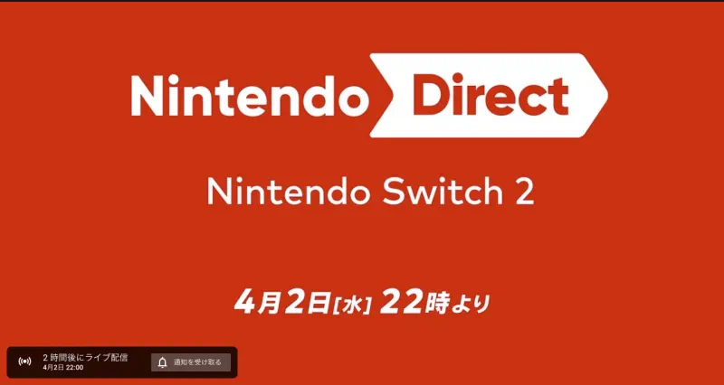

+++
title = "Nintendo Switch 2発表"
description = "ついにNintendo DirectでSwitch 2を発表。本日22時からNintendo Directで発表がありました。6月5日発売です。"
date = 2025-04-02
aliases = ["/articles/2025/04/02/switch2"]

[taxonomies]
tags = ["Game"]
+++

本日22時から[Nintendo
Direct](https://www.youtube.com/live/nkaodTSlhbU?si=5bYJKeb8Ss0yhWft)でSwitch2
の発表がありました。

本体が5万円を切り、同時に発売されるゲームもNINTENDOだけでなくサードパーティ
のゲームも多数準備したようでNINTEDOの力の入れようが伝わってきました。

6月2日発売。買いましょう。

以下は、ライブ動画から読み取ったメモです。

## NINTENDO SWITCH 2について

- 本体は6月5日発売予定
- 価格は動画でアナウンスがなかったが **税込49,980円**
- 画面が拡大
- 解像度は2倍、120fpsに対応、HDR対応
- 厚さは変わらず
- ヘッドフォンで立体サラウンド
- 背面スタンドの角度は可変
- 本体上部にUSB-C端子追加
- 本体目盛りが32GBから128GBに
- 新しいDOCK。4Kに対応。冷却ファン付
- SWITCHのソフトも利用可能
- 本体は日本国内専用

## NINTENDO SWITCH2のハイライト

- MARIO CART WORLD（同日発売、専用ソフト）
  - 完全新作。コースを飛び出しすべてフィールドを走ることができる。コース間の移動もレース？
  - サイバイバルという複数コースを通したラリーのような新モード、競争でなく自由に走れるフリーモードが追加
- JOY CON2の
  - Cボタン追加
    - フレンドとのボイスチャットが可能となる。マイクは本体。ノイズキャンセリング付
    - ゲーム画面の共有も可能、別のゲームでも共有可能
    - 別売りのカメラで自身の姿をゲームに合成して共有可能
    - 2026年3月までニンテンドーオンラインがなくても無料で利用可能？
    - マグネット式
    - スティックの大型化
    - マウスとしても利用可能
- おすそ分け通信
  - 一台にゲームが入っていれば、対応ソフト限定だが同時プレイであれば他のSwitchで他のユーザーもプレイ可能
- 新ゲーム：ひみつ展
  - SWITCHのハードウェアを紹介するゲーム。無料？
- 周辺機器情報
  - ゲームカードはSWITCHと同形状だが、転送速度が違う
  - SDカードは使えず、SD EXPRESSカード
  - SWITCH 2 Pro Controller。背面ボタン追加
- NINTENDO ONLINE
  - これまで通り使える
  - SWITCH 2専用の追加パックも用意。
    - GAMECUBEのシミュレーターも追加
    - GAMECUBEっぽいコントローラーも追加発売

## 専用ソフト

- Nintendo Switch 2 Edition
  - 解像度/フレームレートを上げるなどの改造、マイクやカメラなど専用ハードを利用した機能を追加。すでにSwitch版を持っているユーザーはアップグレードできる
  - スーパーマリオジャンボリー
  - ゼルダの伝説(Breath of World, Teas of the Kingdom)
  - 星のカービィ・ディスカバリー
  - METROID PRIME 4
  - POKEMON LEGENDS
- NINTENDO新作
  - DRAG x DRIVE
    - マウス操作の車いすバスケットボール
    - ゼルダの無双(光栄テクノとの共同開発?)
  - カービィのエアライダー
  - ドンキーコング
- サードパーティ新作
  - ELDEN RING
  - HADES II
  - ストリートファイター6
  - ARSENAL
  - SPLIT FICTION
  - EA SPORTS FC
  - LOGWARTS LEGACY
  - オバケイドロ
  - HITMAN
  - PROJECT 007
  - 龍が如く0
  - BORDERANDS4
  - CIVILIZARTION VII
  - NBA 2K
  - サバイバル・キッズ
  - エンター・ザ・ガンダン2
  - SHINE POST
  - CYBERPUNK
  - FINAL FUNTASY VII(リメイク)
  - DUSTBLOODS (2026年)
  - その他多数
