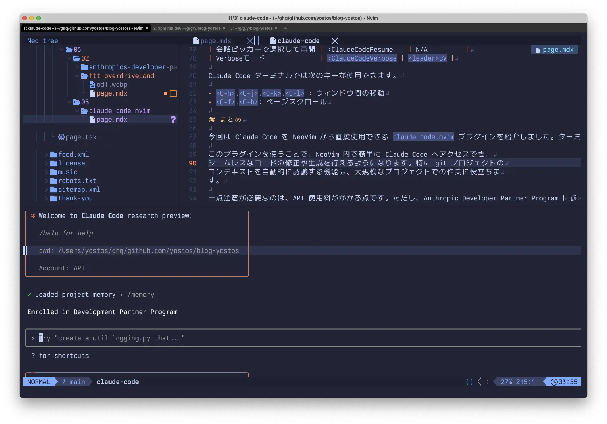

+++
title = "NeoVimからClaude Codeを使う"
description = "Anthropic の Developer Partner Program に Join してClaude Codeを使うモチベーションが高まっています。Claude CodeをNeoVimから使用するためのClaude Code Neovim Pluginをインストールしました。Claude Code Neovim Plugin を NeoVim で使う方法を説明します。"
date = 2025-05-04
aliases = ["/articles/2025/05/04/claude-code-nvim"]

[taxonomies]
tags = ["Tech", "Generative AI"]
+++


Anthropic の Developer Partner Program に Join してClaude Codeを使うモチベーションが高まっています。Claude CodeをNeoVimから使用するためのClaude Code Neovim Pluginをインストールしました。Claude Code Neovim Plugin を NeoVim で使う方法を説明します。

<details>
<summary>Table of Contents</summary>
<!-- toc -->
</details>
## Claude Code Neovim Plugin

今回導入したのは、[Claude Code Neovim Plugin](https://github.com/greggh/claude-code.nvim) `claude-code.nvim` です。

基本的にやっていることは NeoVim のターミナルを使い、Claude Code を呼び出してい
るようです。

次のような機能がサポートされます。

- ターミナルウィンドウでキー一押しだけで Claude Code を切り替え
- --continue などのコマンドライン引数やカスタムバリアントのサポート
- Claude Code によって変更されたファイルを自動検出して再読み込み
- ファイルが外部で変更された際のリアルタイムバッファ更新
- カスタマイズ可能なウィンドウ位置とサイズ
- which-key（利用可能な場合）との統合
- 作業ディレクトリとして git プロジェクトのルートを自動的に使用（利用可能な場合）

当たり前ですが、[Claude Code CLI](https://github.com/anthropics/claude-code)がインストールされている必要があります。

注意点としては、Claude Desktop などを呼び出しているのでなく、Claude Code を呼
び出しているため、　**APIの使用料がかかります**。 Claude API でなく Claude
Code をの呼び出しているため、Anthropic Developer Partner Programe のディスカウン
ト対象とはなります。

## `claud-code.nvim`のインストール

私はプラグインマネージャーとして `lazy.nvim`を使っているので
以下の設定でインストール完了です。

```lua
return {
  "greggh/claude-code.nvim",
  dependencies = {
    "nvim-lua/plenary.nvim", -- Required for git operations
  },
  config = function()
    require("claude-code").setup()
  end
```

## `claude-code.nvim`の使い方

このプラグインは先週インストールして試していたのですが、
今週になって起動方法が追加される名で週末に更新されていました。

基本的な機能は次の通りです。

| 機能                       | コマンド             | キーアサイン |
| -------------------------- | -------------------- | ------------ |
| 起動                       | `:ClaudeCode`        | `<C-,>`      |
| 最後の会話を再開           | :ClaudeCodeContinue  | `<leader>cC` |
| 会話ピッカーで選択して再開 | :ClaudeCodeResume    | N/A          |
| Verboseモード              | `:ClaudeCodeVerbose` | `<leader>cV` |

Claude Code ターミナルでは次のキーが使用できます。

- `<C-h>`,`<C-j>`,`<C-k>`,`<C-l>` : ウィンドウ間の移動
- `<C-f>`,`<C-b>`: ページスクロール

## まとめ

今回は Claude Code を NeoVim から直接使用できる `claude-code.nvim` プラグインを紹介しました。ターミナルから Claude Code を呼び出す方法よりも、コーディング作業の流れを止めることなく AI の支援を受けられるようになります。

このプラグインを使うことで、NeoVim 内で簡単に Claude Code へアクセスでき、
シームレスなコードの修正や生成を行えるようになります。特に git プロジェクトの
コンテキストを自動的に認識する機能は、大規模なプロジェクトでの作業に役立ちま
す。

一点注意が必要なのは、API 使用料がかかる点です。ただし、Anthropic Developer Partner Program に参加している場合は割引が適用されるので、Claude API を直接呼び出すより合理的です。コーディング効率向上のためのツールとして、検討する価値は十分にあるでしょう。
