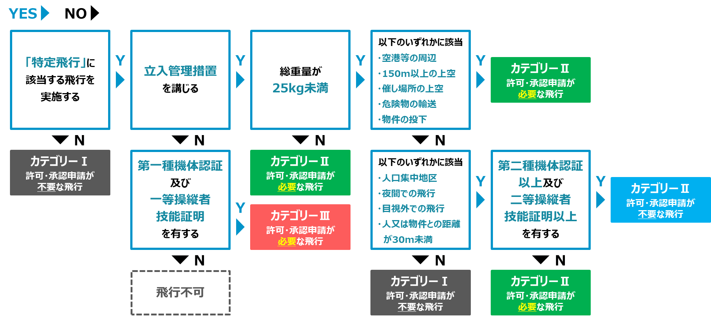

+++
title = "DJI Air3S 初飛行"
description = "購入していたDJI Air3S の初飛行です。ドローンを飛ばすために必要なこともまとめておきました。"
date = 2025-05-17
aliases = ["/articles/2025/05/17/dji-air3s-flight"]
+++

## 実際の飛行

実際の飛行の様子です。
編集は適当です。

{{ youtube(id="AvvVyyDk6ew") }}

今回自動航行も予定していましたが、崖で視界の確保できない不安があったの
ですべてマニュアルで飛ばしました。

## 日本でドローンを飛ばすために

空撮にドローンを使おうとすると必然的に 100g 以上のドローンになりますが、
日本の場合 100g 以上のドローンは航空法の制限を受けます。

絶対に目視飛行だけの一般的な飛行しか行わないなら別ですが、
空撮に使うという時点で操縦装置のディスプレイを見ることがあるでしょうから、そ
の時点で目視外飛行となり「特定飛行」と見なされるので、
次の物が必要となります。

- 機体認証
- 飛行承認

### 機体認証

まず機体認証ですが、2025 年 5 月の時点でコンシューマー向けの機体で
認証を通っているものはありません。

国土交通省が認証した機体を[公開](https://www.mlit.go.jp/koku/certification.html#anc02)
していますが、DJI の機体などありません。
産の 4Kg 以上の機体がいくつかあるだけです。

忘れましょう。

### 飛行承認

「特定飛行」の場合は**国土交通省の承認**が必要です。
詳しいフローは国土交通省の次のフローを見ましょう。

条件を緩和しても「目視外飛行」が入ってしまうと、
ほぼ許可が必要な「カテゴリーII 飛行」となることがわかります。

この飛行承認では、操縦者の技量も審査され飛行経験などが問われます。
ただ、そうすると技量と積むための飛行の承認はどうやって取るかという問題になり
ます。この部分を一番手っ取り早く解決するのは「[二等無人航空機操縦士](https://blog.yostos.org/articles/2025/04/10/drown-lisence)」
の資格を取ってしまうの事です。私は目視外飛行、夜間飛行の限定解除付で
資格取得をしました。

では、資格があれば飛行承認は不要かというとそうではありません。
資格で自由に飛ばせる条件は「認証機体」を使用することです。前述の通り、
そんな機体はほぼありませんから、資格を取っても承認を取る必要があります。

多くの人は面倒なので、全国どこでも 1 年間飛ばすという「包括申請」という形になります。

4 月から申請方法が緩和されたので、資格さえあれば比較的簡単に承認を取ることが
できます。

### 地主・管理者の承認

個別の飛行には、国土交通省の飛行承認と別に土地の所有者や管理者の上空を飛行する承認が必要となります。
川や海、山なども管理している国、自治体の組織があるので承認をもらう必要があり
ます。

今回は自分で手続きするのが面倒だったので、[Flyers](https://flyers.plus/)とい
うサービスを利用しました。自分に替わって、土地の管理者の方の承認から地元警察
への事前通報まで行政書士さんがすべてやってくれます。

一件あたり 1,500〜1,800 円とリーズナブルで、確実に処理いただけます。

### 飛行計画

飛行する際には、包括申請を行っている場合でも国土交通省に飛行計画を通報する必
要があります。これは同じ時間帯、同じ空域で飛行が重複することを防ぐために重要
です。実際、調整が入ることもあります。

通報は、[DIPS2.0](https://www.ossportal.dips.mlit.go.jp/portal/top/)という国
土交通省のシステムからオンラインで行えます。

### 飛行記録

飛行の際には、事前点検、内容、事後点検などを記録することが求められます。
国土交通省からフォーマットが示されていますが、さすがに紙や EXCEL で現地で記入
するのは厳しいのでなんからのツールやサービスを使ったほうがよいかと思います。

私は、[Fwrite Down](https://fwritedown.com/)というサービスを利用しています。
無料な上に、スマートフォンでも PC/Mac からでも同じように操作できるからです。

最小限の機能に絞ってありますが、国土交通省のフォーマットには準拠しているので
安心です。
