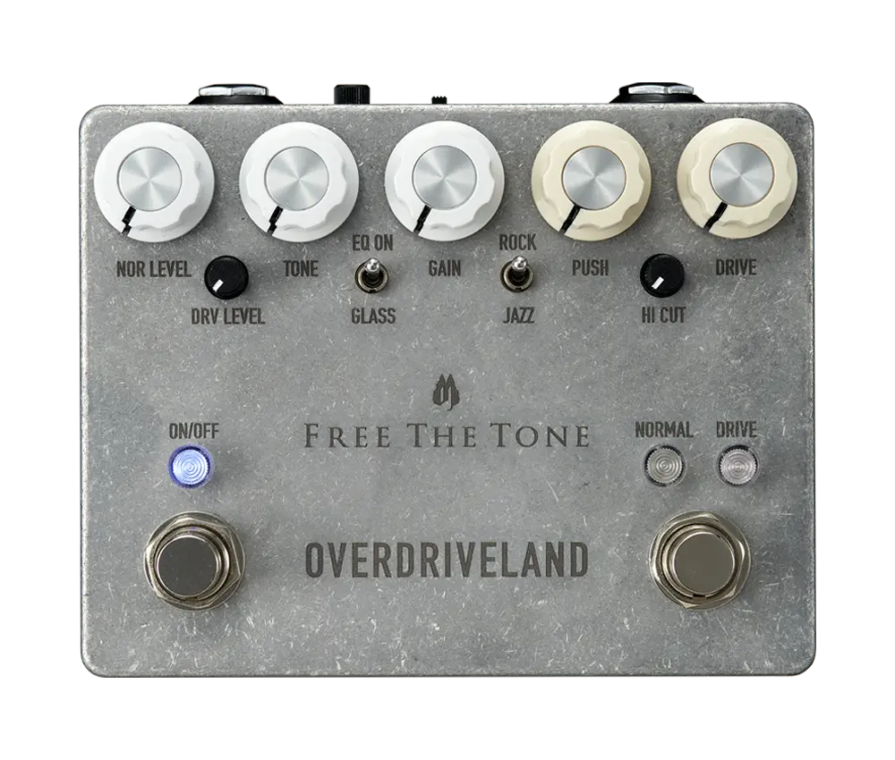

+++
title = "Free The Tone - Overdriveland"
description = "Free The Toneのオーバードライブ Overdrivelandを購入しました。2023年末に発売されて2024年は入荷待ちになるほど人気でしたが、使ってみると確かに究極のオーバードライブと言われるのもわかります。"
date = 2025-05-02
aliases = ["/articles/2025/05/02/ftt-overdriveland"]

[taxonomies]
tags = ["Guitar Pedals"]
+++

Free The Toneのオーバードライブ Overdrivelandを購入しました。2023年末に発売されて2024年は入荷待ちになるほど人気でしたが、使ってみると確かに究極のオーバードライブと言われるのもわかります。

## Overdrivelandとは

Free The Tone の「Overdriveland」は、伝説的な DUMBLE アンプのサウンドとフィーリ
ングを再現することを目指して開発されたオーバードライブペダルです。設計者であ
る林幸宏氏は、20 台以上の DUMBLE アンプのメンテナンス・修理経験を持ち、自身も複
数の DUMBLE アンプを所有し、その経験を基に DUMBLE アンプ特有の
倍音やタッチレスポンスをペダルで再現することに挑戦したエフェクターです。

## Overdrivelandの特徴と評価

「DUMBLE アンプ」は、
故アレクサンダー・ハワード・ダンブル氏が完全ハンドメイドで年に 2〜3 台だけ、
彼が認めたミュージシャン向けにしか制作しなかったと言います。
現存する数も限られており数千万で取引されているアンプです。
当然聞いたことがないので、DUMBLE アンプの音が出ているかどうかは評価できません
が、オーバードライブとしては非常に上質で人気なのも分かります。

特徴はノーマルチャンネルとドライブチャンネルの「**2チャンネル構成**」であることです。:
正確にはドライブチャンネルはノーマルチャネルを経由して出力されるので、
2 チャンネルというよりドライブチャネルをプリアンプ的に捉えたほうがよいと思い
ます。

ノーマルチャンネルの歪み具合は Tube Screamer に近く、クリーンからクランチまでの
サウンドを作成できます。ドライブチャンネルでは、「PUSH」でノーマルチャンネル
にかける音圧を調整し歪み具合が決まります。Tube Screamer などをブースター的に
使う際に Level でアンプの歪みを調整するのと同じ理屈です。

「DRIVE」つまみは GAIN の調整とされていますが、歪み量はほとんど変化しません。
つまみを上げていくとサチュレーション感やコンプレッション感が増していく印象で
す。

決してハイゲインではなく限られた歪み量ですが、このノーマルチャネルとドライブ
チャンネルを使って細かく歪みのキャラクター調整できます。

もう 1 つの特徴は「**電圧切替機能**」です。スタンダードモデルでは 9V と 14V 固定ですが、
私が購入したカスタムショップモデル（ODL-1-CS）では、9V と 10〜19V まで無段階に
昇圧が可能です。昇圧すると歪み感は押さえられヘッドルームが広がり
輪郭のはっきりした押し出し感のある音になります。

[先日Xotic AC Booster V2で弾いた](/articles/2025/04/27/we-are-all-alone)曲を
Overdriveland でも弾いてみました。

<SoundCloudEmbed
  apiurl="https://api.soundcloud.com/tracks/2088586791"
  url="<https://soundcloud.com/yostos/we-are-all-alone-overdriveland/s-raWcXXiO0f9>"
  title="We Are All Alone - Overdriveland"
/>

## 総評

「Overdriveland」は、DUMBLE アンプのサウンドを再現できているかどうかわかりま
せんが、
非常にタッチセンシティブでニュアンスを忠実に反映する繊細なオーバードライブ
エフェクターとなっています。ハイゲインではありませんが、2 つのチャンネルで
歪みのキャラクターを細かくセッティングが可能です。前段か後段に別のオーバード
ライブを置いても良いかも知れません。

タッチに反応するので、演奏の技量がそのまま音に出ていまいます。
私のような腕前では持て余すことは確実ですが、それでも弾いていて気持ちよいエフ
ェクターです。

- [Amazonで購入](https://amzn.to/4cUWTDA)
- [楽天で購入](https://a.r10.to/h5KBTJ)
