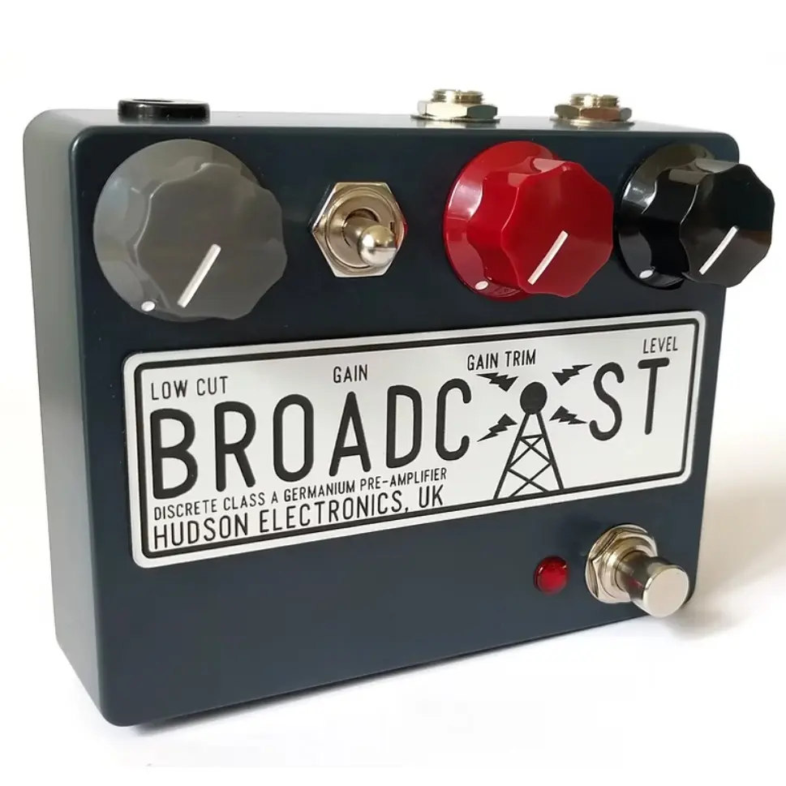

+++
title = "Hudson Broadcastレビュー：クラシックなコンソールサウンドを現代に"
description = "多くのブティックエフェクターが溢れる現代のギターシーンで、真に個性を放つペダルは稀有な存在です。英国Hudson Electronicsの「Broadcast」は、60年代放送コンソールの回路を再解釈した異色のオーバードライブで、クリーンブーストからファジーな歪みまでをカバー。そのユニークなゲルマニウム＆トランスの組み合わせは、デジタル時代に失われつつあるアナログの温かみと複雑さを呼び覚まします。このレビューでは、この特別なペダルの魅力に迫ります。"
date = 2025-05-20
aliases = ["/articles/2025/05/20/hudson-broadcast"]
+++

## 1. Hudson Broadcastとは

[Hudson Broadcast](https://amzn.to/4mfh0AC)は、英国の Hudson Electronics が手作りで製造するエフェクターペ
ダルです。1960 年代の放送用コンソールのプリアンプ回路にインスピレーションを得た
ユニークな設計が特徴となっています。このペダルは「ディスクリートクラス A ゲルマニウムプ
リアンプでトランス回路を採用した」仕様となっており、現代のエフェクターとは一
線を画すビンテージサウンドを提供しています。

いくつかバリエーションがありますが、私購入したのはもっともベーシックなモデル
です。

## 2. Hudson Broadcastの詳細

### コントロール

Hudson Broadcast の見た目はシンプルで、各コントロールが効果的に機能します。

- **LEVEL**：ペダル全体の出力ボリュームをコントロール
- **GAIN SWITCH**：ローゲイン、ミッドゲイン、ハイゲインのモードを切り替え
- **GAIN TRIM**：ゲインのレベルをコントロール。高い設定では信号の高域が緩やかにロールオフされる
- **LOW CUT**：低域を減衰させる。このコントロールは回路の前段にあるため、ゲインコントロールと相互に作用する

また、電圧 V9 で動作しますが、24V まで昇圧して使用できるようです。

### サウンド特性

ローゲインモードでは、Broadcast はスパークリングクリーンブーストから透明感のあ
るオーバードライブまでカバーできます。ゲイントリムを上げていくと、トランス回
路とディスクリート回路が飽和し始め、緩やかでダイナミックなコンプレッションと
中音域の微妙な厚みを生み出します。

ハイゲイン設定ではトリムコントロールを上げると、温かみと少し Fuzz な要素を
持った、より強いディストーションサウンドが得られます。Broadcast はダイナミッ
クな特性を維持しながら、幅広い歪み系トーンをカバーし、ピッキングのアタックや
繊細なニュアンスにもしっかり反応します。John Lennon が "Revolution"で演った
あの Fuzz のような破壊的な音も出すことができます。

このペダルはピックアップのタイプによって調整が可能です。
ベースの少ないシングルコイルを使用する場合は、低域カットの量を減らすことができます。
一方、ベースが豊富なハムバッカーの場合は、
低域カットの量を増やして濁った音の発生を防ぐことができます。

実際の音は私なんかが弾くより、こちらの動画が分かりやすいと思います。

{{ youtube(id="m-col0HDi3E") }}

個人的には、ストラトキャスターのリアピックアップとローゲイン設定を組み合わせた
時の豊かな低音と温かな歪みが特に印象的で、非常にムーディーなサウンドが作れる
ことに一発でほれ込みました。さらに意外だったのは、高ゲイン設定ではファズに近
い暴力的な歪みも可能で、一台で幅広いサウンドメイキングができる汎用性の高さで
す。

### 他のペダルとの相性

Broadcast は「常時オン」のブースターとしても優れています。アンプの音を豊かに
し、真のサウンドを引き出す効果があります。ローゲインモードに設定し、ボリューム
とゲインを 2 時の位置に設定すると完璧に機能します。

また、他のオーバードライブやディストーションペダルとの組み合わせも効果的です
。Broadcast をクリーンブーストとして使用し、他のゲインペダルの前後に配置する
実験をすることで、最適な組み合わせを見つけることができます。

他の多くのゲルマニウムベースのペダルとは異なり、
前段にシリコントランジスタ、後段にゲルマニウムトランジスタを配置しています。
この回路構成によりペダルボード上の配置位置に神経を使う必要がありません。
従来のゲルマニウムファズが最高の音を
出すためにはシグナルチェーンの最初に配置する必要があるのに対し、Broadcast は
どこに配置しても問題なく機能します。

注意点としてはこのペダルは「位相反転[^1]」を起こします。
ギターの音域ではそれほど神経質になることはないと思いますが、
バンドなどアンサンブルの中で使う場合は覚えておいたほうが良いかもしれません。
ちなみに BOSS DS-1 も位相反転します。

[^1]: 正確には「ポラリティ反転」（polarity inversion）

## 3. エフェクターボードの一新

この Hudson Broadcast を購入して、山ほどあったオーバードライブやブースターをす
べて処分しました。残したのは次の 3 つだけです。

1. Free The Tone Overdriveland
2. Hudson Broadcast
3. BOSS DF-2 (ボードからは外しています)

基本的には Overdriveland　と Broadcast、それに Simplifier MK-II だけで、
よほどのハイゲインでなければカバーできるかなと思っています。

## 4. まとめ

Hudson Broadcast は単なるオーバードライブペダルではなく、ビンテージコンソール
の魅力をギターのシグナルチェーンに取り入れる独特のツールです。手作りならでは
の品質と、細部へのこだわりが随所に感じられる製品です。

価格は決して安くありませんが、その音質と汎用性を考えると十分な価値がありま
す。クラス A のゲルマニウム回路とトランス設計によるこのペダルは、単なるエフェ
クターを超えて、音色に新たな表現力を与えてくれるでしょう。

ローゲインからハイゲインまでの多彩なサウンドメイキングが可能で、特に 1970 年代
半ば以前のブリティッシュロックギタートーンを求めるプレイヤーや、ギターのボリ
ュームとトーンノブで細かくサウンドを形作りたいプレイヤーにとって、非常に魅力
的な選択肢となるでしょう。

手作りの美しさと実用性、そして何より素晴らしいサウンドを兼ね備えた Hudson
Broadcast は、長く使い続けたくなるエフェクターの 1 つです。
