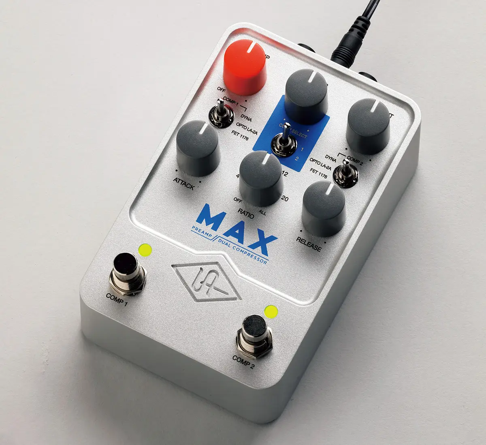

+++
title = "Universal Audio/UAFX Max Preamp & Dual Compressorを買う"
description = "Strymon Compadreに満足していなかったわけではありませんが、少し安く売られているのを見つけたので、UAFX Max Preamp & Dual Compressorを購入してしまいました。"
date = 2025-05-24
aliases = ["/articles/2025/05/24/max"]

[taxonomies]
tags = ["Guitar Pedals","Guitar","Music"]
+++

Strymon Compadreに満足していなかったわけではありませんが、少し安く売られているのを見つけたので、UAFX Max Preamp & Dual Compressorを購入してしまいました。

## UAFX Max Preamp & Dual Compressor の概要

[UAFX Max Preamp & Dual Compressor](https://amzn.to/4jhLWgM) はAmazonが他よりも少し安く購入できました。

本機はUniversal Audioから発売されているコンパクトなエフェクターですが、
伝説的なコンプ3機種であるDyna Comp, LA-2A, UA 1176を再現できる
夢のようなエフェクターです。

しかもコンプレッサーは2つを同時にしようできます。UA 1176を2台直列に繋ぐよう
なことも可能です。スマートフォンと接続すれば接続方法もシリアルからパラレルに
カスタマイズできます。

これだけでも十分美味しいのですが、更にUAのチューブ・マイク・プリアンプ610を
シミュレートしたプリアンプが搭載されており、甘い質感で音をブーストすることも
可能です。

## 実際に弾いてみた

まず、プリアンプはUniversal Audioが誇るビンテージチューブプリアンプである
UA610をシミュレートしています。
ブースター的な使い方でなくサチュレーションを付与するためゲインを稼ぐ効果が
期待できます。音に厚みや温かみを与えることができます。

すべてのコンプレッサーの経験があるわけではありませんが、Dyna Compのブーミー
さや緻密な1176などかなり再現性が高いと思います。

また、シリアルに2台つなげることが可能です。LA-2Aで音を整えてUA1176でサス
ティーンを稼ぐなど、実際にポストレコーディングで行われているような処理を足下
で扱えるのは感動です。

ちょっとだけ弾いてみました。クリーントーンはEpiphone CasinoにDyna Comp +
UA 1176です。ディストーションはAria Pro II PE-1500にLA-2A + Overdriveland
です。

<iframe width="100%" height="166" scrolling="no" frameborder="no" allow="autoplay" src="https://w.soundcloud.com/player/?url=https%3A//api.soundcloud.com/tracks/soundcloud%253Atracks%253A2101336863&color=%23ff5500&auto_play=false&hide_related=false&show_comments=true&show_user=true&show_reposts=false&show_teaser=true"></iframe>
<a href="https://soundcloud.com/yostos" title="Yostos" target="_blank" style="color: #cccccc; text-decoration: none;">Yostos</a> · <a href="https://soundcloud.com/yostos/youre-everything-i-see" title="You&#x27;re Everything I See" target="_blank" style="color: #cccccc; text-decoration: none;">You&#x27;re Everything I See</a>

## 使ってみた感想

内部はデジタルな処理をしていると思いますが、コントロールはつまみを使ったアナログです。
使いやすいのですが、次の点が気になりました。

- コンプによって有効なつまみが違うので編集時に戸惑う
- 同じコントロールを2台のコンプで共有する形になっておりトグルスイッチで切り
  替える方式のため、現在のコントロールの状態がどちらのものか分からない。

私は自宅のレコーディングでしか使わないので大きな問題ではありませんが、
ライブとか使う場合は混乱してしまいそうです。

音については、さすがに伝説のコンプたちでとても高品質です。
それぞれ性格が異なり本機はシリアルに順番も自由につなげることもできるので
組み合わせもバリエーションがあり、UA1176などは制御できるパラメーターが多いの
で研究は必要です。

伝説のコンプ3台がこの価格であれば十分価値があります。
