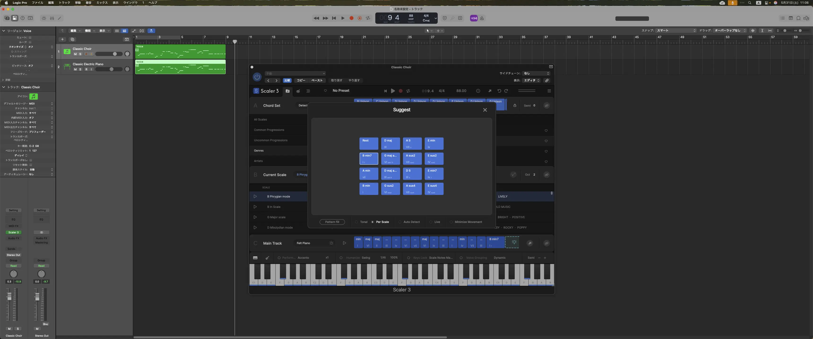

+++
title = "Scaler3で作曲支援"
description = "先日発売されたScaler3ですが、音楽理論を知らなくても作曲や編曲ができると話題なので購入してみました。"
date = 2025-05-31
aliases = ["/articles/2025/05/31/scaler3"]
+++



## Scaler3とは

[Scaler3](https://scalermusic.com/products/scaler-3/)は音楽理論やコード理論
がわからなくても凝ったコード進行が作れる作曲支援ソフトです。

裏では音楽理論に基づいて適切なコード進行を提案してくれるの
その中から気に入ったコードをどんどんドラッグしてコード進行を作っていけます。

「コードに合う違和感のない音はどれか」「コード進行で冒険したいが、このコード
は適切か」といったプロでも抱えてしまいそうな悩みを解消してくれます。

## Scaler3を検証してみた

今回は既存のメロディを取ってきて Suggest 機能に従ってコード進行を作ってみまし
た。使用したのは The Bangles の"Eternal Flame"です。

また Scaler3 から追加されたアレンジ機能を使って伴奏を付けています。
ドラムの生成機能はないので、ドラムだけは Logic Pro の Player 機能を使っています
。

前半が Scaler3 で生成した伴奏、後半がオリジナルのコード進行に従った伴奏です。

<SoundCloudEmbed apiurl="https://api.soundcloud.com/tracks/2105211069"
url="https://soundcloud.com/yostos/sclar3/s-aQqlD1uzAIB?si=ab6c3c4bcd0a49f3b1127fe1090f0657&utm_source=clipboard&utm_medium=text&utm_campaign=social_sharing"
title="Scaler3テスト" />

オリジナルは、G Major で次のようなコード進行です。

```
G Em7 | C D | G Em7 | C D | Em B7 | Em7 A7 | D Bm7| Am7 
```

ですが、 Scaler3 でもっともノートとコードにのマッチ度が高かった B Phrygian
Mode でコードを構成してみました。

```
  Bm G | C D | Em G | Am G | Em7 Dsus2 | Bm Em | A7 D| Bm7 
```

メロディから判断され推奨されるコードはブルーで示されますが、
メロディをすべてマッチするわけではないんで、実際は推奨コードから試しながら
決めていくことになります。しかし、何も参考にせず自分で考えるより数倍生産性は上が
ります。

オリジナルのほうが安心して聞ける印象ですが、
Scaler3 で作ったコード進行もちょっと印象は違っていますが、まぁ成り立っているのではないでしょうか？

多分、メロディからコードを作るより、コード進行を Scaler で練って、
メロディを提案してもらったほうがうまく働くと思います。

## まとめ

Scaler3 は「音楽理論の知識」と「直感的な操作」のバランスが絶妙なツールです。

### 🎯 習得難易度について

完全な素人には難しいものの、基本的な音楽理論（メジャー・マイナー、ダイアト
ニックコードなど）を理解していれば十分活用できます。 転調の提案など高度な
機能については、理論と感性のバランスを取りながら使い分けることが重要です。

### 💡 Scaler3の真価

最大の価値は **「0→1の創作支援」** にあります。白紙の状態から音楽理論に基づ
いた膨大なコード進行のアセットを参考にできるため、創作の起点として非常に強力
です。また、安全圏を抜け出した「冒険的なコード進行」への挑戦も、理論的裏付け
があるので安心して試せます。

### 🤖 AI作曲時代における位置づけ

AI が楽曲を自動生成する時代になりましたが、**創作者が主導権を握りながら音楽理
論の恩恵を受けられるScaler3のようなツールは、まだまだ重要な役割を果たすでし
ょう。** 完全自動化ではなく、人間の創意工夫とテクノロジーの協働による作曲ス
タイルは、今後も価値を持ち続けると考えられます。

**結論として、Scaler3は音楽制作の生産性を大幅に向上させる優秀なパートナーツールです。**
