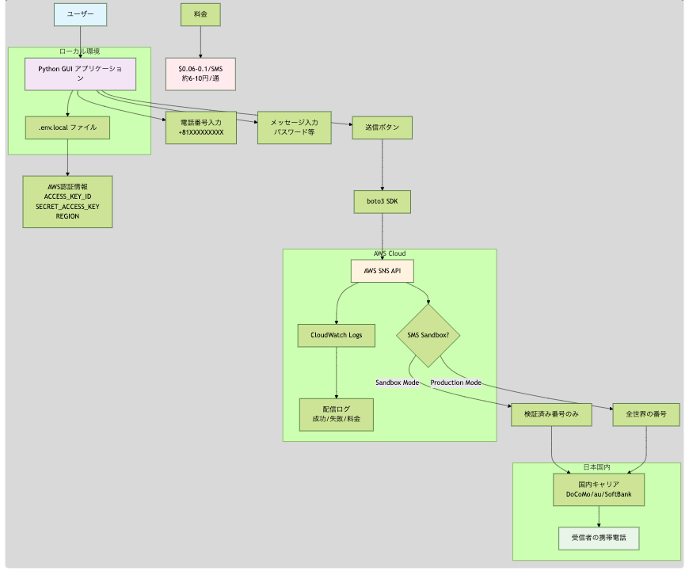

+++
title = "AWSからSMSにメッセージを送る"
description = "AWSが提供するAmazon SNS(Simple Notification Service)を使って、SMSにメッセージを送信するサンプルコードを作ってみました。"
date = 2025-06-09
aliases = ["/articles/2025/06/09/aws-sns"]
+++

## 機密文書のメールでの共有

職場で取引先に資料を送付するのに暗号化した ZIP でメールし職場で取引先に資料を送付するのに暗号化した ZIP でメールし、
パスワードを電話で伝えるということをやっているようです。
最低限の PPAP 対策ですが、前時代的ですね。
当然ですが、先方から「電話で伝えられても困る」とよくクレームを受けているようです。
フィアル送信サービスも使っているようですが、「セキュリティ」と言う観点では何
の解決にもなっていません。

メールで機密文書を送る方法について、
現実的な選択肢を考えると以下のような評価かなと思います。

| 手段                                                                                  | 秘匿性（＝パスワードが第三者に見えないか）    | 本人確認性（正しい相手か）      | コメント                         |
| ------------------------------------------------------------------------------------- | --------------------------------------------- | ------------------------------- | -------------------------------- |
| ① 暗号化ファイル、またはクラウドストレージ（認証なし） + パスワードを同じメールで送信 | ❌：1通盗まれればすべて漏洩                   | ❌                              | PPAPの典型。秘匿性は完全に破綻   |
| ② 暗号化ファイル、またはクラウドストレージ（認証なし） + パスワードを別メールで送信   | △：通信経路は一応分離だが同一インフラ内       | ❌                              | 傍受・誤送信時に漏洩リスク高     |
| ③ 暗号化ファイル、またはクラウドストレージ（認証なし） + パスワードをSMSで送信        | ◯：通信経路分離、実効性あり                   | ◯：端末本人であれば高い         | 現実的な最低限の安全策           |
| ④ クラウドストレージ（認証あり）で共有                                                | ◎：パスワード共有不要、URL単体では無効        | ◎：ログインが必要なため本人限定 | アクセス制限・ログ取得が可能     |
| ⑤ S/MIME暗号化メール                                                                  | ◎：メール本文と添付がエンドツーエンドで暗号化 | ◎：証明書により本人性確保       | 導入済の組織間では最適解         |
| ⑥ GPG暗号メール / 公開鍵暗号によるファイル送信                                        | ◎：パスワード共有不要                         | △：鍵配布と運用に依存           | 高い秘匿性だが一般業務には難しい |

## パスワードを別メールで送信

本来は S/MIME や GPG を検討すべきでしょうが、S/MIME の費用捻出が難しく、GPG を使う
リテラシーも無いので、次善の策として SMS でパスワード送信は経路分離できている
分マシだと思いました。

以下はメールとは別の手段でパスワードを伝えるだけならば PC 上からこうやって SMS にメッセージを送ることもできますよというデモです。
GUI から任意の電話番号に SMS を送信できます。

Python の実行環境が必要です。

{
// `mermaid
// graph TD
//     A[ユーザー] --> B[Python GUI アプリケーション]
//     B --> C[.env.local ファイル]
//     C --> D[AWS認証情報<br/>ACCESS_KEY_ID<br/>SECRET_ACCESS_KEY<br/>REGION]
//
//     B --> E[電話番号入力<br/>+81XXXXXXXXX]
//     B --> F[メッセージ入力<br/>パスワード等]
//     B --> G[送信ボタン]
//
//     G --> H[boto3 SDK]
//     H --> I[AWS SNS API]
//     I --> J{SMS Sandbox?}
//
//     J -->|Sandbox Mode| K[検証済み番号のみ]
//     J -->|Production Mode| L[全世界の番号]
//
//     K --> M[国内キャリア<br/>DoCoMo/au/SoftBank]
//     L --> M
//
//     M --> N[受信者の携帯電話]
//
//     I --> O[CloudWatch Logs]
//     O --> P[配信ログ<br/>成功/失敗/料金]
//
//     Q[料金] --> R[$0.06-0.1/SMS<br/>約6-10円/通]
//
//     subgraph "ローカル環境"
//         B
//         C
//     end
//
//     subgraph "AWS Cloud"
//         I
//         J
//         O
//         P
//     end
//
//     subgraph "日本国内"
//         M
//         N
//     end
//     style A fill:#e1f5fe
//     style B fill:#f3e5f5
//     style I fill:#fff3e0
//     style N fill:#e8f5e8
//     style R fill:#ffebee
//
//`
}


処理概要です。あくまでデモです。



実際に任意の SMS に送信するには、AWS の管理コンソールで SANDBOX を解除する必要が
あります。また、このままだとユーザー認証していないので誰でも送信できてし
まいます。実際にシステムで行うには、認証した上でログを取得し監査できる状態に
するべきでしょう。

また SMS なので料金が発生します。

こんなことやるくらいなら**さっさと S/MINE をちゃんと導入しろよ**と思います。

## ソースコード＆設定

```python

print("アプリケーション開始")


class SNSSender:
    def __init__(self):
        print("SNSSender初期化中...")
        try:
            self.sns = boto3.client(
                "sns", region_name="ap-northeast-1"
            )  # 東京リージョン
            print("AWS SNSクライアント作成完了")
        except Exception as e:
            print(f"AWS SNSクライアント作成エラー: {e}")
            self.sns = None

        self.setup_gui()

    def setup_gui(self):
        print("GUI設定中...")
        self.root = tk.Tk()
        self.root.title("AWS SNS SMS送信ツール")
        self.root.geometry("500x400")

        # 電話番号入力
        tk.Label(self.root, text="電話番号 (+81XXXXXXXXX):", font=("Arial", 12)).pack(
            pady=10
        )
        self.phone_entry = tk.Entry(self.root, width=30, font=("Arial", 11))
        self.phone_entry.pack(pady=5)

        # メッセージ入力
        tk.Label(self.root, text="メッセージ:", font=("Arial", 12)).pack(pady=(20, 5))
        self.message_entry = tk.Text(self.root, height=8, width=50, font=("Arial", 10))
        self.message_entry.pack(pady=5)

        # 送信ボタン
        tk.Button(
            self.root,
            text="SMS送信",
            command=self.send_sms,
            bg="blue",
            fg="white",
            font=("Arial", 12),
            padx=20,
            pady=10,
        ).pack(pady=20)

        # 結果表示
        self.result_label = tk.Label(
            self.root, text="", font=("Arial", 10), wraplength=400
        )
        self.result_label.pack(pady=10)

        print("GUI設定完了")

    def send_sms(self):
        print("SMS送信ボタンがクリックされました")

        phone_number = self.phone_entry.get().strip()
        message = self.message_entry.get("1.0", tk.END).strip()

        print(f"電話番号: {phone_number}")
        print(f"メッセージ: {message}")

        if not phone_number:
            self.result_label.config(text="電話番号を入力してください", fg="red")
            return

        if not message:
            self.result_label.config(text="メッセージを入力してください", fg="red")
            return

        if self.sns is None:
            self.result_label.config(text="AWS接続エラー", fg="red")
            return

        try:
            print("SMS送信中...")
            response = self.sns.publish(
                PhoneNumber=phone_number,
                Message=message,
                MessageAttributes={
                    "AWS.SNS.SMS.SMSType": {
                        "DataType": "String",
                        "StringValue": "Transactional",
                    }
                },
            )

            message_id = response["MessageId"]
            success_text = f"送信完了！\nMessage ID: {message_id}"
            self.result_label.config(text=success_text, fg="green")
            print(f"送信成功: {message_id}")

        except Exception as e:
            error_text = f"送信エラー:\n{str(e)}"
            self.result_label.config(text=error_text, fg="red")
            print(f"送信エラー: {e}")

    def run(self):
        print("GUIメインループ開始")
        self.root.mainloop()
        print("GUIメインループ終了")


# メイン実行
if __name__ == "__main__":
    app = SNSSender()
    app.run()
```

AWS の IAM でアクセスキーを作成して、`.env.local`などに保存しておきます。

```txt
AWS_ACCESS_KEY_ID=A@@@@@@@@@@@@@@@@
AWS_SECRET_ACCESS_KEY=@@@@@@@@@@@@@@@@@@@@@@@@@@@@@@@@@@@@@@@@
AWS_DEFAULT_REGION=ap-northeast-1
```
