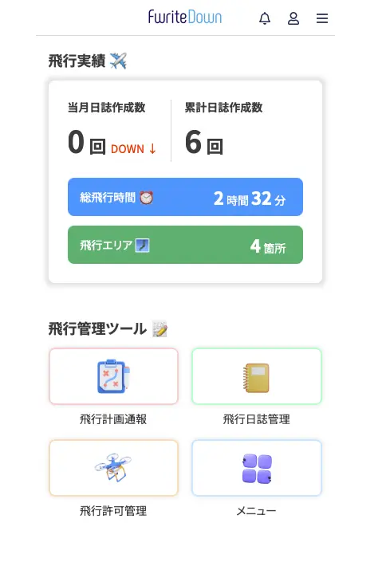

+++
title = "一新されたドローン飛行日誌サービス FwriteDown"
description = "6月からドローンの飛行日誌サービスであるFwriteDownが一新されDIPS2.0との連携など革新的な機能を追加してきました。以前から使用していたので、その使い勝手を確認してみました。"
date = 2025-06-02
aliases = ["/articles/2025/06/02/fwritedown"]
+++

## FwriteDownとは

ドローンの飛行では、国土交通省の[指定フォーマット](https://www.mlit.go.jp/koku/operation.html#anc02)に従った
日常点検記録と飛行日誌を記録する必要があります。

EXCEL/Word のテンプレートも提示されていますし、項目もシンプルです。
業務でなければ EXCEL などの管理でも十分です。
しかし、現地での入力では、 EXCEL/Word
は使い勝手がよくありません。

FwriteDown はブラウザベースのツールで、日常点検や飛行日誌を国土交通省のフォー
マットに準拠した形式で記録・管理できるツールです。

## FwriteDownのバージョンアップ内容

バージョンアップでの主な変更点は大きく 3 つあります。

### 1. DISP2.0とのAPI連携

DISP2.0 と API で連携できるようになりました。
具体的には、次のようなことができるようになります。

1. 飛行計画通報をこのアプリから作成・閲覧ができるようになった
2. **飛行計画をFwriteDownから作成していれば**、飛行日誌作成時に飛行計画から情報
   を引用できる
3. 飛行許可が参照できる。飛行許可申請は許可申請サポートへのリンクが掲載され
   ている。

許可申請は多くの人が包括申請をしているでしょうから、日々の飛行についてはこの
アプリで飛行通報から飛行日誌作成まですべてこのアプリから行うことが可能となっ
ています。

ただし、一番使いそうな飛行日誌の作成の際の飛行計画の参照は、DIPS2.0 の飛行計
画を参照しているわけでなく、FwriteDown 側で保持している飛行計画を参照している
だけです。そのため、DIPS2.0 上で直接作成した飛行計画は参照できません。

### 2. スマートフォンアプリ提供

FwriteDown はこれまでブラウザベースで提供されていました。
スマートフォンで使用する際もブラウザを使用するアプローチを取っていました。
アプリケーションはレスポンシブ対応されていたので、PC でもスマートフォンでも
最適な表示となり操作できました。

今回は iPhoen/Android 用のアプリが提供されることとなりました。
おそらく競合製品のドローンノートがアプリで提供されていることへの対抗なのでし
ょう。

個人的には全く評価しません。むしろ改悪と感じています。

- スマートフォンアプリとは言っても、WebView を使っていると思われるので使い勝
手はブラウザとそれほど変わらない。
- バージョンアップにより PC/Mac 使用時もスマートフォン同様縦長の表示になり使い勝手や読みやすさがかなり改悪された

### 3. 価格変更

これまで無料プランでも機体 10 機、パイロットは 10 人まで管理できました。

今回のリニューアル以降は以下のように改変されました。

無料枠では機体 1 機、パイロット 1 名、月に 3 回までの飛行という制約では、おそらく
多くの人がぎりぎり収まらないかなという印象です。

次のプランが 990 円/月のコースです。従来の無料プランと同じ制約なので個人ユーザ
ーには十分ですが、価格的にかなりハードルが高い設定だと思います。

## まとめ

現在はリニューアルキャンペーンを利用して一ヶ月無料でスタンダートプランを利用
していますが、正直月末には解約しようかなと思っています。

理由は次の通りです。

- スタイルシートのレスポンシブ対応がいい加減で PC/Mac などの画面で閲覧・操作できるというアドバンテージがなくなった
- DIPS2.0 との連携は便利だが、わざわざスマートフォン用の表示でやる意味はなく
DISP2.0 上でやったほうが快適
- アドバンテージがない割に価格が高く、更にメリットがない
- 機能を増やした分、UI の素性の悪さが前面に出てきてしまっている

おそらく[ドローンノート](https://www.shiny-app.com/dronenote)に移行すると思
います。DIPS2.0 の API 連携など技術的にはがんばったのだと思いますが、
ユーザーの利便性向上にはあまり貢献しないという上流工程が悪ければ
こうなるという典型でしょうか。
