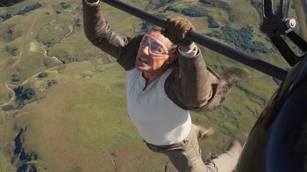

+++
title = "Mission Impossible - Final Recgningを観ました"
description = "『ミッション・インポッシブル』の 最新作『ファイナル・レコニング』を観てきました。前作の『デッドレコニング』からの続編で、タイトルからしてシリーズ最終作となるので集大成ではありました。ネタバレ含みます。"
date = 2025-06-15
aliases = ["/articles/2025/06/15/mission-impossible"]

[taxonomies]
tags = ["Movies","Entertainment"]
+++

Table of Contents

<!-- toc -->

『ミッション・インポッシブル』の 最新作『ファイナル・レコニング』を観てきました。前作の『デッドレコニング』からの続編で、タイトルからしてシリーズ最終作となるので集大成ではありました。ネタバレ含みます。

正直、イマイチでした。

## 前作から時間が経ちすぎた

前作から 2 年経っています。

ハリウッドの脚本家と俳優の長期ストライキの影響で制作スケジュールに遅れが出たため、
制作が遅れたようです。当初は"DEAD RECGNING TWO"だったようですが、遅れた間に
構成が見直されたようです。

前作を復習してから行こうと思っていましたが、時間がなく予習なしで観たので
冒頭からしばらくは「こいつ、誰だ？」、「彼らは今何やってんの？」と混乱し
ストーリーに追いつけず退屈でした。

よく考えると前作もアクションは凄いが退屈な 2 時間 44 分という大作でした。
今回はそれを超える 2 時間 49 分の上映時間なので、前作を見返していたら見に行って
なかったかも知れません。

## アクションは圧巻

アクションは圧巻です。

容量 900 万リットルという満タンにするだけで 15 日かかると言う巨大な水槽での潜水
艦シーンのアクションや、複葉機の羽根の上で実際に行ったと言うアクションは
本当に驚く映像です。

こんなレベルのアクションが全編で行われます。

スタントも使わずに自分でこなしたトム・クルーズは、自身がプロデューサーだから
こそチャレンジできたのだろうと思います。

が、何を見せられているのやら。

リアルにアクションしているのは凄いのですが、「CG でいいじゃね？」とつい思って
しまいます。

このレベルのアクションはオープニングとクライマックスでちょろっと入っているく
らいでちょうどよいと思います。

## もはやスパイ映画ではない

まず敵が AI って、「昭和か？」と突っ込みたく噴飯ものです。前作でも思いましたが
、AI と全人類の戦いはスパイの出る幕では本来ありません。マーベルのヒーローに任
せたほうよい感じです。

相手を欺瞞で出し抜く痛快さや奇妙な秘密兵器などスパイ映画に期待する醍醐味はこ
の映画にはありません。

## まとめ

酷評のようですが、アクション映画としては楽しめます。
3 時間近い上映時間中、イーサン・ハントが何しているかさっぱ
りわかりませんが、驚くアクションで居眠りもせずに画面を観ていることはできまし
たから。

前作を完全に忘れているので、一度見直してみようと思います。
