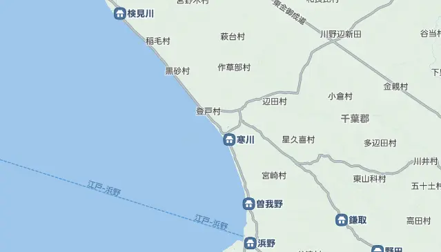

+++
title = "千葉刑場と厳島神社"
description = "同僚から千葉市中央区の登戸辺りに向かい刑場があったと聞いて調査してみました。"
date = 2025-06-22
aliases = ["/articles/2025/06/22/samukawa-kangoku"]

[taxonomies]
tags = ["Travel","Chiba"]
+++

同僚から千葉市中央区の登戸辺りに向かい刑場があったと聞いて調査してみました。

## 千葉刑場

調べてみると、千葉市立郷土博物館が 2015 年に発行した「[編さん便り](https://www.city.chiba.jp/kyodo/research/chibashishi/documents/newsletter14.pdf)」
に「寒川監獄と囚人たち」という記事がありました。

この記事によると、1874（明治 4）年までは、千葉市の大日寺境内に仮監獄があった
そうです。この仮監獄が同年火災で消失し、その為に当時「寒川村」と呼ばれていた
場所にこの監獄が移転し、当初は「寒川監獄」と呼ばれていたようです。
その後 1903 (明治 36) 年に「千葉監獄」と呼ばれるようになりました。

元々佐倉藩の米蔵があり、経費節減のために年貢積み出しのため港に近い寒川の地を
利用したようです。明治になり年貢積み出しの役割がなくなりちょうど開いていたの
でしょう。

「[れきちず](https://rekichizu.jp/)」で 1800 年代の地図を確認してみると、
「寒川」という地名は登戸より少し南に下って都川を挟んで反対側のようです。
現在の「寒川町」より少し北側で現在の「港町」付近だったようです。

現代では埋め立てが進んで海岸線がずいぶんと変わりましたが、以下の地図辺りでは
ないかなと思います。東京ガス本千葉ビルの辺りで、現在は巨大なガスタンクが建っ
ています。

<iframe
  width="425"
  height="350"
  src="https://www.openstreetmap.org/export/embed.html?bbox=140.11248350143435%2C35.59471587191188%2C140.12416720390323%2C35.602488757310795&amp;layer=mapnik&amp;marker=35.59860240897393%2C140.11832535266876"
  style={{ border: "1px solid black" }}
/>
 
<small>
  <a href="https://www.openstreetmap.org/?mlat=35.598602&amp;mlon=140.118325#map=17/35.598602/140.118325">
    大きな地図を表示
  </a>
</small>

海に近い低地であったこともあり、腸チフスが監獄内で流行したりと衛生状態はよく
なかったようです。そのためか 1907(明治 40)年には、
現在刑務所がある貝塚に移転しています。

## 厳島神社 港町弁天

当時の監獄に一番近かったであろう、厳島神社に参拝してきました。

厳島神社は首都圏では境内社のケースがほとんどですが、この神社と JR 千葉駅近くの
弁天という町にある厳島神社は珍しく主役の神社となって
います。

拝殿の裏には弁財天が鎮座しておりご神水もあります。正殿より、むしろこちら(=裏手)にご神気が満ちている印象です。

{{ youtube(id="DJl6NVe-JLw") }}
