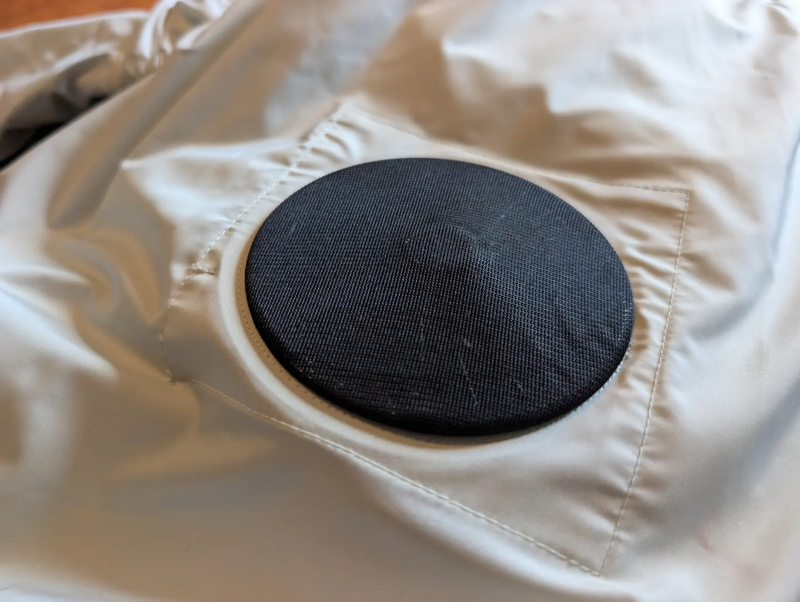

+++
title = "ワークマンの空調ウェア「ウィンドコア」を試す"
description = "ワークマンの空調ウェア「ウィンドコア」を購入して試してみました。大阪万博への暑さ対策として、建設現場で使われるファンウェアの実力を体験レポートします。"
date = 2025-06-27
aliases = ["/articles/2025/06/27/workman-windcore"]

[taxonomies]
tags = ["Gadget","Seasons"]
+++

Table of Contents

<!-- toc -->

来月地獄の大阪万博に行く予定なので、熱中症対策が必要になりました。
散歩中に建設現場の作業員の方を見ていて「そうだ、空調ウェアだ。ワークマンに行
こう」となって、早速買ってきて試しました。

## 購入したもの

今回ワークマンで購入したのは、ウィンドコアBlueB半袖ジャンパー（4,900円）、ウィンドコア26Vバッテリー・ファンセット（19,800円）、そしてクールコア(R)冷感長袖ミドルネック（1,900円）の3点です。

半袖ジャンパーはポリエステル100%で軽量。背中と腰の部分にファンを取り付けるポケットが付いています。色はネイビーを選びました。建設現場でよく見かける長袖タイプもありましたが、万博での使用を考えて動きやすい半袖にしました。

バッテリーとファンのセットは空調ウェアの心臓部です。26Vの高電圧仕様で、風量は4段階に調整可能。フル充電での持続時間は電圧によって異なり、13Vで8.2時間、17Vで4.6時間、22Vで2.7時間、26Vだと1.6時間とのこと。充電時間は約2.5時間です。

インナーは吸汗速乾素材で、濡れると気化熱で冷感効果が得られるクールコア素材を使用しています。紫外線カット機能（UPF50+）も付いているので、日焼け対策にもなります。

合計2万5千円を超えです。決して安い買い物ではありませんが、熱中症で倒れることを考えれば必要な投資だと判断しました。

## 空調ウェアの仕組み

ワークマンでは「ファンウェア」と呼ばれている空調ウェアですが、その仕組みは意外とシンプルです。服の内部に2つのファンを取り付け、外気を強制的に取り込んで服の中に風を送り込みます。この風が汗を蒸発させることで気化熱が発生し、体温を下げる仕組みです。

エアコンのように冷たい風が出るわけではなく、あくまで「汗の蒸発を促進する」ことで涼しさを感じる仕組みです。汗1gが蒸発する際に約580calの熱を奪うため、ファンで風を送ることで汗の蒸発速度が上がり、効率的に体温を下げることができます。

また、無風状態と比べて、風速1m/sごとに体感温度が約1℃下がると言われています。服の中に常に風が流れることで、実際の気温より涼しく感じるのです。通常の服では体温で温まった空気が服の中にこもりますが、ファンで常に新しい空気と入れ替えることで、熱がこもらないという効果もあります。

## 使用感

購入後、さっそく気温32℃の日に2時間ほど屋外で試してみました。ファンとバッテリーの取り付けは簡単で、説明書を見なくても直感的に装着できました。ファンの重さは1個約110gと軽量ですが、腰の部分に付けると存在感はあります。バッテリーは専用のポケットに収納するので、動いてもずれることはありません。

風量は4段階で調整できます。13V（弱）はそよ風程度で室内や軽作業なら十分。17V（中）はしっかり風を感じる程度で、通常の屋外活動に最適です。22V（強）はかなり強い風で、暑い日の移動時に重宝します。26V（最強）はジェット機のような音がして、本当に暑い時の短時間使用向けという感じです。

「涼しい」というより「過剰な体温上昇を防いでいる」という表現が正確です。エアコンのような冷たさを期待すると期待外れですが、同じ気温でファンウェアなしの時と比べると、明らかに汗の量が減り、体力の消耗が少なくなりました。特に効果を感じたのは、直射日光下から日陰に入った時。通常なら汗がダラダラ流れる状況でも、ファンの風で素早く汗が乾き、涼しさを感じました。

ただし、デメリットもあります。ファンの音が意外と大きく、中モード以上だと会話に支障があります。見た目もゴツく、ファン部分が膨らむので、人混みではファンが他人に当たりそうで気を使います。また、バッテリーの充電を忘れると使えないのも注意点です。

## まとめ

ワークマンの空調ウェア「ウィンドコア」は、エアコンのような劇的な涼しさは得られませんが、暑い環境での体力消耗を確実に軽減してくれる実用的なアイテムでした。

長時間屋外で活動する必要がある人、熱中症リスクの高い環境で作業する人、夏のイベントやフェスに参加する人、ガーデニングや農作業をする人などに特におすすめです。

購入時のアドバイスとしては、ファンで膨らむことを考慮して、普段より1サイズ大きめを選ぶこと。また、直接肌に着るとファンの風が冷たすぎることもあるので、インナーは必須です。長時間使用する場合は、予備バッテリーがあると安心でしょう。

大阪万博という「灼熱地獄」に挑むための装備として購入しましたが、普段の生活でも活躍しそうです。建設現場で働く人たちの知恵に感謝しつつ、この夏を乗り切りたいと思います。
