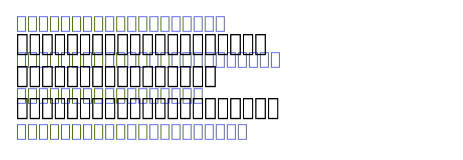

+++
title = "中村書体室の新フォント「コントラ体」"
description = "中村書体室から新しくリリースされた「コントラ体」を購入しました。直線基調でありながら太細の線が独特のコントラストを生み出す、遊び心と書道の味わいを併せ持つユニークなフォントです。80歳を超えてなお精力的に活動される中村征宏氏の職人魂に触れます。"
date = 2025-07-15
aliases = ["/articles/2025/07/15/kontora-font"]

[taxonomies]
tags = ["Design","Font"]
+++

[中村書体室](https://www.n-font.com/)から新フォント「コントラ体」がリリースされたので、早速購入しました。

このフォントは直線を基調としながらも、太い線と細い線が一見不規則に配置されています。この大胆な太細の差が、まさにフォント名の由来となった「コントラスト」を生み出しています。遊び心がありながらも、どこか書道を思わせる味わい深さを併せ持つ、実にユニークなフォントです。

高いデザイン性ゆえに本文での使用には向きませんが、動画のタイトルやポスターの見出しなど、インパクトを求める場面では効果的に使えそうです。

制作者の中村征宏氏は、「ゴナ」や「ナール」といった名作書体を手がけた巨匠です。80 歳を超えてなお精力的に新作を発表し続ける姿勢には、本当に頭が下がります。

購入後にいただいた発送連絡メールには、以下のような心温まるメッセージが添えられていました。

> もし不足文字が出た時はご通知ください。2〜3日で文字追加ファイルをメール添付にて送信いたします。フォントに不備がありましたらご連絡をお願いします。

こうした細やかな配慮からも、長年にわたって日本の文字文化を支えてこられた職人魂を感じます。
