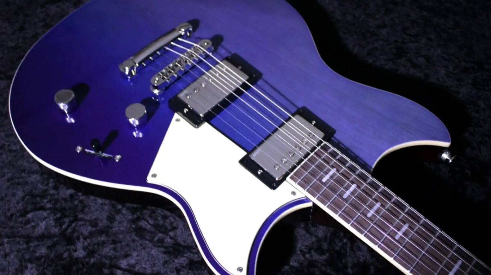

+++
title = "渚・モデラート"
description = "A guitar performance of \"Nagisa Moderato\" by Masayoshi Takanaka using the newly acquired YAMAHA REVSTAR RSP20. Exploring the guitar's tonal characteristics and reflecting on the nostalgic connection to this 1985 classic during university days."
date = 2025-07-26
aliases = ["/articles/2025/07/26/nagisa-moderato"]
+++

折角新しいギター、YAMAHA REVSTAR RSP20 を買ったので、『渚・モデラート』を弾い
てみました。

<SoundCloudEmbed
  apiurl="https://api.soundcloud.com/tracks/2135110158"
  url="https://soundcloud.com/yostos/nagisa-moderato"
  title="渚・モデラート"
/>

今回使用した YAMAHA REVSTAR RSP20 のピックアップは程よい出力でモダンな中高域を提供しますが、
トーンノブを引くことでオーバーワウンドピックアップのような効果が得られる「Focus Switch」
と呼ばれるパッシブブースト機能がついています。
このスイッチを入れるとモダンなトーンから中低域が強調された太い音色に変化します。
今回は後半のソロの部分でこの機能を試してみました。

この曲は高中正義さんが 1985 年にリリースしたシングルです。「渚・モデラート」というタイトルの「モデラート」は音楽用語で「中程度の速さで」という意味で、この曲の持つ心地よいテンポ感を表現した絶妙なネーミングでした。

その頃、私は大学の最終学年でした。気がつくと学年でもビリを争うほど単位が取れておらず、
卒業単位の心配を胸に就職活動真っだ中という時期でした。

非常にストレスフルな時期であまり記憶がないのですが、不思議とこの曲はよく弾いていたのを憶えています。
おそらく、「モデラート」の持つ適度なテンポが、当時の心境にぴったりと合っていたのかもしれません。速すぎず遅すぎない、まさに人生の歩調そのもののような。

音楽には人生の瞬間を刻む力があるということでしょうか。
