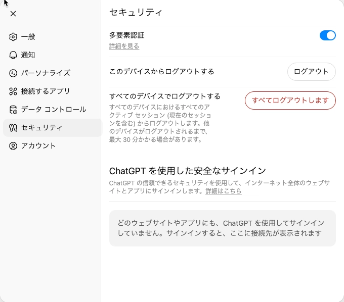

+++
title = "OpenAIではパスワード変更機能が提供されていない？"
description = "OpenAIでパスワードを変更しようとして、パスワード変更機能が提供されていないことに気付きました。"
date = 2025-07-18
aliases = ["/articles/2025/07/18/openai-pwd-change"]

[taxonomies]
tags = ["Tech", "Security"]
+++

最近はずっと Claude を利用していて ChatGPT/OpenAI はご無沙汰しています。
しかし、なぜかパスワードマネージャーから OpenAI のパスワードが使い回しという警告が出てしまったので、パスワードを変更することにしました。

しかし、ここで気付いたのです。パスワード変更機能が提供されていないということ
に。

以下は、OpenAI アカウントのセキュリティ設定画面です。

多要素認証の設定しかありません。
