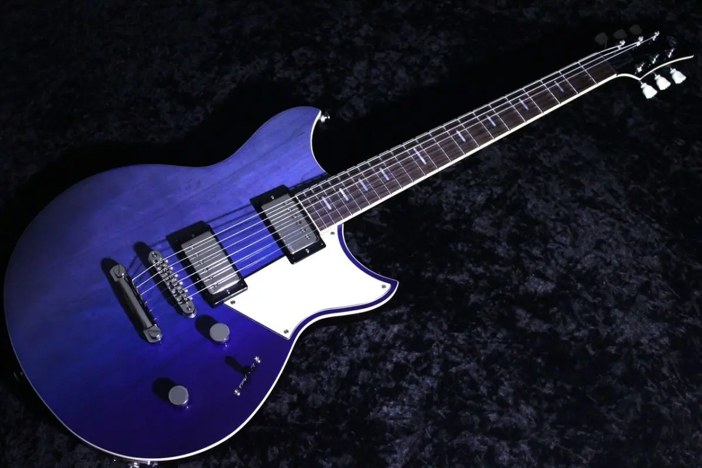
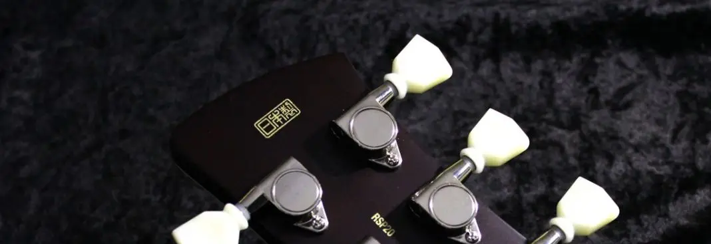

+++
title = "YAMAHA REVSTAR RSP20を購入"
description = "ギター不況と言われ、あのフェルナンデスが倒産してしまう今日ですが、独自に自社で良いギター作りをしているヤマハの現在のフラッグシップとも言えるREVSTARを軽い気持ちで見ていたら、つい購入してしまいました。"
date = 2025-07-22
aliases = ["/articles/2025/07/22/yamaha-revstar-rsp20"]

[taxonomies]
tags = ["Guitar"]
+++

## YAMAHA REVSTAR とは

YAMAHA REVSTARシリーズは、ヤマハが2015年に発表したエレキギターラインです。
無駄を削ぎ落としたシンプルで美しいデザインが特徴でGibsonやFenderとも違う
楽器とバイクという2つの象徴的なヤマハ製品を結びつけた独自のスタイルを持ちま
す。

発表された時は、YAMAHA SGシリーズの劣化版かとも思いましたが、
よく仕様を見ると新たに設計されたモデルであることが分かります。
ギター不況にあって、新モデルを投入しいまだに精密な製造技術と職人気質を
体現している。ヤマハは国産のギターメーカーとしても希有な存在です。

2022年に刷新された現行モデルは、
多くの革新的な機能を搭載し前モデルを更に進化させています。

Elemental, Standard, Professionalの3つのシリーズで構成されており、
それぞれハムバッカーとP-90のピックアップのモデルが存在しています。

ElementalとStandardはインドネシアで生産しているようですが、Professioanlは日
本生産でネック裏には「日本製」と誇らしげに表記されています。

- **スケール**: 24.75インチ (628.6mm)
- **ピックアップ**: VH5+ Alnico Vハムバッカー×2
- **特徴**:
  - 日本製（ヤマハ浜松工場）
  - 5ウェイピックアップセレクター
  - Focus Switch（プッシュプル）
  - チェンバードマホガニーボディ＋メイプルトップ
  - カーボン強化ネック
- **音の傾向**: モダンでバランスの良いハムバッカーサウンド、幅広いジャンル対応
- **位置づけ**: 現代的な多機能ギター

## YAMAHA REVSTARを購入した訳

ハムバッカー搭載のギターとしてはAria Pro II PE-1500RIを所有していましたが、
これがとても重い。オリジナルと比較するとチェンバー加工されているはずですが、
おそらく4Kgは切っていないでしょう。

REVSTARの惹かれた理由の1つは、その軽さです。

REVSTARは2022年のモデル変更で鳴りの良さを計算したチャンバー加工がなされるようになりました。
相対的に前モデルよりも軽くなっています。
今回購入した個体は何より3.39kgと、おそらくチェンバー加工だけでなく使われた材がかなり
軽量だったのでしょう。モデルの中でもかなり軽い個体だと思います。

軽いは正義です。

シリアル番号から、おそらく今年の1月に製造された個体じゃないかと思います。

5ポジションセレクターとか、ステンレスフレット、プッシュスイッチやIRAなどヤマハ独自の機能が詰まっ
ていますが、やっぱりこのご時世にギターを進化させ続けて日本で生産しているとい
う企業の姿勢に惚れてしまいました。

購入したのはムーンライトブルーと言う色です。
ブルーだとシェイプがSGに似ているのであの人を思い浮かべます。
薄いグラデーションがかかっており、6弦側に向かって色が薄くなっています。この
部分ではトップ材の木目も見えて独特な雰囲気になっています。

## YAMAHA REVSTARを弾いてみた

<iframe width="100%" height="166" scrolling="no" frameborder="no" allow="autoplay" src="https://w.soundcloud.com/player/?url=https%3A//api.soundcloud.com/tracks/soundcloud%253Atracks%253A2134293801&color=%23ff5500&auto_play=false&hide_related=false&show_comments=true&show_user=true&show_reposts=false&show_teaser=true"></iframe>
<a href="https://soundcloud.com/yostos" title="Yostos" target="_blank" style="color: #cccccc; text-decoration: none;">Yostos</a> · <a href="https://soundcloud.com/yostos/yamaha_revstar-rsp20-demo" title="YAMAHA REVSTAR RSP20 Demo" target="_blank" style="color: #cccccc; text-decoration: none;">YAMAHA REVSTAR RSP20 Demo</a>

とても鳴りがいいなと思いました。ボディ構成やチャンバー加工、カーボンファイン
バーのネックとボディへの埋設もあると思いますが
、ステンレスフレットの影響が大きいのかなと思います。ピックアップの出力は上品
でそれほど高くないと思いますが、飛んでもないサスティーンを得ることが出来ます
。

また5セレクターで2と4の位置にすると、コイルタップでなくコイルの＋とーを逆転させフェイズシフトします。
Stratocasterのハーフトーンのような音になりますが、コイルタップしているわけで
はないので音量は下がらないという不思議な音がします（"Every Breath You Take"
のリフの部分で使っています）。

ボディは大振りのようですが、軽さもあり意外に取り回しがよく、コンター加工もあ
るのでとても弾きやすいです。

## まとめ

元々所有していた、[Fender Stratocaster 70周年記念モデル](../../../04/27/stratocaster-1954/)(シングルコイル) ,
1981年製Epiphone CASINO(P-90)、
Aria Pro II PE-1500RI(ハイゲインハムバッカー)でコレクションは完結しているは
ずでした。

同じハムバッカーということでPE-1500RIと置き換えも考えていますが、
ハイゲインでクラシックなピックアップとバランスのよいハムバッカーと
微妙にポジションも違います。

PE-1500RIは希少ですが、市場がないためリセールバリューは期待できず
「売ってもな」というのが正直なところです。あぁ、エレキギターで4台体制か。
