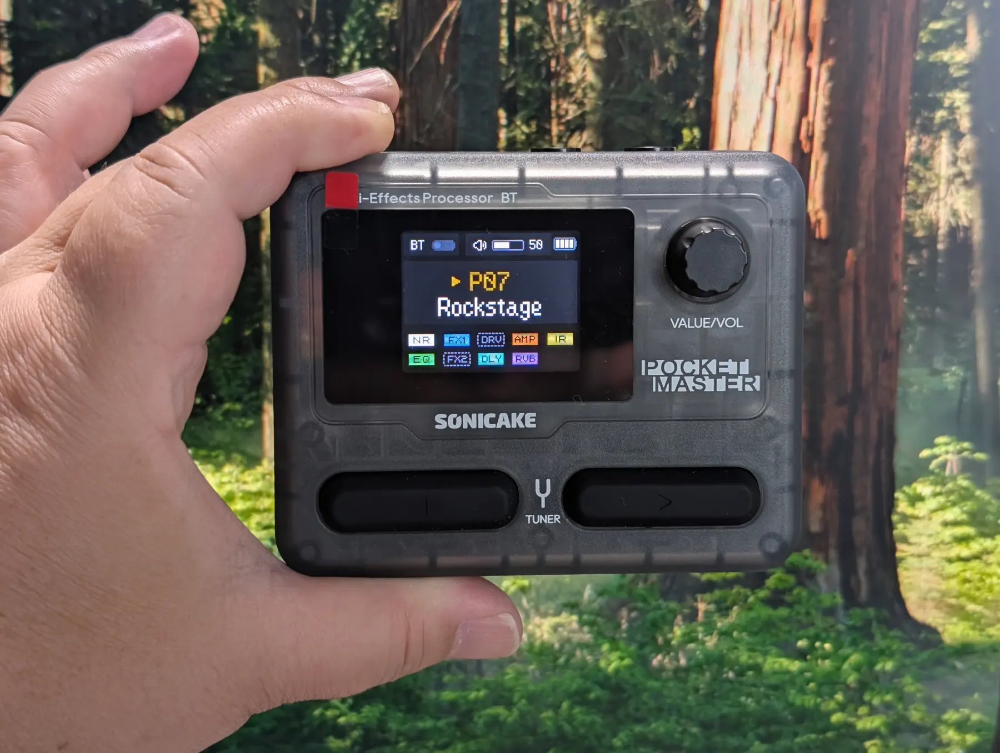

+++
title = "Sonicake Pocket Masterを購入"
description = "8,800円という脅威の低価格でNAMまで使えてしまうマルチプロセッサーSonicake Pocket Masterを購入してためしてみました。"
date = 2025-08-26
aliases = ["/articles/2025/08/26/sonicake-pocket-master"]

[taxonomies]
tags = ["Guitar", "Pedals"]
+++

Sonicake の[Pocket Master](https://amzn.to/3UHO4Vz)です。
一時は品切れで入荷待ちでしたが、最近は普通に Amazon などで購入できます。

この大きさで、100 種以上のエフェクター、20 種類のアンプシミュレーター、IR キャビネットは 15 種類が使え、
チューナーとドラムマシンも付いて、オーディオインターフェイスにもなる超便利な
ギター用エフェクターです。

しかもバッテリー内蔵なので、気軽にスタジオなどにも持ち出せます。

そして、NAM(Neural Amp Modeler)がローディングできるのです。どんなお高いアン
プやエフェクターの音もキャプチャーしたデータがあれば Pocket Master にローディ
ングさえすれば再現できます。

これが 8,800 円です。恐ろしい時代です。
