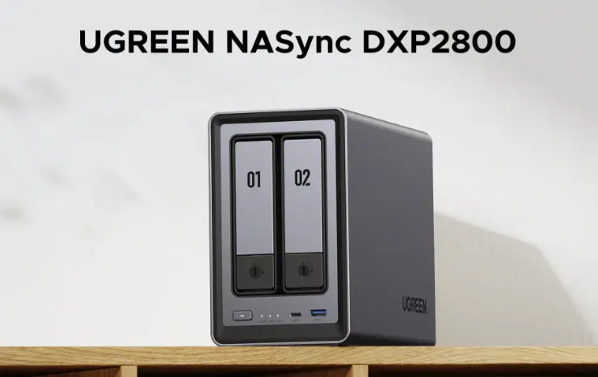

+++
title = "A New Proposal for the Cloud Era: How UGREEN NAS is changing the future of personal data storage"
description = "A 2-month review of the excellent cost-performance UGREEN NASync DXP2800. This popular NAS offers outstanding specs for its price range. From tool-free easy setup and SSD cache acceleration to UGOS practicality, we explain in detail why we recommend it to NAS beginners and how to use it effectively. We provide an honest evaluation including concerns about Chinese manufacturers."
date = 2025-08-31
aliases = ["/articles/2025/08/31/ugreen-nas"]

[taxonomies]
tags = ["Tech","Gadget"]
+++

Table of Contents

<!-- toc -->

## Why I Chose UGREEN NAS

Among numerous NAS products, I selected the UGREEN NASync DXP2800
for its outstanding cost-performance ratio.
Despite being significantly cheaper than the Synology DS224+,
it comes standard with an Intel N100 processor and 8GB DDR5 memory.
It also includes a 2.5GbE port and dual M.2 slots.
The 2.5GbE port is particularly rare in this price range and offers
future-proofing.

The tool-free removable drive tray system for easy HDD
replacement was also appealing. Setup Experience Upon unboxing, I was
impressed by the build quality of the aluminum alloy chassis. The included
dual CAT 7 LAN cables were also high-quality. I installed
2×[WD Red Plus 4TB HDDs](https://amzn.to/4myLddI) (RAID 1 configuration) and
2×[Samsung 990 EVO Plus 1TB SSDs](https://amzn.to/3HZmdgD).
HDDs simply clicked into the trays, and SSDs were easily installed with the included
screwdriver. Initial setup through the dedicated "UGREEN NAS" app took just
minutes. The RAID configuration suggested optimal settings based on
installed drives, making it beginner-friendly without confusion.

## Real-World Usage

The Samsung SSD cache implementation showed dramatic results, with
near-instantaneous photo browsing and previews. It's a completely different
experience from external HDDs. Power management features allow scheduled
automatic shutdown at night and startup in the morning, extending HDD
lifespan. UGOS (UGREEN's OS) exceeded expectations with robust file
management, automatic photo organization, remote access, and other essential
daily functions.

## Final Verdict: Worth Buying?

**Conclusion: Absolutely a "buy."**

The price-to-hardware spec ratio is unmatched by competitors. It
combines beginner-friendly usability with future expandability.
Considerations:

- Security concerns about Chinese manufacturers (may not suit corporate
  secrets)
- Software is still developing compared to Synology DSM

However, it's sufficient for home use and continuously improving through
frequent updates. Compared to monthly cloud service fees, the long-term
benefits of building a private cloud are immeasurable. I recommend this
noteworthy product that's bringing fresh innovation to the NAS market.
