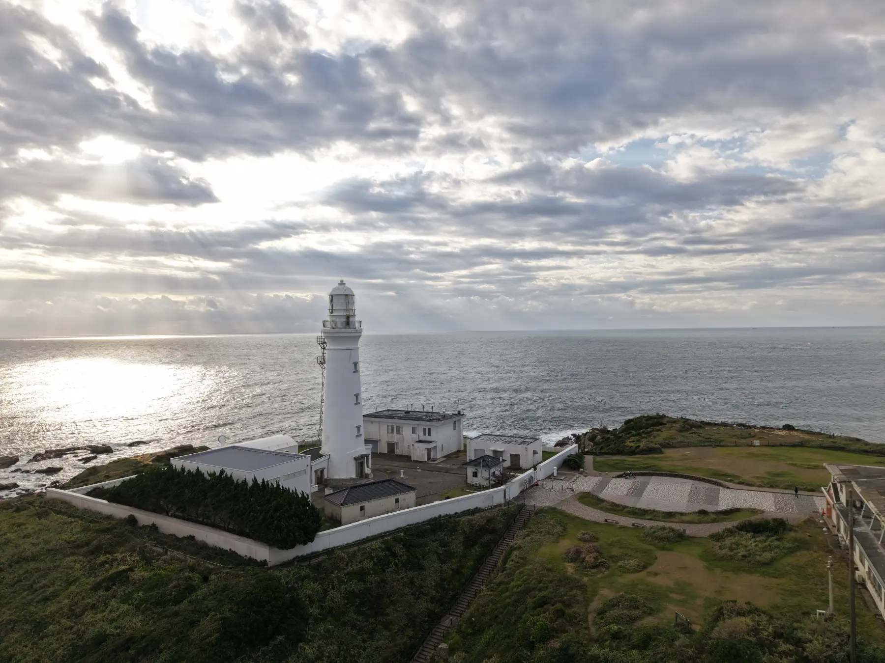

+++
title = "Viewing a Meiji Era Lighthouse from Above - Inubosaki Lighthouse"
description = "Drone footage of Inubosaki Lighthouse, located at the easternmost point of the Kanto region. Capturing the white lighthouse that has watched over the Pacific Ocean since 1874 in the mystical light of early morning."
date = 2025-09-30
aliases = ["/articles/2025/09/30/inubousaki"]

[taxonomies]
tags = ["Drone", "Photography"]
+++

Today, I captured drone footage of Inubosaki Lighthouse, located at the easternmost point of the Kanto region.

{{ youtube(id="dv22mPGs-j8") }}

## About Inubosaki Lighthouse

Inubosaki Lighthouse is a historic lighthouse that began operation in 1874 (Meiji 7). For over 150 years, it has watched over ships traveling across the Pacific Ocean. Its beautiful white structure has become one of Choshi's iconic landmarks.

This location is also known as the place where the sun rises earliest in Japan, attracting many visitors on New Year's Day to watch the first sunrise of the year.

## Early Morning Shoot

The filming took place in the early morning. I was able to capture the sea and lighthouse from above in mystical light. Unfortunately, it was cloudy, but the footage still conveys the vastness of the Pacific Ocean and the impressive presence of the lighthouse.

The view of the lighthouse from a drone offers a different charm compared to ground-level perspectives. From above, you can clearly see the surrounding rocky shore, the expansive sea, and the overall landscape centered around the lighthouse.

## The Toei Opening Rock

Interestingly, on the south side of Inubosaki Lighthouse lies the "wave-beaten rock" used in Toei's opening footage. This is the iconic rocky formation familiar from the beginning of many TOKEI's movies.

Since I flew the drone from the north side of the lighthouse this time, I couldn't pinpoint the exact location due to signal limitations. However, somewhere among the rocks visible in the footage should be that famous rock. If I get another chance to shoot, I'd like to approach from the south side to capture it.

## Conclusion

Viewing historic structures from the air makes you appreciate their grandeur anew. Inubosaki Lighthouse will continue to illuminate the Pacific Ocean for years to come.
