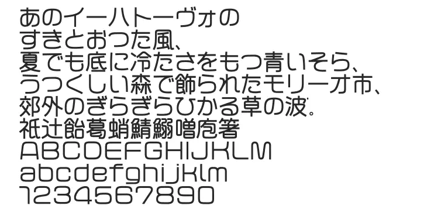

+++
title = "中村書体室のフォント「カドマ-R」を購入"
description = "中村書体室の「カドマ-R」を購入しました。スクエアなのに丸みや柔らかさを感じる独特な印象のフォントで、ターミナルにぜひ使用したいと思いました。Berkeley Monoと組み合わせて使用しています。"
date = 2025-09-15
aliases = ["/articles/2025/09/15/kadoma-r"]

[taxonomies]
tags = ["Design","Font"]
+++

ターミナル用に[中村書体室](https://www.n-font.com/)の「[カドマ-R](https://www.n-font.com/fonts/kadomar)」
を購入しました。

文字のマス目一杯にデザインされていますが、コーナーには限りなく柔らかな丸みがつけてあります。
スクエアなのに丸みや柔らかさを感じるという、
従来の丸ゴシック体や角ゴシック体とも違う独特な印象があり大変気に入っています。

ターミナルで愛用していますが、
半角文字は大きさを合わせてデザインされているようで英単語などを多用すると読みづらいので、
半角文字は`Berkeley Mono` を表示するようにしています。

あまりに気に入ったので、このサイトにも使用させていただいています。[^1] [^2]

[^1]: フォントの変換とサイトでの使用については、中村書体室に同意をいただいています。

[^2]: 2026年よりブログのプラットフォームを移行したので、WEBフォントは外しています。

また、購入後に書体の追加とOTFへの移行を快く対応いただき、
書体デザイナーの中村征宏様には大変感謝しています。
