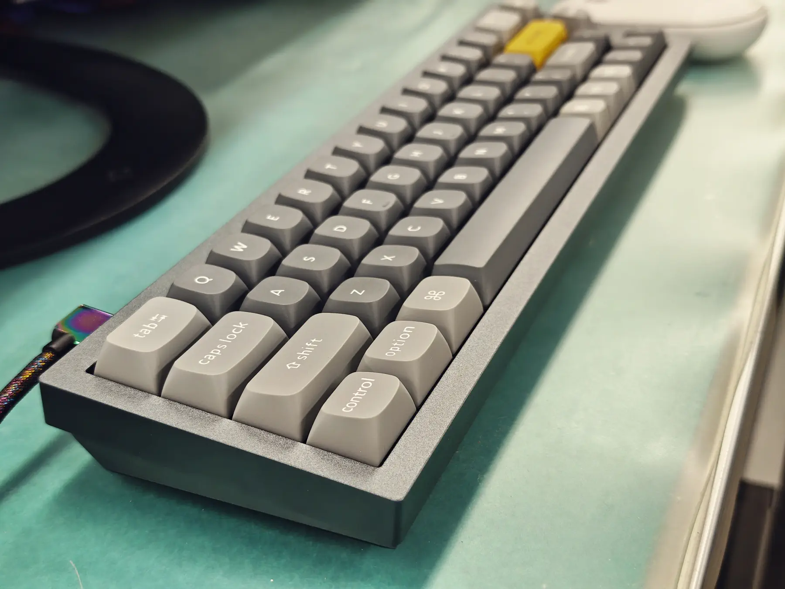
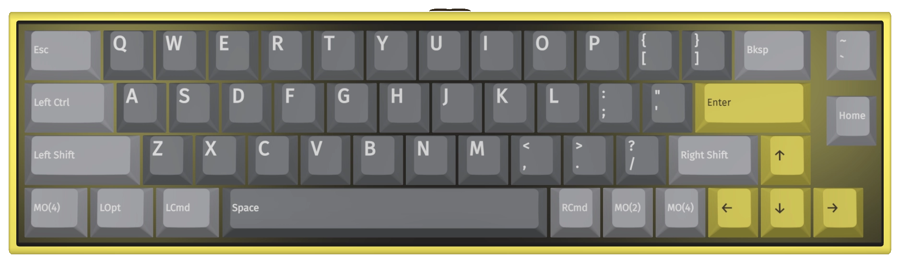
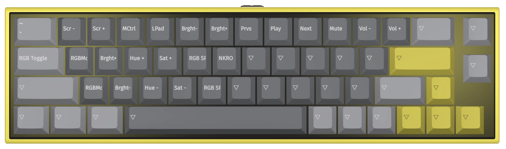
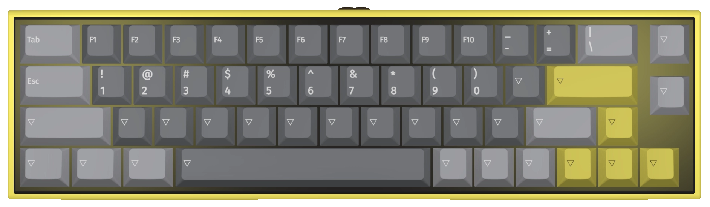

+++
title = "Purchased Keychron Q9"
description = "A review of the Keychron Q9 40% keyboard - exploring its unique design, layer configuration, usage experience, and customization options for this compact keyboard."
date = 2025-09-25
aliases = ["/articles/2025/09/25/keychron-q9"]

[taxonomies]
tags = ["Gadget","Keyboard"]
+++

## What is the Keychron Q9?

The Keychron Q9 is a compact keyboard called a 40% keyboard.

60% keyboards like HHKB omit function keys to save space,
which works minimally without compromising usability for people like me who don't use function keys.
However, 40% keyboards go even further by omitting the entire row of number keys. If you only type English text, I thought "this might actually work" and became interested.

The Keychron Q9 is quite unique even among 40% keyboards. While the depth is shorter due to fewer key rows,
the width is actually greater than 60% keyboards.

There are models with a knob where the Backspace key would be, and models with split space keys,
but I purchased the most basic type.

Above all, the tightly packed size feels more cute than functionally beautiful.

## Layers

The Keychron Q9 has a 5-layer structure as follows:

| Layer   | Description                                                           |
| ------- | --------------------------------------------------------------------- |
| Layer 0 | Base layer for Mac system                                             |
| Layer 1 | Base layer for Windows system                                         |
| Layer 2 | Multimedia keys for Mac system. Accessed with fn1 key combination     |
| Layer 3 | Multimedia keys for Windows system. Accessed with fn1 key combination |
| Layer 4 | Function keys, numbers, etc. Accessed with fn2 key combination        |

The system toggle switch allows switching between Mac and Windows.
For Mac, Layer 0 and Layer 2 (when Fn1 is pressed) are selected.
For Windows, Layer 1 and Layer 3 (when Fn1 is pressed) are used.
Layer 4 is common to both Mac/Windows.
It activates when Fn2 is pressed for numbers and function keys.

The Q9 features a 5-layer structure designed to support both Mac and Windows.

## Usage Experience

First, since there are overwhelmingly fewer keys, it's certainly quite challenging to use.

The main issues are:

- **Hyphen and Equals**: No key assignment. Not that they're not on the default layer, but there's no key assignment at all.
- **ESC Key**: Can only be input with Fn2 key combination (common issue with compact keyboards)
- **Backspace**: Above the Enter key is the \ key, not Backspace (specific issue for HHKB users)
- **Control**: Next to the A key is Caps Lock, not Control (specific issue for HHKB users)
- **Fn2**: Number keys can only be input with Fn2 combination, but Fn2 key is only on the right side

The biggest problem is that Japanese requires hyphens for long vowel sounds, but there's no key mapping for it.
Therefore, key mapping changes are essential if you want to use it properly.

## Customization

- **Hyphen and Equals**: Sacrificed some function keys and made them accessible via Fn2 key combination
- **ESC Key**: Set it to the Tab key position since that's a familiar location, and made Tab accessible via Fn2 combination
- **Backspace**: Since this is also a familiar position, set it to the backslash key. Backslash is now accessible via Fn2. However, it might be better to train myself to use Ctrl-H instead.
- **Control**: Replaced Caps Lock with Control
- **Fn2**: Replaced the Control key position with Fn2. This creates a setup with two Fn2 keys on both left and right sides

<figure>
  
  <figcaption>LAYER0</figcaption>
</figure>

<figure>
  
  <figcaption>LAYER2</figcaption>
</figure>

<figure>
  
  <figcaption>LAYER4</figcaption>
</figure>
## Keychron Q9 Evaluation

The switches are Gateron G Pro Red, with an aluminum case and double gasket mount, so the typing feel is excellent.

You get used to it quickly, but since number keys and some other keys can only be typed with key combinations,
typing efficiency does decrease.

While it's marketed as a 40% keyboard, the depth is indeed space-saving since it's reduced by one row of number keys. Compared to HHKB, you can save about 2cm in depth.
However, the width is about 1.5cm wider on each side compared to typical 60% keyboards.

Personally, I can't imagine scenarios where I'd feel the
space-saving benefits at this level.
However, if you have extreme desk constraints, this unique size
that no other keyboard offers would be the only choice.

As for myself, I'll continue using this keyboard purely
for the sake of "showing off the minimal number of keys."

In a degenerate workplace with useless individuals,
using a favorite keyboard is about the only motivation I have.
This should keep me entertained for about a month.
