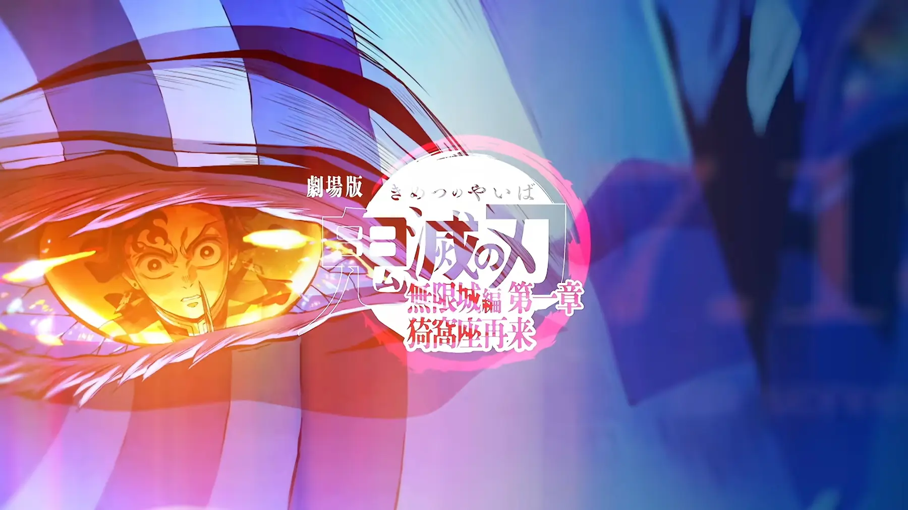

+++
title = "映画『鬼滅の刃 - 無限城編 第一章 猗窩座再来』を見てきた"
description = "I watched the movie \"Demon Slayer: Kimetsu no Yaiba - Infinity Castle Arc Chapter 1: Akaza's Return\"."
date = 2025-09-19
aliases = ["/articles/2025/09/19/kimetsu-no-yaiba"]

[taxonomies]
tags = ["Anime", "Movies", "Entertainment"]
+++

The visuals and sound were absolutely flawless. Being an IMAX experience, the Infinity Castle sequences were particularly breathtaking. The production team rebuilt the 3D models from scratch. What was initially expected to take 10 years to render was made possible through ultra-high-performance GPUs. The result was stunning. Combined with the powerful audio, I was completely satisfied with how they brought the original manga to life.

However, when I look at it as a movie, I felt there was a major issue. Demon Slayer's signature storytelling technique of "flashback monologues during battle scenes" is used for six different characters in this film. These characters include Doma, Shinobu Kocho, Tanjiro Kamado and others like Kaigaku, Zenitsu Agatsuma and Akaza. Most of these are self-indulgent sob stories.

In the manga serialization or 30-minute TV anime episodes, this technique works as a climactic moment. But when you're watching nearly 3 hours of a movie with six characters' flashbacks, you start thinking "Oh great, here we go again." I started feeling "grossed out" by it halfway through. I found myself distancing from the story.

As a faithful adaptation of the source material, it's perfect. But if you're going to show this to movie audiences, I think they should have considered what works for cinema. Instead of repeating the same storytelling technique over and over, they could have used the unique characteristics of film as a medium to create something even better.
