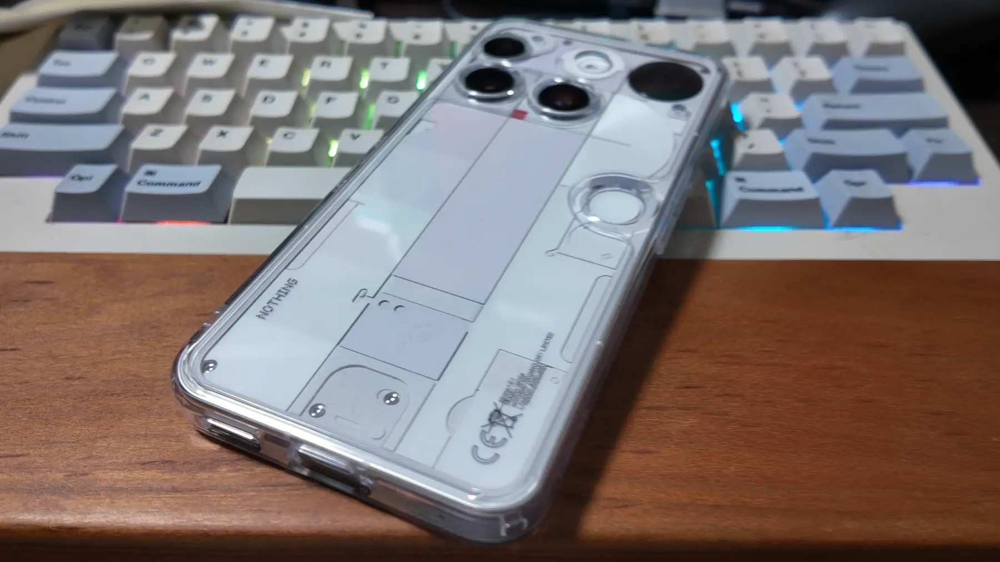

+++
title = "Nothing Phone (3)を購入"
description = "Pixel 8 Proからの買い替えでNothing Phone (3)を2週間使用したレビュー。透明な背面デザイン、Glyphマトリックス、Nothing OS 3.0の使い勝手、カメラ性能などを詳しく紹介。デザインにこだわりがあるユーザーにおすすめの一台。"
date = 2025-09-17
aliases = ["/articles/2025/09/17/nothing-phone3"]

[taxonomies]
tags = ["Gadget"]
+++

Table of Contents

<!-- toc -->

Pixel 8 Proのバッテリーの持ちが悪くなってきたので、日本での発表当日
Nothing Phone(3)を予約購入しました。
8月末に届いて2週間程使ってみたので、レビューとしてまとめたいと思います。

## Nothing Phone (3)の背面デザイン

Nothing Phone (3)の最も特徴的な部分が背面のデザインだと思います。
ガラスの透明なボディ内部には複数のパーツが複雑に組み合わされたような造形が見えます。
特にカラーがホワイトの場合に、より鮮明にこれらのデザインが目に付きます。
実際にパーツの一部が露出した造形でなく、機能のない全くの「デザイン」です。

工業製品ではデザインは機能の帰結としてある「機能美」を支持しますが、
iPhoneとAndroidの区別がつかないノッペリしたデザインばかりのスマートフォンの現状を鑑みると、
フェイクでも「何か機能的」と感じさせるデザインについて嫌いではありません。
唯一中心部にある赤い四角はレコーダーアプリ起動時には赤く点灯します。

グリッドに沿って配置されたカメラのレンズは大仰にも感じますが、
3連や4連で縦や横一連に並んだレンズの気色悪さよりよほどマシです。

Nothing Phoneの特徴であった「Glyphインターフェイス」はコスト削減のためか
「Glyphマトリックス」というドットマトリックスを表示できるディスプレイに
変更されました。今のところ特定の条件（通話相手やアプリなど）により
特定のアイコンを表示することと、Glyph Toyの表示くらいしかできません。

Glyph Toyはじゃんけんや瓶回しなどあまり実用的でないものしかありませんが、
そのうちこれを利用できるアプリが出てくるとよいなと思います。

## Nothing Phone (3)の性能について

プロセッサはQualcomm Snapdragon 8S Gen 4で、私が購入したモデルは
ストレージ512GBモデルで、メモリーは16GBです。

Galaxy辺りのハイエンドを比較すると見劣りしますが、
私は負荷の高いゲームなどあまりやらないので十分です。この2週間で不満を感じたシーンは全くありませんでした。

ディスプレイは6.77インチ、1,260×2,800ドットのフレキシブルAMOLEDです。
明るさは通常800nit、屋外1,600nitなので、ハイエンドには及ばないものの十分だと感じます。

カメラ性能はPixel 8 Proと比べてしまうと、若干使い勝手が悪かったりAI補正は弱いと感じます。
メインカメラは1/1.3インチと大型センサーを搭載し35mm換算24mm/F1.68、ワイドが15mm/F2.2、望遠が70mm/F2.68
で解像度はどれも50MPなのでそれなりの画像は撮れます。

## Nothing OS 3.0と独自アプリ

Nothing Phone (3)にはAndroid 15をカスタマイズしたNothing OS 3.0とNothing独自アプリが搭載されています。

予め統一感のあるデザインされた独自のHomeアプリとWedget、アイコンパックが提供されているNothing OS 3.0は、
「もうこれでいいや」と思える程度にセンスよくまとめることを簡単にできます。最初は楽しかったAndroidの
Homeアプリのカスタマイズが最近は苦痛だったので、非常にありがたいと思いました。

独自のギャラリーやレコーダーアプリ、お天気も使い勝手が良く、デザインが統一されているのでWedgitも利用価値があります。
AIを活用したEssential Spaceはまだ使い込んでおらず、あまり恩恵を感じません。

## Out of Boxですぐに使える

Nothing Phone (3)はその背面デザインをスポイルしないトランスペアレントなケースが付属している上に、
ディスプレイには予め保護フィルムが貼ってあり自分で購入して貼る必要がありません。
箱から出してすぐに使い始めることができるので、これは非常に好印象です。

ケースに特に不満はありませんでしたが、Glyphマトリックス部分が保護されていない点と
素材的に黄ばみそうな気がして[Spigenのクリアケース](https://amzn.to/4gpAxMe)に差し替えました。
保護能力は折り紙付きでGlyphマトリックス部分もしっかりケースで覆われます。また黄変を抑制する特殊素材を採用されているので黄ばみも押さえることができるのでお勧めで
す。

## まとめ

Nothing Phone (3)は2週間使ってみて非常に満足度の高いスマートフォンでした。

突出して高機能ではありませんが、もはやミッドレンジ以上であれば私の使い方では差が感じられないので十分です。
カメラもPixelには及ばないものの、SNS投稿や記録用途には問題ありません。

背面の透明デザインは賛否が分かれるかもしれませんが、他社の似通ったデザインに対する明確な差別化になっており私は好感を持ちました。
Nothing OS 3.0と独自アプリのUIは本体背面とも統一したデザインがなされており、他の違うセンスよさげな雰囲気を醸し出している点が好きです。

Glyphマトリックスはまだ活用の幅が狭いものの、今後のアプリ開発に期待が持てます。

デザインにこだわりがあるユーザーには、所有する喜びを感じることができお勧めできる一台です。
