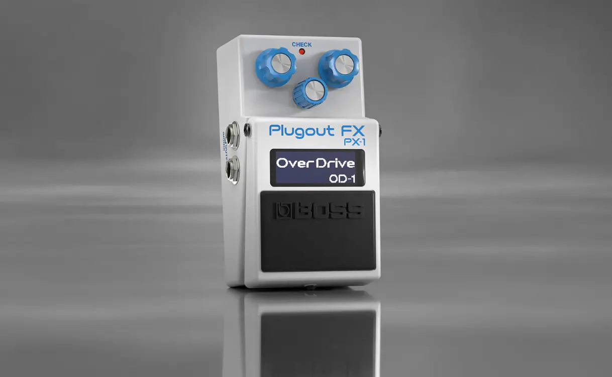

+++
title = "やはり買ってしまったBOSS PX-1"
description = "海外では大変バッシングされているBOSSの新しいコンパクトエフェクター PX-1ですが、日本ではどの楽器店でもSOLD OUTで大変人気なようです。そんな中BOSS PX-1の在庫を見つけてしまったので、思わず買ってしまいました。"
date = 2025-09-27
aliases = ["/articles/2025/09/27/purchased-boss-px-1"]

[taxonomies]
tags = ["Guitar", "Pedals"]
+++

以前の[記事](/articles/2025/09/08/boss-px1-personal-thoughts)では
技術的には興味深いが、
使い方が思い浮かばないなどと書いていました。

にも関わらず、購入してしまったのは「売り切れ続出で入手できない」という希少性に
惹かれたという大変ミーハーな理由です。

## 購入したらアップデータを適用

さて、購入後 Android で BOSS EFFECT LOADER をインストールして遊ぼうとしたところ
Bluetooth で接続してエフェクターを追加しようとしても「Install」ボタンが表示されません。

既に本体のアップデータがリリースされていて、適用しないとエフェクターのアップロードができないようです。

手順は次の通りです。

1. Mac/Windows で[BOSSのサイト](https://www.boss.info/jp/support/by_product/px-1/updates_drivers/646108a8-2e7d-44a7-976e-133ebc4059fb/)からアップデータをダウンロードして解凍しておく。(現在は Ver1.10 である)
2. PX-1 のペダルを押しながらアダプタを接続し電源を入れると、UPDATER の画面が表示される。
3. Mac/Windows からは PX-1 がリムーバブルドライブに見えているので、解凍したファイル群を PX-1 にコピーしてドライブを切り離す。この時、いきなりケーブルを抜かずにち
   ゃんと「ドライブの切り離し」を行なう。
4. PX-1 でアップデートが開始され完了すると「UPDATE COMPLETED」と表示される。

## BOSS PX-1の操作性について

あのサイズに結構な機能を詰め込んでいるので、操作性が悪いのではないかと心配していましたが杞憂でした。

操作は独特ですが、3 つのノブをクリックする、回すというシンプルな操作ですべての操作が出来るようによく練られています。
エフェクターに切り替えやスマートフォンの接続など PX-1 独自の機能については少し操作を憶える必要はあります。

しかし、一度エフェクターを呼び出してしまえば、慣れたエフェクターの操作なので特に考えることもなく
操作できてしまいます。

ノブの操作でパラメータの変化量が小さすぎるというクレームを見たことがありますが、
おそらく操作方法を知らないのでしょう。ノブを押しながら操作するとパラメータが 10 単位で変化します。

## BOSS PX-1は使えるか？

さて、技術的には興味深いが使い道がわからんなとか書いていました。
実際に使ってみると意外に便利で手放せなくなりました。

私は完全に誤解していました。ついつい BOSS GT-1 や Zoom MS-50G などマルチエフェクターと比較してしまい
「can do everything but only one thing at a time」などと考えていたのです。

BOSS はちゃんとアナウンスしていました。

> タイムレスなBOSSのエフェクターを体験できる革新的な**コンパクト・ペダル**

そう、これはマルチエフェクターでなく、あくまでコンパクトエフェクターなのです。
同時に複数のエフェクターが使えないのは当たり前です。

ただし、いろんなエフェクターに成り代われるエフェクターです。
多くの人はある程度エフェクターを持っていたり、ボードを組んでいると思います。
そして、こんな悩みを一度は持ったことがあるはずです。

- 買うほどではないけれど、あの曲でこのエフェクターを入れたい
- 買い足すほどじゃないが、たまにいつもと違う歪み系エフェクターを使いたい

手持ちのエフェクターのラインナップに BOSS PX-1 を加えると、こういったイレギュラーな
思いつきに多くの場合 PX-1 で対応できます。

「こんな中身が入れ替わるエフェクター、ボード上のどこに入れればいいんだ」なんて思っていましたが、
逆でした。ボード上のどこにでも入れられるんです。切り替えたエフェクターに応じて役目が変わるので、
むしろボード内で遊撃手のようにポジションを変えるべきエフェクターなのでした。

多くの YouTuber が検証しているように、歴代の BOSS の名器が再現されており音は折り紙付きです。

これで私のエフェクターの旅もようやく終わりを迎えそうです。
