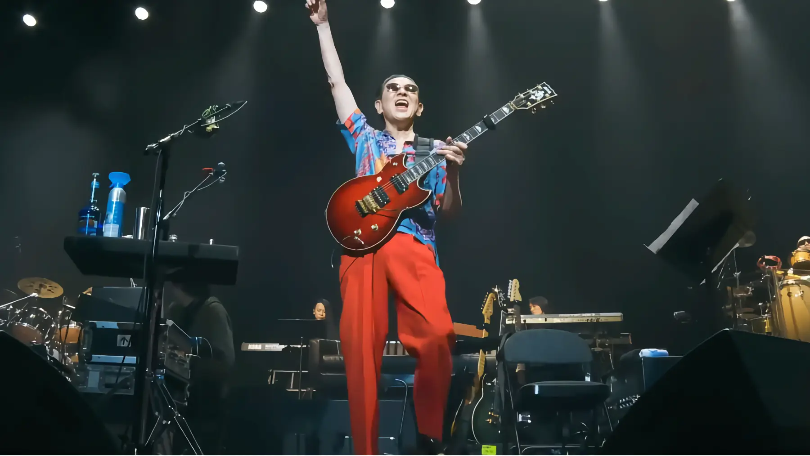

+++
title = "高中正義 SUPER TAKANAKA WORLD LIVE 2025-2026"
description = "40年ぶりくらいに高中正義さんのライブに行ってきました。本当によかった。生きている間に見ることが出来て良かった。"
date = 2025-09-21
aliases = ["/articles/2025/09/21/takanaka"]

[taxonomies]
tags = ["Music"]
+++

久しぶりというのも憚られるほど久しぶりに高中正義さんのライブに行ってきました。
会場は川崎のカルッツかわさきでした。

今回久しぶりにライブに行こうとおもったのも 39 年前のライブも
場所が川崎でほろ苦い思い出と共に当時の記憶が蘇ったからです。

1986 年の「JANGLE JANE TOUR」で社会人になった年でした。
会場は川崎産業文化会館でしたが、現在は川崎市教育文化会館と改名しており
当時ライブが行われた大ホールは 2018 年に閉鎖になっていました。

なんか、やっぱりよかったなぁ。
メンバーも斉藤ノヴ(Percussion) / 岡沢章(Bass) / 宮崎まさひろ(Drums) /井上薫(Keyboard) と一流です。
加えて以前「[Haru](https://open.spotify.com/intl-ja/album/4mteo8oYvzdSszotEzomOJ?si=egVX7idJReGY0D0N2g1Ldg)」
というアルバムをよく聴いていた髙本りなさんもキーボードで参加されたので驚きました。

1 曲目から「BLUE LAGOON」で感極まり、アンコールのフィナーレは
「You Can Never Come To This Place」です。米国で 10 月から公開される映画"The Smashing Machine"
でこの曲が使われていると言っていたのでちょっと期待していましたが、まさかこの曲が生で聴けるとは。 泣きました。

観客はジジィばかりだろうと思っていたら、若い海外の方が意外に多く、
米国で人気になっているというのもホントなのだなと思いました。

あー、もう一公演くらい見に行きたいなぁ。
