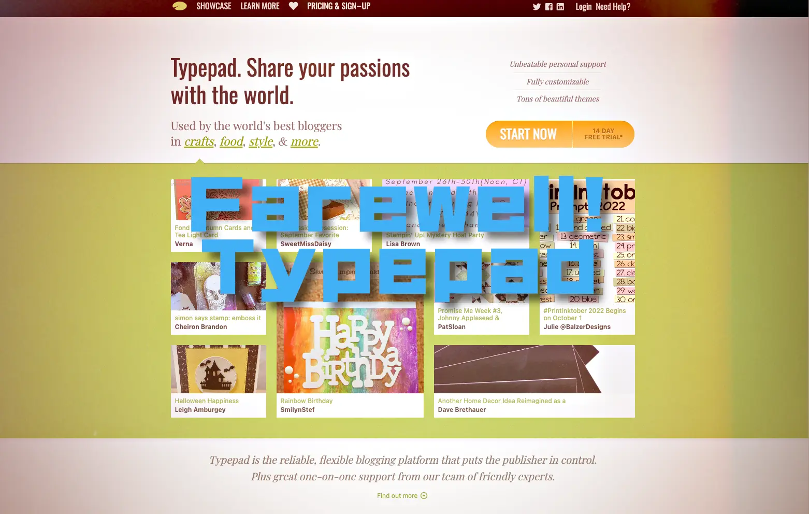

+++
title = "TypePad終了：ブログ革命の一時代の終焉"
description = "TypePadが2025年9月30日でサービス終了。2003年から22年間続いたブログプラットフォームの歴史を振り返り、初期ブログ文化からSNS時代、そして個人所有メディアへの回帰まで、Web発信環境の変遷を考察。"
date = 2025-09-09
aliases = ["/articles/2025/09/09/typepad-shutdown-end-of-blog-era"]

[taxonomies]
tags = ["Tech", "Weblog"]
+++

Table of Contents

<!-- toc -->

An article titled "[Typepad is shutting down](https://everything.typepad.com/blog/2025/08/typepad-is-shutting-down.html)" has been published on TypePad's official blog.

<blockquote cite="https://everything.typepad.com/blog/2025/08/typepad-is-shutting-down.html">
We have made the difficult decision to discontinue Typepad, effective September 30, 2025.

**What Does This Mean for You?**

After September 30, 2025, access to Typepad – including account management, blogs, and all associated content – will no longer be available. Your account and all related services will be permanently deactivated.

<footer>
  <cite>Everything Typepad - "<a href="https://everything.typepad.com/blog/2025/08/typepad-is-shutting-down.html">Typepad is shutting down</a>"</cite>
</footer>
</blockquote>

## An Icon of Early Blog Culture

TypePad launched in October 2003, and I registered and started using it almost simultaneously with the service launch. This was back when Six Apart's Japanese subsidiary hadn't even been established yet.

Looking back at the situation then, PC magazines featured articles on how to set up Movable Type, but it was still an era with high technical barriers where only tech-savvy enthusiasts would set up their own servers.

Around that time, I read Rebecca Blood's "Weblog: A History and Perspective" (2000) and thought, "Wow, this is something different from Japanese diary sites." It was also impressive that she consistently used the term "weblog" throughout that period.

## Constraints That Sparked Creative Exploration

One of TypePad's charms was the joy of exercising creativity within a constrained environment. Creating widget-like components for the sidebar, customizing designs within limited freedom—it was truly experiencing the essence of blogging.

Unlike today's web development environment where you can do anything, there was a kind of creativity that emerged precisely because of certain constraints.

## Meeting the Developer Couple

On November 21, 2003, I participated in a Six Apart gathering held in Tokyo and had the memorable experience of meeting the developers Ben Trott and Mena Trott in person, which remains vivid in my memory.

Around this time, Six Apart was scaling up their service after receiving funding from venture capital led by Joi Ito's Neoteny Co. At the venue, I was able to meet various people who participated as TypePad users—Neoteny associates, people from NTT Communications, someone who challenges the human-powered aircraft contest every year—and could feel firsthand the excitement of the early blog community.

## The Evolution of Blog Culture and Personal Publishing

TypePad's shutdown feels like it symbolizes the end of an era, beyond just a service termination.

In 2003, it was also a transitional period when the abbreviation "blog" was trying to replace "weblog." The term "blog," which originated from Peter Merholz's split notation "we blog" in 1999, became mainstream around this time.

The blog community of that era had a culture of writing deeper content and engaging in denser communication, unlike today's SNS-dominated age. There were rich interactions that we don't see today, such as inter-article linking through TrackBack and active discussions in comment sections.

## The Importance of Personal Ownership: From Dawn to Present

When I think about it, the dawn of blogging—the early 2000s when TypePad and Movable Type appeared—was very similar to the ideals advocated by current IndieWeb and microblog concepts, wasn't it?

Back then, many people ran blogs on their own domains, and personal publishing on platforms you owned and managed was taken for granted. In the pre-Twitter and Facebook web world, the principle of "personal publishing on your own blog" was practiced unconsciously.

Regarding the microblog concept advocated by the IndieWeb movement, while I personally question whether micro-web is necessary, I strongly resonate with the underlying idea that "individuals should have a place where they can control their own publishing."

## Current Choice: Self-Built Blog Based on Next.js

With such thinking, I currently operate a self-built blog based on Next.js on my own domain[^1]. This is one answer I've reached through a long evolution of personal web usage from TypePad.

From TypePad era's "creativity within constraints," through Blogger and Static Site Generators' "freedom and management complexity," to now choosing "complete technical autonomy." In terms of avoiding platform dependency risks and building an environment where I can control my own publishing, this could be seen as a return to the spirit of early blogging days.

[^1]: I've moved to Zola in 2026.

## The Fragility and Inheritance of Digital Culture

TypePad's termination reminds us once again of the vulnerability of cultural assets in the digital age. The reality that a platform that supported many people's thoughts and creativity for 22 years can completely disappear with a single corporate decision.

This reality tells the story of the importance of individuals owning their own publishing infrastructure. Platforms may disappear, but domains and content you manage yourself continue to exist.

At the same time, the role TypePad played—making it technically possible for ordinary people to publish online and promoting the democratization of blog culture—can be said to be inherited as the foundation for current SNS and content platforms, as well as new web technologies.

Personal publishing environments may be drawing a large circle, going from hosted blogs to SNS, and then returning to individual ownership again.

Though it's the flow of time, it's still quite sad.

---

TypePad の公式ブログに「[Typepad is shutting down](https://everything.typepad.com/blog/2025/08/typepad-is-shutting-down.html)」という記事が掲載されました。

<blockquote cite="https://everything.typepad.com/blog/2025/08/typepad-is-shutting-down.html">
We have made the difficult decision to discontinue Typepad, effective September 30, 2025.

**What Does This Mean for You?**

After September 30, 2025, access to Typepad – including account management, blogs, and all associated content – will no longer be available. Your account and all related services will be permanently deactivated.

<footer>
  <cite>Everything Typepad - "<a href="https://everything.typepad.com/blog/2025/08/typepad-is-shutting-down.html">Typepad is shutting down</a>"</cite>
</footer>
</blockquote>
## 初期ブログ文化の象徴的存在

TypePadは2003年10月にローンチされ、私もサービス開始とほぼ同時にユーザー登録して利用を始めました。まだSix Apartの日本法人も設立されていない頃の話です。

当時の状況を振り返ると、パソコン系雑誌でMovable Typeの導入方法が特集記事として掲載されていましたが、それでもまだまだマニアックな人たちがサーバーを立ち上げるという、技術的ハードルの高い時代でした。

ちょうどその頃、Rebecca Bloodの「Weblog: A History and Perspective」（2000年）を読んで、「おおぉ、これは日本の日記サイトとは別物なんだな」と感じていました。彼女は当時、一貫して「weblog」という用語を使用し続けていたことも印象的でした。

## デザインへの探求心を刺激した制約

TypePadの魅力の1つは、制限された環境の中でいかに創造性を発揮するかという楽しさでした。サイドバーに置くウィジェット的な部品を作ったり、限られた自由度の中でデザインをカスタマイズしたりと、まさにブログの醍醐味を味わっていました。

現在のように何でもできるWebサイト制作環境とは違い、ある種の制約があったからこそ生まれる創造性があったのかもしれません。

## 開発者夫妻との出会い

2003年11月21日、東京で開催されたSix Apartのギャザリングに参加し、開発者であるBen TrottとMena Trott夫妻に直接お会いできたことは、今でも印象深い体験として記憶に残っています。

この頃、Six ApartはJoi ItoのNeoteny Co.主導のベンチャーキャピタルから資金調達を受けてサービスを本格化させていました。会場ではTypePadユーザーとして参加していた様々な方々—Neotenyの関係者、NTT Communicationsの方、毎年鳥人間コンテストにチャレンジされている方など—とも知り合うことができ、初期のブログコミュニティの熱気を肌で感じることができました。

## ブログ文化の変遷と個人発信の意味

TypePadのシャットダウンは、単なるサービス終了を超えて、1つの時代の終わりを象徴しているように感じます。

2003年当時、「blog」という略語が「weblog」に取って代わろうとしていた過渡期でもありました。Peter Merholzが1999年に「we blog」と分割表記したのが始まりとされる「blog」という呼び方が、ちょうどこの頃に一般化していったのです。

当時のブログ界隈は、今のSNS全盛時代とは異なり、より深い文章を書き、より密なコミュニケーションを取る文化がありました。TrackBackによる記事間のリンクや、コメント欄での活発な議論など、現在では見られないような濃密な交流が日常的に行われていたのです。

## 個人所有の重要性：黎明期から現在へ

よく考えてみると、ブログの黎明期—TypePadやMovable Typeが登場した2000年代初頭—は、現在のIndieWebやマイクロブログ・コンセプトが提唱する理念に非常に近い状況だったのではないでしょうか。

当時は多くの人が自分自身のドメインでブログを運営し、個人の発信は自身が所有・管理する場所で行うことが当たり前でした。TwitterやFacebookが台頭する以前のWeb世界では、「個人の発信は自身の所有するブログで」という原則が、意識せずとも実践されていたのです。

IndieWebムーブメントが主張するマイクロブログのコンセプトについては、個人的にマイクロWebが必要かどうかは議論の余地があるものの、その根底にある「個人が自分の発信をコントロールできる場所を持つ」という考え方には強く共感しています。

## 現在の選択：Next.jsベースの自作ブログ

そうした考えもあって、私は現在、自身が所有するドメインでNext.jsをベースとした自作のブログを運営しています[^2]。これは、TypePadからの長い個人Web利用の変遷を経て到達した、ひとつの回答でもあります。

[^2]: 2026年にZolaへ移行しました。

TypePad時代の「制約の中での創造性」から、BloogerやStatic Site Generatorでの「自由度と管理の複雑さ」を経て、現在は「技術的完全自律性」を選択したという流れ。プラットフォーム依存のリスクを避け、自分の発信を自分でコントロールできる環境を構築するという意味では、まさに初期ブログ時代の精神への回帰とも言えるかもしれません。

## デジタル文化の儚さと継承

TypePadの終了は、デジタル時代における文化的資産の脆弱性をあらためて思い起こさせます。22年間という長期間にわたって多くの人々の思考と創造性を支えてきたプラットフォームが、企業の判断1つで完全に消失してしまうという現実。

この現実こそが、個人が自分の発信基盤を所有することの重要性を物語っています。プラットフォームは消えても、自分が管理するドメインとコンテンツは残り続けるのです。

同時に、TypePadが果たした役割—一般の人々がオンラインで発信することを技術的に可能にし、ブログ文化の民主化を推進したこと—は現在のSNSやコンテンツプラットフォーム、新しいWeb技術の基盤となって受け継がれているとも言えるでしょう。

個人の発信環境は、ホスト型ブログからSNSへ、そして再び個人所有へと回帰する大きな円を描いているのかもしれません。

時代の流れとは言え、やはり寂しい限りです。

---

_参考：TypePadは2025年9月30日をもってサービス終了予定。コンテンツのエクスポートは同日までに完了する必要があります。_
