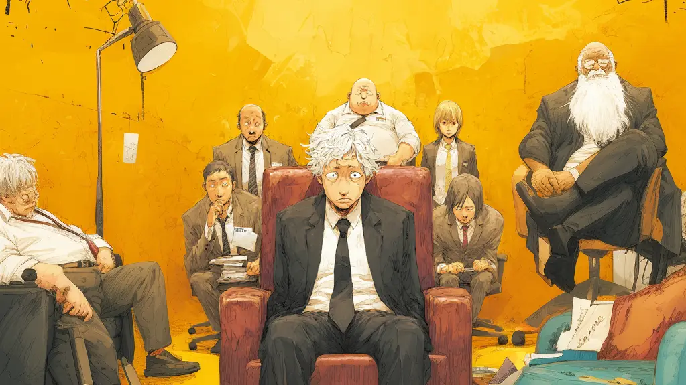

+++
title = "労働問題の落とし前のつけ方: 総合労働相談コーナーと法的手段"
description = "業務をアサインされないなどの労働問題に直面したとき、どう対処すれば良いでしょうか。私自身、5ヶ月近く業務をアサインされない状況に置かれています。ハラスメントならまだ救いがありましたが、業務を用意できないというバカ上司と弛みきった職場で解決する能力がなさそうなので、厚生労働省の「総合労働相談コーナー」の活用方法と弁護士による法的手段という外部からの解決手段について検討してみました。"
date = 2025-10-28
aliases = ["/articles/2025/10/28/hacking-labor-consultation-corner"]

[taxonomies]
tags = ["Career"]
+++

## 1. 労働問題解決の全体像

労働問題を解決するための手段は、大きく分けて以下の 2 つの段階があります。

1. 総合労働相談コーナーを利用する方法(相談→助言・指導→あっせん)
2. 弁護士による法的手段を取る方法(内容証明→示談交渉→労働審判→訴訟)

重要なのは、これらの手段は段階的に進むだけでなく、状況に応じて並行して活用できるという点です。
自分の置かれた状況と目的に応じて、最適な戦略を選択することが重要です。

## 2. 総合労働相談コーナーとは

総合労働相談コーナーは、労働者や事業主からの相談に無料で対応してくれる窓口です。
全国の労働局や労働基準監督署に設置されており、千葉県であれば 10 ヶ所程度あります。

相談内容は秘密が守られるため、会社に知られることなく相談できる点が大きなメリットです。
相談があったこと自体も秘密として扱われます。

このコーナーでは、状況に応じて次のような段階的な支援を受けることができます。

### 第1段階(相談)

まず第一段階として、専門の相談員が電話または面談で対応してくれます。
ここでは労働問題に関する情報提供や、どのような解決方法があるかについてのアドバイスを受けることができます。

自分の置かれている状況が労働問題としてどう扱われるのか、
法的にどのような問題があるのかを、まずはここで確認することが重要です。

例えば、業務をアサインしないという行為は、以下のような観点から問題となる可能性があります。

- 労働契約に基づく使用者の義務違反が考えられる(労働者に適切な業務を与える義務)
- 安全配慮義務違反が考えられる(精神的健康への配慮を欠く)
- 不当な労働条件の変更にあたる可能性がある

### 第2段階(労働局長による助言・指導)

相談の結果、問題があると判断された場合、労働局長による助言・指導を申し出ることができます。
この制度では、労働局長が会社に対して問題点を指摘し、改善を促してくれます。

重要な点として、これは法違反に対する行政指導ではありません。
会社に対して強制力はなく、あくまで自主的な解決の方向性を示すものです。

ただし、公的機関から指導を受けたという事実は、会社にとって無視できない重みがあります。
特にコンプライアンスを重視する企業や、公的な評価を気にする組織にとっては、
この段階で改善に動く可能性が高いと考えられます。

### 第3段階(あっせん)

助言・指導でも解決しない場合、または金銭的な補償を求める場合は、
紛争調整委員会によるあっせんを申請できます。

あっせんでは、学者や弁護士などの労働問題の専門家が中立的な立場で、
双方の言い分を聞き、解決案を提示してくれます。

会社側に求められる内容としては、以下のような例があります。

- 退職金の上積みを求めることができる
- 精神的損害に対する賠償を求めることができる
- 不利益変更に対する代替措置を求めることができる
- 会社都合退職としての処理を求めることができる

ただし、これも強制力はありません。
会社側があっせんへの参加を拒否した場合は、手続きが打ち切られることになります。

とはいえ、公的な第三者機関を通じた交渉の場が設けられることで、
当事者間だけでは難しかった解決の糸口が見つかることも多いようです。

## 3. 弁護士による法的手段

総合労働相談コーナーでの解決が難しい場合、または最初から強い姿勢で臨みたい場合は、
弁護士に依頼して法的手段を取ることになります。

### 法的手段の流れ

1. 弁護士を通じて交渉する。内容証明郵便などを通じて会社に対し、問題点の指摘と改善要求を実施する
2. 示談交渉する。双方の主張を調整し、和解による解決を目指す
3. 労働審判に移行する。裁判所が行う簡易な手続きにより、通常 3 回以内の期日で結論が出る
4. 訴訟に移行する。労働審判で解決しない場合、正式な訴訟手続きに移行する

### 費用とインセンティブ

弁護士費用は、一般的に以下の構成になります。

- 着手金として案件の着手時に支払う(相場は 10〜30 万円程度)
- 成功報酬として獲得した金額の 10〜20%程度を支払う

弁護士もインセンティブが必要なため、現実的には金銭的な解決(慰謝料、解決金など)が前提となるでしょう。

## 4. 戦略的な活用方法

総合労働相談コーナーと法的手段、どちらを選ぶべきでしょうか。
実は、この選択は経済状況と目的によって大きく変わってきます。

### 経済的余裕がない場合

経済的に余裕がなく、職場に残る必要がある場合は、穏便な解決を目指すことになります。

「何もせず現状を放置する」という手もあります。アサインメントがないという状況を苦にしなければですが。

一般的には穏便な解決を目指し、推奨される戦略は以下の通りです。

1. まず総合労働相談コーナーで相談し、状況の客観的な評価を受ける
2. 助言・指導を申し出て、会社に改善を促す
3. 改善されない場合はあっせんを活用する
4. それでも解決しない場合に、初めて法的手段を検討する

この場合、会社との関係を完全に壊さずに改善を求めることが目的となります。

留意点は以下の通りです。

- 段階的に進めることで、会社側に改善の機会を与えることができる
- 相談や助言・指導の段階では秘密が守られるため、関係悪化のリスクは低くなる
- ただし、完全な解決が得られない可能性もある

### 経済的余裕がある場合

経済的に余裕があり、退職も選択肢として考えられる場合は、最初からフルオプションを使えます。

この場合優先すべきは、このハラスメントまがいの行為の代償をきちんと組織に払ってもらうことです。
従って経済性は優先度が下がり何を以て代償と考えるかは個人により違うので、
目指すゴールも個人により違ってきます。

## まとめ

労働問題に直面したとき、まずは総合労働相談コーナーという無料の公的窓口があることを知ってください。
段階的な支援(相談→助言・指導→あっせん)が用意されており、多くの問題はここで解決できます。

それでも解決しない場合や、より強い姿勢で臨みたい場合は、弁護士による法的手段を検討することになります。

重要なのは、自分の経済状況と目的に応じて、最適な戦略を選択することです。

さぁ落とし前をつけましょう。
