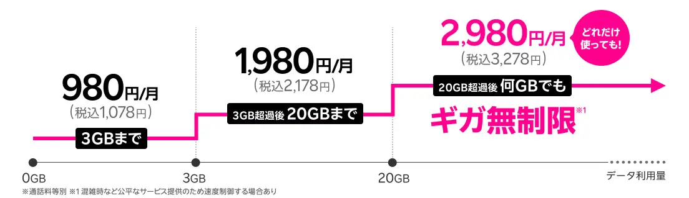

+++
title = "楽天モバイルからPovo2.0に移行"
description = "楽天モバイルの通信品質に不満を感じ、Povo2.0に移行しました。混雑時に通信不能になる楽天モバイルと比べ、Povoは高速で安定した通信品質を提供しています。トッピング制による柔軟な料金体系も魅力的です。"
date = 2025-10-13
aliases = ["/articles/2025/10/13/povo20"]

[taxonomies]
tags = ["Gadget"]
+++

Table of Contens

  <!-- toc -->

## 楽天モバイルの問題

下図は楽天モバイルの最強プランです。1プランで分かりやすく、通信量に応じて料金は上がっていきますが20GB以上は料金が2,980円で固定だと言う点が特徴です。

設定が絶妙で、実質的に3GB以下で収まる人はほとんど居ないでしょう。
つまり、大半のユーザーは1,980円（3-20GB）または2,980円（20GB以上）のどちらかの料金帯に収まる形です。

私の場合、月平均8〜10GBなので、1,980円となっています。
これでも安いほうですが、飛び抜けて安いわけでもありません。

楽天モバイルはRakuten Linkアプリで通話すると通話料が無料という利点もあります。
しかし、実際にはデータ通信を使った通話なので通信状況に左右されてよく途中で通話不能となるので、
ちょっとした電話でも中断するのが煩わしく通常の電話を使ってしまいます。

問題は**通信品質**です。
通信速度を測定すると非常に状況が良い時でも60Mbps程度で、中程度の速度です。
致命的なのは人が多いターミナル駅やイベント会場などでは、極端に通信速度が落ちたり通信不能に陥るケースがよくあることです。
この品質では、以前使っていたMineoマイそくスタンダードプラン(1.5Mbps)の方が速度は遅くとも確実に通信できて安定していました。

最近何度か外出時に通信が出来なくなり、うんざりしました。
この通信品質ではいくら料金がリーズナブルでも納得感がありません。

## Ahamo

当初は楽天モバイルと同様に1プランで分かりやすく、5分通話無料が標準で付いているAhamoに移行しようかと手続きを始めました。

しかし、手続きの中で`dアカウント`が必要と言われます。私はDocomoのHome 5Gを使っているので、`dアカウント`を持っているので登録しようとするとエラーになります。

`dアカウント`は1回線にしか紐付けることができず、Ahamoに移行するには新たに`dアカウント`を作る必要があるようです。
しかし、`dアカウント`はメールアドレスと紐付いているので、これでは別途メールアドレスを用意しなければなりません。

手続きの煩雑さから、Ahamoへの移行は止めました。
こんな手続きを平然と継続する企業など、ろくなもんではありません。

## Povo2.0

次にKDDIがサービスしているPovo2.0です。

特徴としては基本料金のようなものがなく、「トッピング」という形で有効期限付きのデータ量を都度購入すると言う点が独特です。
料金体系は独特ですが試算したところ楽天モバイルと同等、通話料金も含めるとAhamoと同等となりそうです。

例えば、私の場合月平均10GBの通信量なので、1年間120GBのトッピング(21,600円)を購入すると、一月当たり1,800円となります。

通信品質にも問題なく、かなり高速です。
場所によっては1Gbpsを超えてきますし、
東京駅でも200〜700Mbps程度の速度は出ます。楽天モバイルとは雲泥の差です。

トッピングを購入する手間はありますが、1年間有効なトッピングもあるので上手く組み合わせると
自分に必要な分だけ最適な購入の仕方も工夫できます。

有効期限が過ぎて180日間購入がないと利用停止されてしまうので注意が必要です。
ただし、サブ回線で無い限り180日間も通信できない状況を放置するとは思えないので、あまり気にしなくても良さそうです。

## まとめ

楽天モバイルが始まった当初は革新的なプラン体系でしたが、
やはりこういった基地局整備への莫大な投資が継続して必要な資本集約型産業・インフラ産業への理解と経験が楽天モバイルには足りないのでしょう。

PovoはKDDI・AUが何年もかけた設備投資の蓄積とそのノウハウが十分あり、本気で価格勝負となったら新規参入企業では分がないということでしょう。
手間を惜しむユーザーにはトッピングという形態は面倒でしょうが、
必要な分だけ手当てできる柔軟なプランは私にはあっているようです。

もし、Povoに移行される方は、以下のプロモーションコードをご利用下さい。

プロモーションコード： `MGOZXOZN`

データボーナス100GB(3日間)が特典として付与されます。
