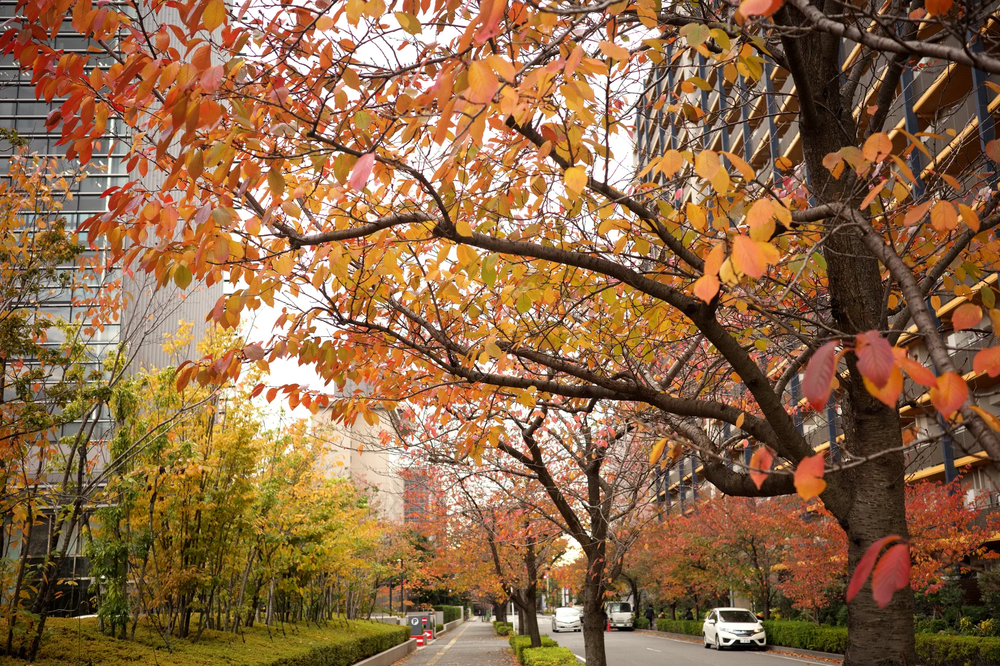

+++
title = "Photo Friday: Amber Glint"
description = "A fleeting amber glint dances across autumn leaves, as afternoon light filters through the canopy, illuminating the quiet transition of seasons."
date = 2025-11-18
aliases = ["/articles/2025/11/18/amber-glint"]
+++

[Amber Glint](https://www.photofriday.com/yostos/17015)

A fleeting amber glint catches the edge of autumn leaves, as the late-afternoon sun slips through the quiet street. Each leaf becomes a small lantern, glowing with warmth where light meets color. The canopy above filters the golden hour into fragments of brilliance, revealing the gentle transition from green to gold, a moment suspended between seasons.
