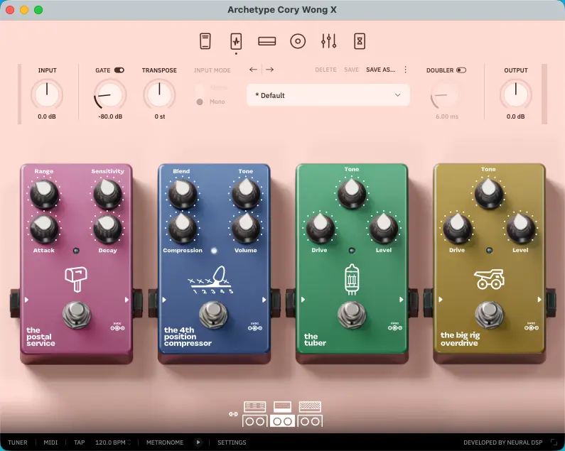

+++
title = "Neural DSP Archetypeプラグインを買おう"
description = "Thanksgiving Day is coming up soon.Neural DSP, which develops and sells music-related devices and software,also typically starts its Black Friday sale in the third week of November each year.The Neural DSP Archetype plugin for guitar that I've always wanted will probably be half-priced on Black Friday.Let's make sure to prepare thoroughly and decide which ones to buy before the sales starts."
date = 2025-11-16
aliases = ["/articles/2025/11/16/archetype"]

[taxonomies]
tags = ["Guitar", "Software","Music Production"]
+++

## Archetype シリーズとは

Archetype シリーズは、Neural DSP 社が開発するプラグインで、PC/Mac 上でギターアンプやエフェクターっを再現するソフトウェアです。

このジャンルの先駆けとなった IK Multimedia の Amplitube も持っていますが、Amplitube が膨大なアンプとエフェクターに対応した総合的なアンプシミュレーターであるのに対し、Archetype シリーズはアーチストの名を冠したラインナップに分れており、そのアーチストに特化した数種類のアンプとエフェクターが厳選されています。

個人的に以下の点を評価しています。

- 厳選したモデルをリアルに再現したアンプモデリング技術
- アーチストのスタイルに特化した実用的な機材の組み合わせに厳選
- 高音質の割りに CPU 負荷が軽い

Amplitube が「広く浅く」多くのジャンルに対応しているのに対して、「狭く深く」特定ジャンルに特化しています。

## 購入候補

Neural DSP の過去のブラックフライデーセールを確認すると、
2022 年は 11 月 18 日、22023 年は 11 月 17 日、024 年は 11 月 24 日にセールが始まったようです。
よって、今年も今週か遅くとも来週にはセールがあると予想できます。
どのプラグインを購入するか決めなければなりません。

現在検討しているのは以下の 2 つです。

### Archetype: Cory Wong X

[Archetype: Cory Wong X](https://neuraldsp.com/plugins/archetype-cory-wong)は、
Vulfpeck（ヴァルフペック）のギタリストでファンクギターの代表的存在としてクリーントーンの美学と完璧主義的な音作りで「モダンギターヒーロー」と称されている Cory
Wong の機材をシミュレートしたプラグインです。

クリーントーンからローゲインまでカバーでき、なかなか極まらないファンクなカッティングに適した音が直ぐに出せます。ブースターとオーバードライブをオンにして The Amp Snob を選べば、激しめのリードもこなせそうです。

#### Pre Effect

- Wah - MIDI 対応のワウペダル（オートワウ機能付き）
- The Postal Service - エンベロープフィルター
- The 4th Position Compressor - Cory のシグネチャーコンプレッサー
- The Tuber - チューブアンプファン向けの改造ブースター
- The Big Rig Overdrive - ファズ寄りの強力なオーバードライブ

#### Amp

- D.I. Funk Console - アナログチャンネルストリップベース、チューブサチュレーション/コンプレッサー/EQ/フィルター搭載。その名の通りコンソール直の音をシミュレートしており貴重
- The Clean Machine - 業界最高のクリーンアンプを集約したカスタムアンプ。おそらく Roland Jazz Chorus がモデル
- The Amp Snob - 希少なアンプのモデル、クリーンから歪み手前まで対応。Dumble アンプがモデル

#### Post Effect

- The 80s - 80 年代風ヴィンテージコーラス
- Delay-y-y - アナログ回路ベースの BBD ディレイ
- The Wash - シマー機能付きリバーブ

### Archetype: Plini X

[Archetype: Plini X](https://neuraldsp.com/plugins/archetype-plini)は、プログレッシブ、フュージョン、メタルのブレンドサウンドに特化した汎用性の高いプラグインです。

アンプの前にディレイがあるのは魅力的ですね。

#### Pre Effect

- Compressor - バスコンプのモデル
- Octaver（新機能）- オクターブ上下のブレンド
- Drive（更新版）- ブースト/オーバードライブ、ファズスイッチ追加
- Delay（新機能）- ディープなアンビエンス用

#### Amp

- Clean - 透明でパンチのあるクリーンアンプ。Fender Twin + Dumble のミックス
- Crunch - クリーンとハイゲインの中間、ブリティッシュトーン。Friedman BE-100 (BE チャンネル)
- Lead - Crunch にゲインステージ追加、リード/ヘヴィリフ向け。Friedman HBE + EVH 5150/5153 のミックス

#### Post Effect

- Chorus（新機能）- ヴィンテージ 80s/モダン空間系の 2 モード
- Delay（更新版）- テープサチュレーション/モジュレーション搭載
- Reverb - 多次元リバーブ

## まとめ

Cory Wong は購入確定なので、残る選択肢を整理します。
歪み系なら Plini かなと思っていますが、Nolly も気になっています。

Plini はクリーンからハイゲインまで汎用的で、プログレ・フュージョン・メタルと幅広く対応します。Cory Wong と組み合わせれば、クリーンから激しい歪みまでシームレスにカバーできるでしょう。

一方 Nolly はモダンメタル特化で、4 種類のアンプと 640 の IR を搭載し、より攻撃的なサウンドに強みがあります。既に Cory Wong でクリーンが確保できているなら、ハイゲインに振り切った Nolly も魅力的です。

ブラックフライデーセールは 11 月末頃から始まり半額になる可能性が高いため、全て 14 日間無料トライアルで試して今週中に決断せねば。
