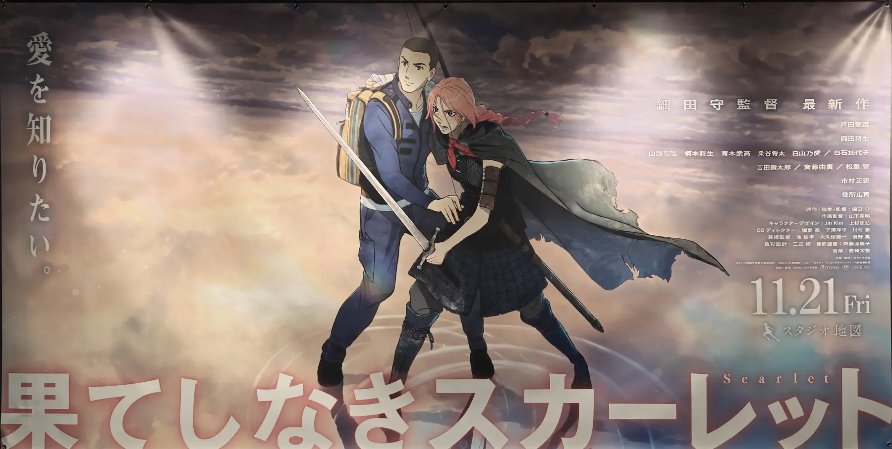

+++
title = "Movie Review: Scarlet"
description = "I finished my errands at the mall way earlier than expected, and since it was a weekday and the theater was pretty empty, I decided to catch a movie.It was such a spontaneous decision that I didn't even research what was playing—I just jumped into whatever was starting soonest, barely glancing at the title.That movie turned out to be \"Scarlet\" (果てしなきスカーレット). Unexpectedly, it was absolutely fantastic."
date = 2025-11-21
aliases = ["/articles/2025/11/21/scarlet"]

[taxonomies]
tags = ["Movies"]
+++

## What is "Scarlet"?

I didn't even know it was an animated film, so I initially regretted my choice—but from the opening scene, I was completely blown away and couldn't take my eyes off the screen.

Written and directed by Mamoru Hosoda and produced by Studio Chizu, this 2025 Japanese animation is inspired by Shakespeare's "Hamlet."

The 19-year-old Princess Scarlet watches as her father, the king, is murdered by her power-hungry uncle Claudius. She confronts him seeking revenge but is defeated and dies. She awakens in the "Land of the Dead," where she faces a harsh fate: unless she achieves her revenge and reaches the "Unseen Place," her very existence will fade away. Scarlet embarks on a journey of vengeance.

Today, November 21, 2025, is actually the opening day in Japan.

Here are three things that stood out to me.

## 1. Stunning Visuals and IMAX Sound

Since most of the story takes place in the "Land of the Dead," there are fantastical images of giant dragons and crowds of tens of thousands, largely rendered in 3D CG. The sheer scale combined with CGI that's both photo-realistic in its intensity and incredibly detailed is just mind-blowing.

Plus, I happened to catch the IMAX version, and the booming, realistic sound made even the most fantastical imagery feel incredibly convincing—like you could actually believe it was real.

## 2. Voice Acting Performances

I was also blown away by the powerful voice performances from the protagonist and other main characters.

I didn't know who was voicing them while watching, but when I saw the ending credits, I was shocked. The cast includes Mana Ashida, Masao Okada, Koji Yakusho, Masachika Ichimura, Kotaro Yoshida, Yuki Saito, Yutaka Matsushige, and Shota Sometani—an incredibly star-studded lineup.

Especially Mana Ashida as the protagonist—she brings a genuine intensity that typical voice actors can't quite capture. I found myself muttering "she's amazing" during the credits.

## 3. The Ending Song

And yes, Mana Ashida also sings the ending song. I'm not sure how skilled of a singer she is, and nowadays there's probably quite a bit of audio enhancement, but the ending—which begins with a phrase from the film—had a persuasive power that could only come from her voice.
