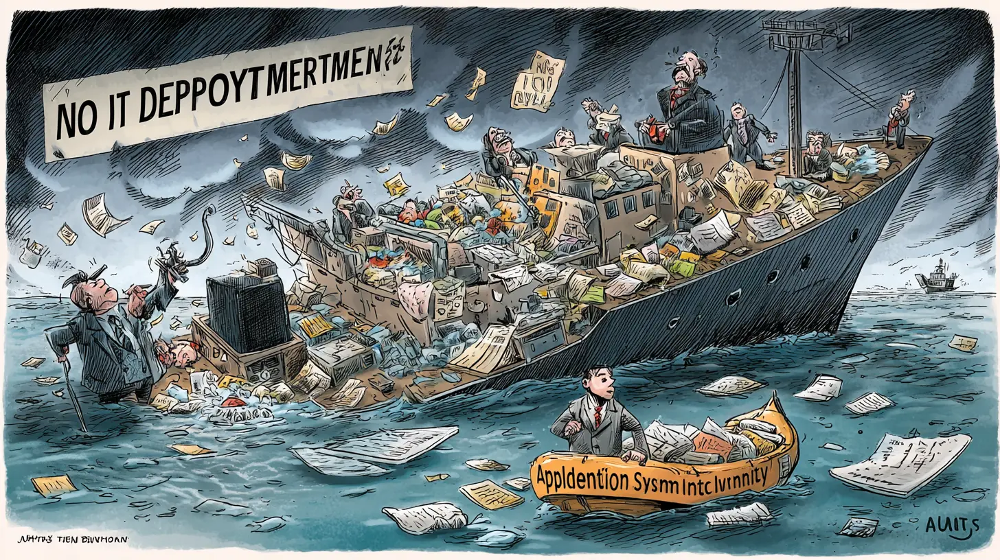

+++
title = "Because Your Tech Ignorance Is Now a Business Liability"
description = "この記事はIT部門を持たず、非技術部門だけでベンダーに作らせた業務システムを所有し運用している組織について想定しています。きっとランサムウェアで危機に見舞われているアサヒビールやアスクルを見て震え上がって、何をすればいいか焦っている組織も多いと思います。そんな組織が行なうべき第一歩として業務システム台帳の整備について解説しています。"
date = 2025-11-08
aliases = ["/articles/2025/11/08/tech-ignorance-is-business-liability"]

[taxonomies]
tags = ["Tech", "Security"]
+++

Table of Contents

  <!-- toc -->

## What is Application System Inventory?

"Application System Inventory" is an inventory that records and keeps a list of application systems the organization owns. The important point is that it does not manage the internal structure of each system or technical details.

More specifically, the inventory stores the following basic attributes of systems.

- System Name: A name that can be uniquely identified within the organization (e.g. Finance System, Sales Management System, Human Resource Management System).
- Business Process: A name of the business process that the system supports. This makes visible what kind of value the system provides to the organization. As a prerequisite, it is desirable that the organization also maintains an inventory of its business processes.
- Business Process Owner: This is also an important attribute. This clarifies who is responsible for the system and manages the budget for it. Without this, decision-making and life-cycle management for the system become ambiguous.
- Importance: This classifies whether the system is a critical system that is subject to Business Continuity Planning(BCP), or a system whose impact on business operations is limited even if it stops. This is essential information for risk management and determining investment priorities.

Application System Inventory is the most fundamental component of IT governance. If the organization doesn't understand what it owns, appropriate investment decisions, risk management, and cost optimization cannot begin.

## Why Application System Inventory Is Important

In recent months, an increasing number of enterprises have been attacked by ransomware. The ransomware encrypts their systems and data, disrupting business operations for several months. In such critical situations, what happens if Application System Inventory does not exist?

No one would be able to understand what has been destroyed and what should be restored. Which systems are most critical for business operations? Where are the data backups for each system located? How many systems were operating across the organization in the first place? Without this basic information, recovery efforts would become extremely chaotic, and business resumption would be significantly delayed. Application System Inventory is the most fundamental infrastructure for crisis management.

Another important aspect is driven by accounting requirements. Systems developed under a work contract ("Ukeoi" contract) need to be depreciated as intangible fixed assets, and functional enhancements during the operational phase are also subject to capitalization. However, with only the accounting asset ledger, it is difficult to make judgments specific to Application Systems, such as which functional enhancements warrant capitalization. An Application System Inventory that is aligned with the accounting asset ledger is necessary.

## Why Organizations Cannot Maintain Application System Inventory

Many organizations witness other companies' disasters and begin to establish their Inventory, driven by a sense of crisis. However, in most cases, the inventory is forgotten from the moment it is created and eventually becomes outdated and buried in the darkness.

For example, a department procures a system independently, but it is not registered in the inventory. Another system undergoes major enhancements to expand the business processes it supports, but this is not reflected in the inventory. In this way, the inventory gradually diverges from reality, becomes useless, and is eventually discarded.

Why does this happen? Murphy's Law states, "Anything that can go wrong will go wrong." Moreover, we are talking about dysfunctional organizations that have failed to establish IT Governance. Operations that rely on the goodwill and diligence of people in such organizations are bound to fail at some point.

So how can we maintain the Inventory? The key is the flow of money. Both departmental system procurement and major system enhancements are always accompanied by financial transactions. If you can capture this flow of money, you can use it as a trigger that won't miss changes to the Inventory.

## The Mechanism to Maintain Application System Inventory

As described in the previous section, the key is to capture the flow of money. There are three financial processes related to Application System: budgeting, expenditure(procurement), and fixed asset accounting. By incorporating Inventory updates into these processes, you can establish a mechanism to maintain the Inventory automatically.

### Budgeting

Budgeting must be done for operating or modifying an Application System. Generally, budgets are managed using budget codes or account codes, along with budget amounts. Therefore, the following two things are required during the budgeting process:

If the budget is related to Application System, it must be linked to a record in the Application System Inventory. If, at this stage, the Application System isn't registered in the Application System Inventory, it must be considered a new system and should be added to the inventory as such. In this way, you can prevent budgeting for systems that are not in the Inventory.

Next, at the completion of the budgeting process, you verify whether some budget has been allocated to all Application Systems that are either operational or planned to be operational. You mandate budget allocation for the owners of operational application systems that are running despite not having an assigned budget.

The important point is not to require Inventory updates to maintain it, but to incorporate a mechanism in which budget processing cannot be completed without being consistent with the Inventory.

### Expenditure(Procurement)

The introduction, modification, and maintenance of Application Systems always incur expenditures. In organizations without an established IT department, these expenditures are typically processed through the procurement or accounting departments. This procurement process itself becomes the most reliable trigger for maintaining the Inventory.

Orders and contracts related to Application Systems should be identifiable based on which budget they are tied to. For procurements identified as related to Application Systems, it should be mandatory to ensure linkage and consistency with the Application System Inventory both at the time of ordering and at delivery. This prevents failure patterns such as "a department independently procured a system, but it was never added to the Inventory."

By embedding an Inventory consistency check within the procurement process, many companies treat any procurement that bypasses this check as a deviation—a "BYPASS"—and impose penalties on the requesting department. In the future, these checks will also function as part of the organization's IT Governance framework, serving as a review point to verify whether systems being introduced align with the organization's intended architecture.

### Fixed Asset Accounting

Application Systems developed under contract should be recorded as intangible fixed assets of the organization and are subject to depreciation. Service-based agreements such as SaaS are not capitalized as assets, but systems that are ordered and delivered must still be properly managed from an accounting perspective.

In organizations without an IT department, there is no "handover" capture process; therefore, a mechanism that links the update of the intangible fixed asset ledger with the update of the Application System Inventory upon delivery is essential. The system owner must determine whether a functional enhancement qualifies for capitalization and request the accounting department to update the ledger. By designing a process that prevents acceptance until this consistency check is completed, both ledgers are reliably updated.

This mechanism has two effects. If the organization's accounting practices are accurate, the intangible fixed asset ledger should correctly record all systems that need to be capitalized. Maintaining consistency with this ledger enhances the reliability of the Application System Inventory. Conversely, if accounting practices are inaccurate, establishing a mechanism to ensure consistency with the Application System Inventory helps prevent improper accounting treatments.

Crucially, embedding this consistency check into the acceptance process ensures that both ledgers are maintained reliably without depending on human goodwill. When acceptance cannot be completed without this verification, the updates happen automatically as part of the standard workflow.

## Conclusion

Organizations that have not even established an Application System Inventory, even if driven by a sense of crisis to create one, will not be able to maintain it. It is clear that it will start to decay from the moment it is created.

What matters is the mechanism to maintain it. It is important to embed the mechanism for updating and maintaining the Inventory into the unavoidable processes that accompany the flow of money: budget, procurement, and accounting.

Conversely, if you simply establish this mechanism, you can take the first step toward IT governance. It is not difficult. You just need to capture the flow of money related to systems. If you cannot even do that, your organization does not have the fundamentals of corporate governance in place even before considering IT governance—though that is likely the case.
