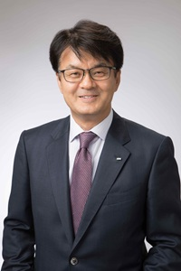

+++
title = "Akio Yamaguchi's Appointment as Managing Director of Keizai Doyukai"
description = "Akio Yamaguchi, President of IBM Japan, has been appointed as a managing director of Keizai Doyukai (Japan Association of Corporate Executives)."
date = 2025-12-16
aliases = ["/articles/2025/12/16/akio-yamaguchi"]

[taxonomies]
tags = ["Current Affairs","IBM"]
+++

Akio Yamaguchi, President of IBM Japan, has been [appointed](https://www.doyukai.or.jp/news/hr/251216.html) as a managing director of Keizai Doyukai (Japan Association of Corporate Executives).

Given that the position had been vacant for about two months following Suntory's Takeshi Niinami's resignation over the supplement issue, this could prove to be quite a challenging role.

This brings back memories from about 20 years ago when Kitashiro, then President of IBM Japan, served as a managing director. I was asked to provide advisory services for the Keizai Doyukai website and system renewal for a token fee—literally just a rice cracker.

As for President Yamaguchi himself, I have a couple of personal memories. A senior colleague of mine was close to him, and I had occasional conversations with Yamaguchi when he returned from his assignment in the United States. I also recall exchanging communications with him regarding team member participation in a banking package project that, unfortunately, turned out to be completely unusable.

Well, I'm sure it won't be easy, but congratulations on the appointment anyway.
