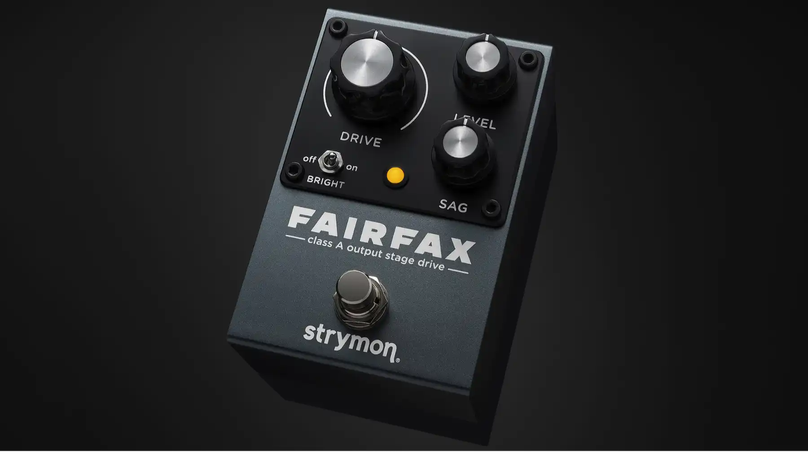

+++
title = "真空管の歪みを実現するStrymon Fairfax"
description = "Strymon から Fairfaxという新しい歪み系のペダルが発売されました。Strymonには既にSunsetとRiversideという歪み系ペダルが既にあります。なぜStrymonは更に新しい歪みペダルをリリースしたのでしょう?この記事では50年以上に渡るエレキギターのオーバードライブサウンドの歴史から、Strymon Fairfaxの技術的な意義を紐解いてみたいと思います。"
date = 2025-12-21
aliases = ["/articles/2025/12/21/fairfax"]

[taxonomies]
tags = ["Guitar Pedals"]
+++

Table of Contentes

  <!-- toc -->

Strymonは、既に優れた歪み系ペダルを2つリリースしています。
6種類のオーバードライブを2段重ねできるSunsetと、3つのモードを持つオーバードライブRiversideです。
これらのペダルは、多様な歪みサウンドを提供し多くのギタリストに支持されています。
ではなぜ、Strymonは2025年に新たに[Fairfax](https://amzn.to/3Y6rRC8)という歪みペダルをリリースしたのでしょうか。

その答えは、Fairfaxが従来のオーバードライブペダルとは根本的に異なるアプローチを採用しているからです。
ほとんどのオーバードライブペダルは「プリアンプの歪み」を再現します。
しかしFairfaxは、真空管アンプ全体の挙動、つまり「プリアンプ＋パワーアンプ＋出力トランス＋電源部のサグ」という総合的な歪みを再現しようとしています。
この違いを理解するには、まず「真空管の歪み」の本質と、それが現代のエフェクターでどのように再現されてきたかを知る必要があります。

## ギタリストが恋焦がれる「真空管の歪み」の正体

オーバードライブサウンドの原点は、真空管アンプを大音量で駆動し生じる自然な歪みにあります。
1950年代後半から1960年代にかけて、ブルースやロックギタリストたちはアンプのボリュームを限界まで上げた時に生まれる「偶然の音色」を発見しました。
これは真空管という増幅素子の物理的な限界から生まれた現象でした。

真空管は、入力信号がある一定のレベルを超えると線形動作領域を逸脱します。
信号のピーク部分が平らに削られる「クリッピング」という現象が起こり、これが豊富な倍音成分を含んだ歪みを生み出します。
真空管アンプの歪みが「暖かい」「音楽的」と評される理由は、波形のクリッピングが徐々に起こる「ソフトクリッピング」特性にあります。
これにより偶数次倍音が多く含まれ、聴感上心地よい歪みとなるためです。

実際のアンプでは、プリアンプ段とパワーアンプ段の両方で歪みが発生します。
プリアンプ管（12AX7など）は高ゲイン設計で、比較的小さな信号でも飽和しやすく鋭い歪みを生成します。
一方、パワー管（EL34、6L6など）の歪みは、出力トランスの飽和特性も関係して、より滑らかで音楽的な特性を持ちます。
大電流が流れると鉄心が磁気飽和を起こし、高域が丸まり低域に独特のコンプレッションがかかります。
この「重さ」や「押し出し感」も真空管アンプ特有の特性です。

さらに重要なのが、大音量時に電源部の整流回路やトランスが一時的に電圧降下を起こす現象です。
これが「サグ」と呼ばれ、信号に一度音量が下がって時間経過で音量が戻るという自然なコンプレッション効果が加わり、
独特のダイナミクスとタッチレスポンスを生み出します。
ピッキングの瞬間に音が「呼吸する」ような反応性は、このサグによるものです。

Fender Tweed、初期Marshall、Vox AC30などの古典的アンプには、マスターボリュームがないか、
プリアンプ段が少ない設計でした。
ボリュームノブはプリアンプの出力とパワーアンプの入力の間に配置され、ボリュームを上げるとプリアンプ段とパワーアンプ段の両方が同時に駆動されました。
Eric Claptonの「Bluesbreakers」アルバムや、Jimi Hendrixのサウンドは、文字通りアンプを爆音で鳴らしてプリアンプとパワーアンプの両方を歪ませた結果です。

## 現代のアンプやエフェクターで作る「歪み」とは

1970年代以降、マスターボリューム搭載アンプが一般化しました。
これにより、GAINノブでプリアンプを歪ませマスターボリュームで音量を調整するという使い方が可能になりました。
1980年代以降のハイゲインアンプ（Mesa Boogie、Peavey 5150、現代のMarshall JCMシリーズなど）は、プリアンプ段を多段構成にしてGAINノブで極端に歪ませる設計となっています。
これにより、寝室レベルの音量でも激しい歪みが得られるようになりました。
この方式は、1970〜80年代のハードロック、ヘヴィメタルの需要に応えたものでステージ音量を管理しながら高ゲインサウンドを得る必要があったからです。

歪み系エフェクターは、信号チェーンの中でアンプの前段に接続されます。
つまり「ギター → エフェクター（歪み）→ アンプのプリアンプ（GAINで歪み）→ パワーアンプ → スピーカー」という流れになります。
回路的には、エフェクターは「プリアンプ的な歪み」を生成していると言えます。現代的な使い方では、「プリアンプ的な歪み」を二段重ねしていることになります。

初期のオーバードライブペダル（Ibanez Tube Screamer、Boss OD-1など）は、トランジスタやオペアンプを使って真空管アンプが自然に歪む「感触」を再現しようとしました。
ソフトクリッピング回路で、倍音特性や圧縮感を似せています。ただし、これは「プリアンプ単体」というより、アンプ全体が適度に歪んだ状態を、小型回路で近似したものです。
ディストーションペダルは、より積極的なハードクリッピングを使い、ハイゲインアンプのプリアンプ段のような強い歪みを作ります。

## 現代の歪みと本来の歪みの違い

現代のハイゲインアンプやエフェクターペダルは、主にプリアンプで歪みを作ります。
マスターボリュームで音量を下げれば、パワーアンプはほぼクリーンな状態のままとなります。
プリアンプ主体の歪みは、ゲインが高く圧縮されたサウンドになりますが、パワーアンプも歪ませた時のような立体感、
ダイナミクス、タッチレスポンスには欠けたものになります。

この結果、これまでのエフェクター単体では、以下の要素を再現できません。

- パワー管の暖かな歪み（偶数次倍音が豊富なソフトクリッピング）
- 電源部のサグ（電圧降下による自然なコンプレッション効果）
- 出力トランスの飽和特性（重さと押し出し感）
- スピーカーの物理的な挙動
- アンプ全体の相互作用

これらが、「真空管アンプを全開にした音」の核心であり、小さな真空管アンプを使用しなければ完全な再現は困難でした。

1960年代の本来の歪みは、プリアンプの歪みとパワーアンプ・トランスの歪みとスピーカーの駆動が総合的に作用した結果です。
それに対して、現代的設定では「エフェクターの歪み＋プリアンプの歪み（＋パワーアンプはほぼクリーン）」となります。
だからこそ、本物のヴィンテージトーンを求めるギタリストは、小型アンプ（5〜15W）をフルボリュームで使ったり
アッテネーター（パワーアンプの出力を減衰させる装置）を使ったりして、パワーアンプ段も歪ませようとするのです。

## Strymon Fairfaxが挑む課題

StrymonのSunsetやRiversideは、多様な歪みキャラクターを提供する優れたペダルです。
しかし、これらも基本的には「プリアンプの歪み」を再現するという、従来のオーバードライブペダルと同じアプローチを採用しています。
つまり、アンプを全開にした時の「アンプ全体の総合的な歪み」を再現するものではありませんでした。

2025年に発表されたFairfaxは、この従来のアプローチの限界を超えようとする試みです。
Fairfaxは、1965年Randy Bachman用に製作されたGarnet Amplifiers Herzog®とChampライクなチューブアンプ回路をヒントに、
Strymonとしては初の完全アナログで小型化したエファクターです。

Fairfaxが従来のペダルと決定的に異なるのは、以下の要素を同時に再現しようとしている点です。

1. **クラスAパワーアンプの歪み**：パワー管の滑らかで音楽的な歪み
2. **出力トランスの飽和特性**：カスタムアナログ回路でエミュレート
3. **可変Sag回路**：電源部の電圧降下による自然なコンプレッション効果

特に注目すべきは、9VDCを内部で40Vに昇圧している点です。
通常のエフェクターペダルは9Vのままで動作しますが、Fairfaxは高い動作電圧により真空管アンプのような高いヘッドルームと
応答性を実現しています。この高電圧動作が、パワーアンプの歪みやサグの再現を可能にしているのだと思います。

Fairfaxは、エフェクターペダルという小型の筐体の中で、実際の真空管や出力トランスを使わずにどこまで本物に近づけるかという技術的挑戦です。
これが、Strymonが既に歪み系ペダルを持っているにもかかわらず、Fairfaxをリリースした理由です。

同様の試みはKORGの極小真空管Nutubeを使ったTR-Sでも行われていましたが、挙動が敏感過ぎて扱いに難しい面がありました。
Strymon FairFaxはエフェクターの運用の中で、現実的な実用性を兼ね備えている点は活気的です。

従来のオーバードライブとアンプの間にFairfaxを挟み、ドライブとSAGをほんの少し加えるだけで実にアンプライクな気持ちよい歪みを得ることができます。
私の場合、両方のツマミをかなり抑えてクリーン時も常時オンにして使っています。

## 真空管アンプの音色を追い求めて

オーバードライブサウンドの歴史は、技術的制約と音楽的要求の相互作用の歴史です。
1960年代の偶然の発見から始まったこの音色は、現代では様々な技術的アプローチで再現が試みられています。
しかし、真空管アンプを全開にした時の「プリアンプ＋パワーアンプ＋出力トランス＋サグ」という総合的な挙動を完全に再現することは、依然として困難な課題です。

だからこそ、ヴィンテージアンプの価値が保たれ続け、Fairfaxのような新しい技術的挑戦が今なお続いているのです。
音楽技術において、「古い」と「新しい」は対立するものでなく、
それぞれが異なる価値を持ち続けている好例と言えるでしょう。

---

\_この記事は、アンプとエフェクターの技術的な理解を深めるための考察です。
実際の音作りにおいては、技術的な正確さよりも、演奏者の感性と音楽的文脈が最も重要であることを付け加えておきます。
