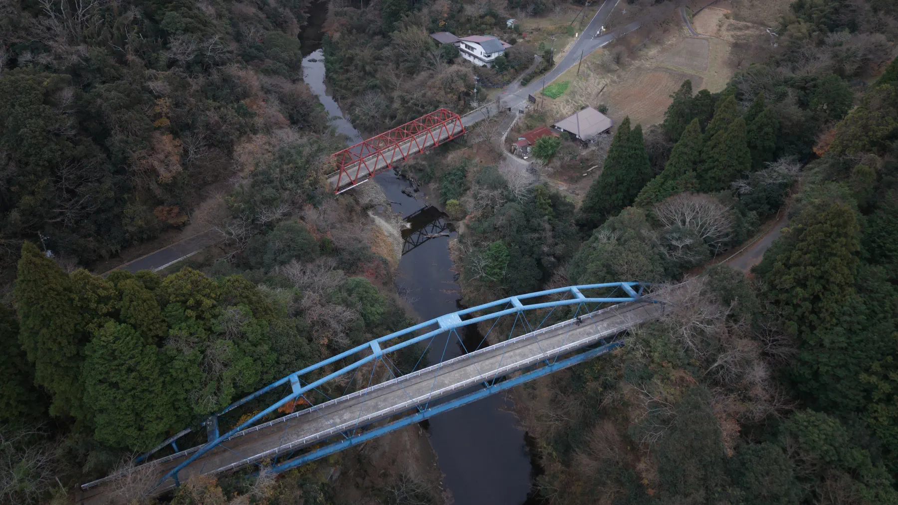

+++
title = "青と赤のコントラスト - 渓谷橋と宝衛橋"
description = "養老渓谷の象徴的な2つの橋、青い渓谷橋と赤い宝衛橋をドローンで撮影しました。江戸時代後期から行われた「川廻し」による治水の歴史と、昭和の開発によって生まれた美しい橋の物語を紹介します。"
date = 2025-12-13
aliases = ["/articles/2025/12/13/keikokubashi"]

[taxonomies]
tags = ["Drone", "Photography"]
+++

養老渓谷でドローンの撮影をしてきました。

小湊鉄道の養老渓谷駅から梅ヶ瀬渓谷へ向かうと、
すぐに養老川本流にぶつかり「渓谷橋」という青い橋を渡ることになります。
橋から左手(東側)を眺めると、もう一本赤い橋「宝衛橋」が見下ろせます。
橋の下には養老川が流れています。

この地域は蛇行する養老川に作られた「川廻し」の地形です。
「川廻し」とは、川の湾曲する部分に直線で結ぶ河川を作り、
曲流していた旧流路に盛土をして新田を開発するという江戸時代後期から行なわれた手法で、
平地が少ない山間部では貴重な土地を得るためによく行なわれました。

この地では昭和初期に川廻しが行なわれ、この2つの橋は川廻しで繋いだ直線部に渡された橋です。
当初はトンネルで曲流部を繋いだようですが、昭和45年の集中豪雨によりトンネル付近で水が滞留し温泉街に被害が
出たため、トンネル部分を切り通しにしたそうです。この橋は切り通しによって渡れなくなった集落を繋ぐため、昭和48年に架けられたそうです。

今では養老渓谷を象徴する橋となっています。

{{ youtube(id="KZ613jRe8cI") }}

